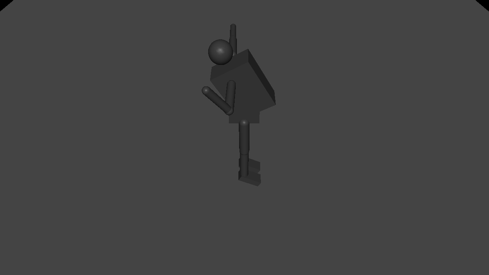

# Humanoid demo Viewer validation

Validation date: 2026-09-25

The Phase-1 humanoid demo was simulated for 2,000 physics steps (2.0 s) and
rendered through the MuJoCo Viewer path with a GLFW OSMesa context.

| Command | Goal | Target | Final position | Result |
| --- | --- | ---: | ---: | --- |
| `右手を上げて` | `RaiseRightArm` | -1.35 rad | -1.32711 rad | PASS |
| `右手を下げて` | `LowerRightArm` | 0.00 rad | 0.00304399 rad | PASS |

## Rendered poses

Right arm raised:

Right arm lowered:

The two rendered files have different SHA-256 hashes, and visual inspection
confirms elbow flexion in the raised pose and extension in the lowered pose.
The full configured test suite also passed: 36/36 tests.
