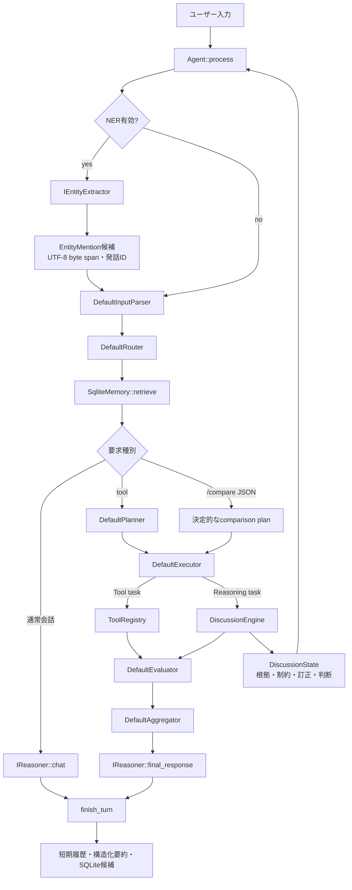

# Agent全体構想

2026-09-18時点の作業ツリーを正とする。クラス関係は
[agent_uml.md](agent_uml.md)、議論機能の評価と学習手順は
[discussion_evaluation.md](discussion_evaluation.md)、NERの詳細は
[japanese_ner.md](japanese_ner.md)を参照する。

## 結論：モデルの核は維持、Agent構成は拡張

初期構想から変わっていない中心部分は、C++で完結する小型Agentと、最大1024 tokenの
decoder-only causal Transformerを会話生成に使う点である。一方、Agent全体は
「生成モデルが解析・判断・記憶をすべて担う構成」ではなく、次の層を組み合わせる
ハイブリッド構成へ変わった。

1. `Agent`が予算、実行順、retry/replan、状態保持を管理する。
2. tool、数値制約、根拠整合性、訂正は可能な範囲でC++が決定的に処理する。
3. 日本語NERは言語モデルと別bundleで動き、抽出結果を未確定候補として渡す。
4. 会話履歴は短期履歴、検証済み形式の要約、SQLite長期記憶に分ける。
5. 比較・判断は`DiscussionState`へ根拠と更新履歴を保持し、生成文と分離する。
6. Transformerは自然な会話や将来の構造化入出力を担当するが、検証可能な判定の
   正しさをモデルの自己評価だけに委ねない。

したがって「モデル構造を全面変更した」のではなく、「小型生成モデルをAgentの一部へ
位置付け直し、決定的な制御面と構造化状態を強化した」が現在の構想である。

## 実行時アーキテクチャ

`/compare JSON`はbackendが`model`でも、明示入力のparse、plan、評価、最終整形を
決定的経路で処理する。未学習モデルが正しい形式を出しただけで判断成功にしない。
未知のReasoning operationは成功扱いせずエラーにする。

## 状態と信頼境界

| 状態 | 役割 | 確定事実としての扱い |
|---|---|---|
| `EntityMention` | 人名・組織・場所・数値・条件の候補 | 抽出だけでは確定しない |
| `ConversationTurn` | 要約前の直近会話とNER候補 | 発言履歴であり真実保証ではない |
| `_summary` | 6 sectionの検証済み会話要約 | 失敗時は以前の要約を保持 |
| `SqliteMemory` | Semantic/Episodic/Project長期記憶 | importance/confidence閾値後に保存 |
| `DiscussionState` | 論点、Claim、Evidence、制約、判断、revision | 根拠origin・stance・時点・条件で利用可否を判定 |

Evidenceは`user`、`document`、`tool`、`model`、`verified_judgement`を区別する。
出典が存在することは、その内容が世界で真であることを意味しない。未検証のユーザー
主張、モデル推測、提案、撤回済みClaimは選択根拠へ自動昇格しない。

訂正はupdate IDで冪等化する。旧値・旧根拠・新根拠をrevisionへ残し、検証に失敗した
更新は状態へ部分適用しない。会話要約が失敗しても`DiscussionState`を上書きしない。
現時点の議論状態はprocess内メモリで、SQLite永続化は未実装である。

## 推論と生成の責務

| 処理 | C++決定処理 | 生成モデル |
|---|---|---|
| route、DAG検証、retry/replan上限 | 主担当 | ModelReasonerでは候補生成に利用可 |
| calculator、file、memory tool | 主担当 | 実行しない |
| 数値制約、必須条件、根拠ID検証 | 主担当 | 正解判定に使わない |
| 訂正・撤回・優先順位更新 | 主担当 | 長い思考過程を保存しない |
| 通常会話 | 制御とcontext構築 | `hybrid`/`model`で生成 |
| 要約 | schema・予算・失敗時保持 | `hybrid`/`model`で候補生成 |
| NER | ruleまたは別の小型モデル | 会話Transformerから独立 |

backendは次の3種を維持する。

- `rule`: 学習モデルなしの動作確認と決定処理。
- `hybrid`: 通常会話と要約をモデルへ渡し、解析・計画・tool・限定比較はルール側。
- `model`: 多modeモデルを利用するが、明示的な限定比較は決定的経路を優先する。

## 1024-token予算

言語モデルのcontextは入力と出力で共有する。BOSとmode IDに2 tokenを使い、
`EVALUATE`/`MEMORY_QUERY`は出力128 token・入力894 token、それ以外は出力256 token・
入力766 tokenを予約する。`ContextBuilder`はcritical constraintを優先し、summary、直近
会話、記憶、NER候補を予算内で選ぶ。必須summaryを収められない場合は黙って落とさず
失敗させる。

限定比較の全資料JSONはモデルcontextへ入れない。C++比較器が構造化入力を処理し、表示
するのは短い結論、使用根拠ID、未確認事項である。会話履歴にも巨大JSONではなく
scenario参照を残す。

## 学習bundle

### 会話・生成モデル

`AgentTransformer`はPre-LNのdecoder-only causal Transformerで、9個のmode IDを同じ
重みで共有する。実行に使う主なmodeはCHAT、PARSE、PLAN、EVALUATE、SUMMARIZE、
MEMORY_WRITE、FINALである。既定configは4層・埋め込み256・4 heads・FFN 1024。

現在進行中のv3事前学習は別設定（6層・埋め込み320・5 heads・FFN 1280、
12,977,152 parameters）である。これはbundle内manifestが正であり、C++既定値を
変更したものではない。

### NERモデル

NERは`ai_cpp_ner_bundle_v1`として独立保存する。Unicode code point語彙、17 BIO label、
設定、重み、fingerprintを持つ。初期候補のBiLSTMではなく、実装コストと既存libraryを
考慮して左右windowの埋め込み平均を使う小型双方向encoderを採用した。public spanは
必ず原文のUTF-8 byte半開区間へ戻す。rule NERは金額、日付、時刻、期間、数量、条件を
扱い、hybridでは重なる高精度な数値ruleを優先する。

会話モデルbundleとNER bundleは互換性・配布単位・学習状態を混同しない。実行時に
学習や自動downloadは行わない。

## 学習・評価データの位置付け

- Jawiki sharded pretrainingは次token予測を学習する。
- agent SFTは既存modeを混合し、prompt部分をloss対象外にする。
- discussion SFTは既存agent SFTへ追加するFINAL例で、単独corpusとして使わない。
- NERはページ単位splitと独立bundleを使う。
- 決定的比較器の正解とモデル生成結果は別々に評価する。

事前学習を最初からやり直す必要はない。現在のpretraining checkpointを完了させ、
議論例を既存agent SFTへ混ぜて別bundleへSFTする。具体的なコマンドは
[README.md](../README.md)の「議論データを追加する場合」を参照する。

## 実装対応表

| 役割 | 主な実装 |
|---|---|
| Agent制御 | `include/ai/agent/agent.h`, `src/agent/agent.cpp` |
| interface・既定component | `include/ai/agent/components.h`, `src/agent/components.cpp` |
| backend | `include/ai/agent/reasoner.h`, `src/agent/reasoner.cpp` |
| context・要約予算 | `include/ai/agent/context_builder.h`, `src/agent/context_builder.cpp` |
| SQLite記憶 | `src/agent/memory.cpp` |
| tool | `src/agent/tools.cpp` |
| 議論状態・比較器 | `include/ai/agent/discussion.h`, `src/agent/discussion.cpp` |
| NER | `include/ai/ner/`, `src/ner/` |
| 生成モデル | `include/ai/model/`, `src/model/` |
| 学習CLI | `train/agent_model_main.cpp`, `train/ner_main.cpp` |

## 現在の非対象・未完成

- 自由討論、Web検索、複数Agent討論。
- 一般自然文から完全なClaim/constraintを作る処理。限定比較は`/compare JSON`が入口。
- DiscussionStateのSQLite永続化とschema migration。
- 一般自然文の真偽判定、暗黙の単位変換、曖昧な時点解決。
- discussion追加SFTのsmoke/full学習と学習済み重みの精度評価。

これらを未実装のまま、構造化出力が生成できることだけで「討論能力を獲得した」とは
扱わない。
