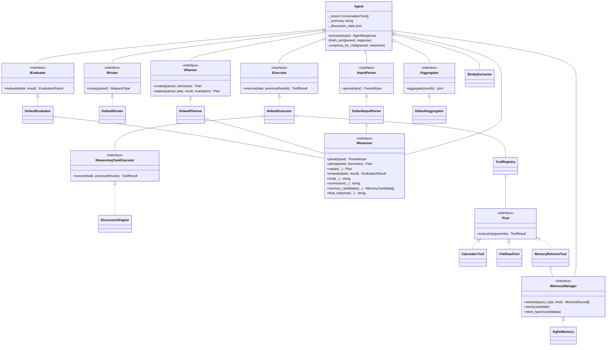
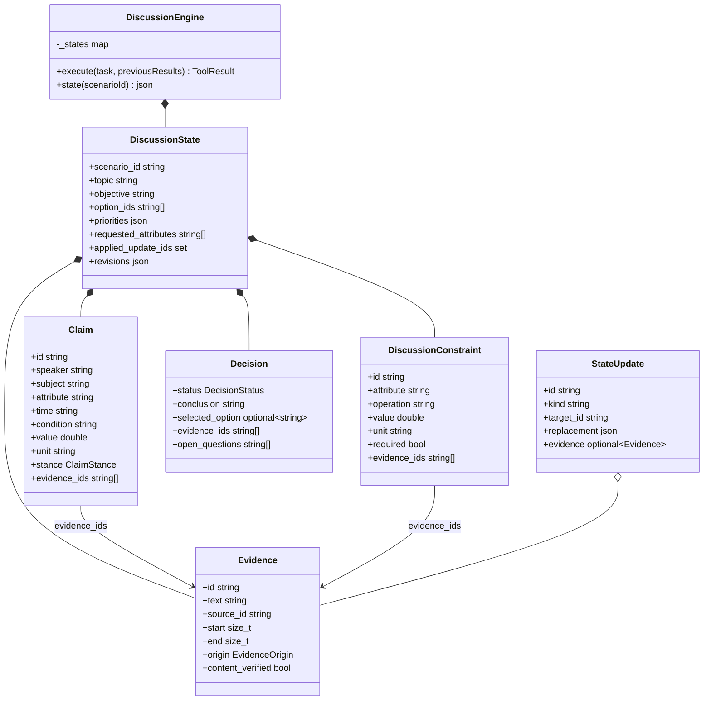
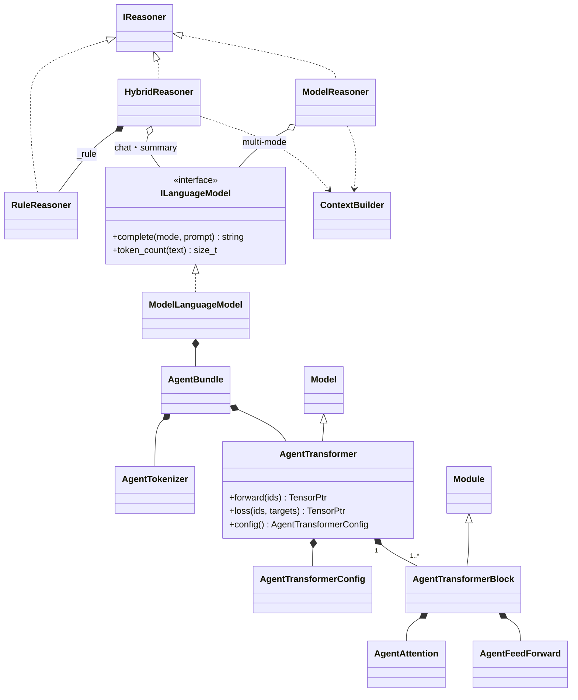
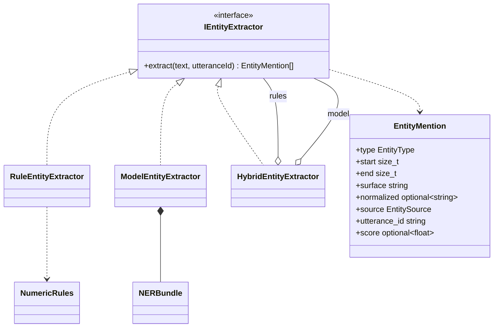
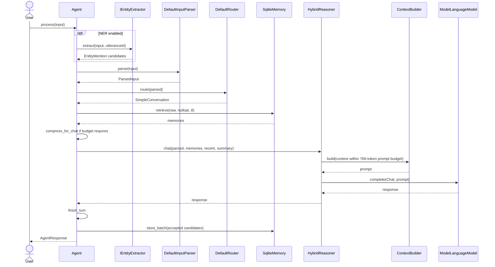
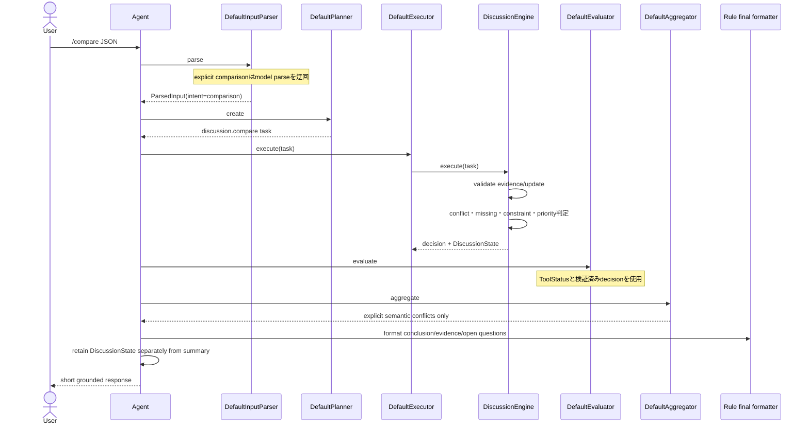
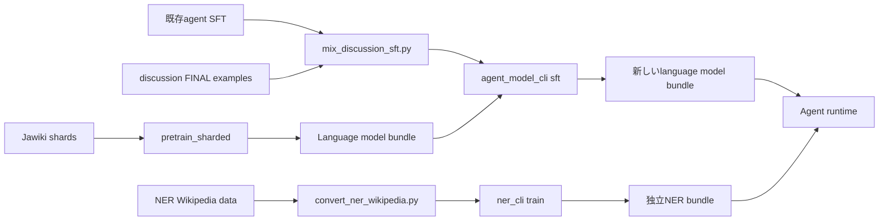

# Agent UML

2026-09-18時点の実装を示す。全体方針は[agent_overview.md](agent_overview.md)を参照。
読みやすさのため補助型と一部引数は省略している。

## 1. Agent制御、tool、限定Reasoning

## 2. 議論状態

`StateUpdate`相当のJSONは`correct_constraint`、`correct_claim`、`set_priorities`、
`retract_claim`として検証後に適用する。update IDで重複適用を防ぐ。

## 3. Reasonerと生成モデル

明示的な`/compare JSON`では`DefaultInputParser`と`DefaultPlanner`が決定的な経路を
作り、`DefaultEvaluator`もモデルによる自己評価を使わない。`ModelReasoner`の最終文も
検証済みdecisionを短く整形するだけで、判断内容を書き換えない。

## 4. NER

`EntityMention.start/end`はUTF-8 byte offsetの半開区間で、model内部のUnicode code
point位置から原文位置へ戻す。scoreは未校正logitであり正解確率ではない。

## 5. 通常会話シーケンス（hybrid）

## 6. 限定比較シーケンス

## 7. 学習とbundle

言語モデルとNERは別bundleである。既存事前学習をやり直さず、完了checkpointから
混合SFTを別出力へ作る。実行時に学習やdownloadはしない。
