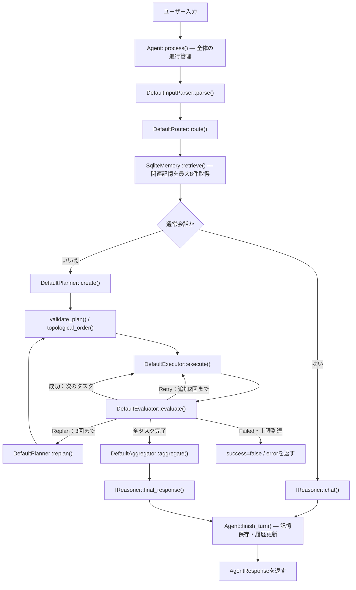
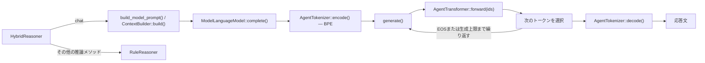
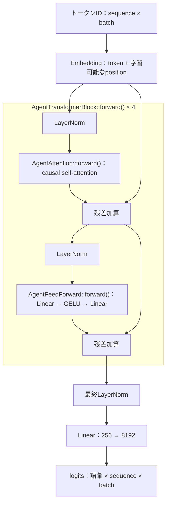
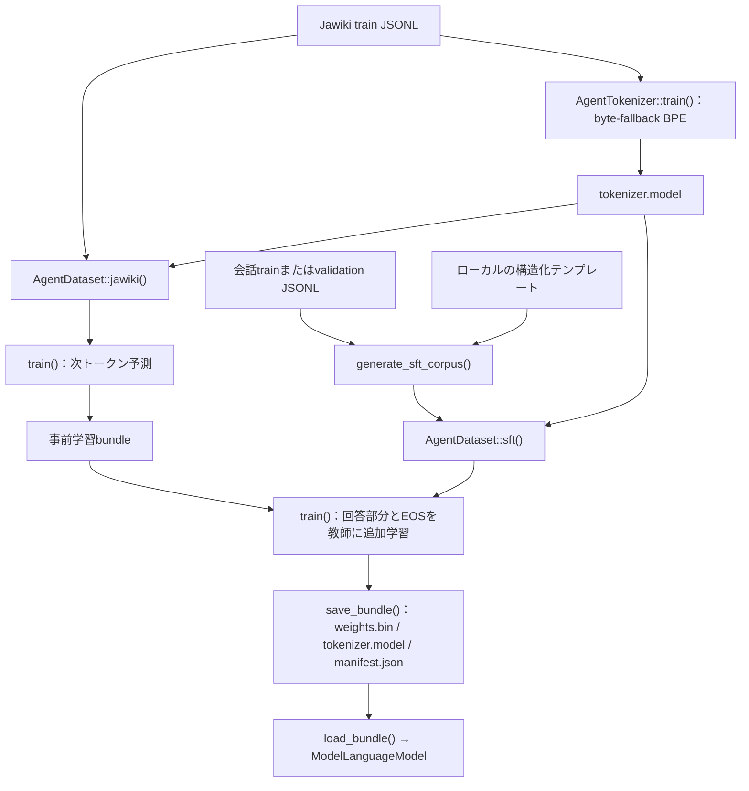

# AIAgent 概要図とコード対応

2026-09-16時点の作業ツリーの実装を参照。学習済みcheckpointの品質・学習完了状況を示す資料ではありません。別紙：[UML図](aiagent_uml.md)。図はMermaid対応のMarkdownビューアで表示できます。

## 1. 全体像：制御するAgentと、文章を生成するモデル

このプロジェクトでAgent全体を担うクラス名は `Agent`、ニューラルネットの本体は `AgentTransformer` です。`AIAgent` という単一のクラスがすべてを処理する構造ではありません。

`process()` は例外を捕捉し、エラー応答にします。計画不正・集約結果の矛盾などもエラーになります。図のループは概略で、実際には計画を依存順に逐次実行します。

## 2. モデルを使う場所：3種類のbackend

| 処理 | rule | hybrid | model |
|---|---|---|---|
| 入力解析・計画・再計画・評価 | RuleReasoner | RuleReasonerへ委譲 | ModelReasonerからモデルを呼ぶ |
| 通常会話 | ルール | 学習モデル | 学習モデル |
| 要約・記憶候補の抽出・最終文 | ルール | RuleReasonerへ委譲 | 学習モデル |
| 分岐・計画検証・実行ループ | C++ | C++ | C++ |
| ツール実行・SQLite検索と保存 | C++ | C++ | C++ |

`agent_cli` の既定は `rule`。`scripts/run_07_agent.sh` は明示的に `hybrid` を指定します。モデルを使うビルドは `AI_CPP_BUILD_MODEL=ON` が必要です。

プロンプトの先頭にはBOSとmode IDが付きます。`CHAT` と `FINAL` はtemperature/top-pによるサンプリング、それ以外はgreedyです。生成可能数はcontextの残り容量でも制限されます。現在の `generate()` は各ステップで履歴全体を `forward()` に渡します。

## 3. Transformer内部

下記は `AgentTransformerConfig` の既定値。ロード時はbundle内のconfigを使います。

| 項目 | 値 |
|---|---:|
| パラメータ数 | 7,624,192 |
| 語彙数 | 8,192 |
| ブロック数 | 4 |
| 埋め込み次元 | 256 |
| Attention heads | 4（各64次元） |
| FFN中間次元 | 1,024 |
| 最大context | 1,024 tokens（入力・生成で共有） |
| 学習時dropout | 0.1 |

Pre-LN方式のdecoder-only Transformerです。causal maskで未来のトークンを見ないようにします。図の残差配線は1ブロック分を示し、同じ構造を4回通ります。出力Linearと入力Embeddingの重みは独立しています。

## 4. BPE・事前学習・SFTの関係

会話データはRealPersonaChat等を前処理したJSONLを渡します。`chat` profileはCHATのみ、`agent` profileは会話とローカル生成データで7 modeを扱います。テンプレートからの生成はagent profileで使います。両profileは事前学習bundleを起点に選べる構成で、必ずchat SFT→agent SFTと連続学習するわけではありません。

BPEは「文字列とIDの変換」、SFTは「Transformerの重み更新」です。SFTは `BOS + mode + prompt + response + EOS` を組み立て、prompt部分の予測targetをPADにしてloss対象から除外します。`train()` は `loss()` → `backward()` → 勾配蓄積・クリッピング → Adam更新を行います。大規模Jawiki用には別経路の `pretrain_sharded()` もあります。

| mode | ModelReasoner側の対応メソッド | agent profile |
|---|---|---|
| CHAT | chat() | 学習対象 |
| PARSE | parse() | 学習対象 |
| PLAN | plan(), replan() | 学習対象 |
| EVALUATE | evaluate() | 学習対象 |
| SUMMARIZE | summarize() | 学習対象 |
| MEMORY_WRITE | memory_candidates() | 学習対象 |
| FINAL | final_response() | 学習対象 |
| MEMORY_QUERY / TOOL | 専用のモデル呼び出しなし | ID互換のために保持 |

9個のmode IDは9個の別モデルではありません。同じTransformerに処理の種類を伝える識別子です。`ModelReasoner::structured()` は構造化JSONを検査し、不正な場合は一度だけ修正を要求します。

## 5. 役割からクラス・関数・ファイルを探す

| 役割 | クラス・関数 | 実装 |
|---|---|---|
| 起動・backend選択・依存の組立 | main() | [app/main.cpp](../app/main.cpp) |
| 全体制御・ターン終了 | Agent::process(), finish_turn() | [agent.cpp](../src/agent/agent.cpp) |
| 入力解析・ルーティング | DefaultInputParser::parse(), DefaultRouter::route() | [components.cpp](../src/agent/components.cpp) |
| 計画と再計画 | DefaultPlanner::create(), replan() → IReasoner | [components.cpp](../src/agent/components.cpp) |
| DAG検証と実行順 | validate_plan(), topological_order() | [components.cpp](../src/agent/components.cpp) |
| 実行とツールの選択 | DefaultExecutor::execute(), ToolRegistry::execute() | [components.cpp](../src/agent/components.cpp) |
| 結果の評価・集約 | DefaultEvaluator::evaluate(), DefaultAggregator::aggregate() | [components.cpp](../src/agent/components.cpp) |
| ルール／モデル推論 | RuleReasoner, HybridReasoner, ModelReasoner | [reasoner.h](../include/ai/agent/reasoner.h), [reasoner.cpp](../src/agent/reasoner.cpp) |
| 文脈の組み立てと予算制限 | ContextBuilder::build(), build_model_prompt() | [context_builder.cpp](../src/agent/context_builder.cpp) |
| 長期記憶 | SqliteMemory::retrieve(), store_batch() | [memory.cpp](../src/agent/memory.cpp) |
| 計算・ファイル読取 | CalculatorTool::execute(), FileReadTool::execute() | [tools.cpp](../src/agent/tools.cpp) |
| 記憶検索ツール | MemoryRetrieveTool::execute() | [memory.cpp](../src/agent/memory.cpp) |
| 文章生成の入口 | ModelLanguageModel::complete(), generate() | [model_language_model.cpp](../model/src/model_language_model.cpp) |
| BPE | AgentTokenizer::train(), encode(), decode() | [agent_tokenizer.cpp](../model/src/agent_tokenizer.cpp) |
| ニューラルネット | AgentTransformer::forward(ids), loss() | [agent_transformer.cpp](../model/src/agent_transformer.cpp) |
| データ整形・SFT生成 | AgentDataset::jawiki(), sft(), generate_sft_corpus() | [agent_dataset.cpp](../model/src/agent_dataset.cpp) |
| 学習・検証 | train(), validate(), pretrain_sharded() | [agent_training.cpp](../model/src/agent_training.cpp) |
| 学習コマンドの入口 | main() | [agent_model_main.cpp](../train/agent_model_main.cpp) |

## 6. 記憶と実装上の境界

- 短期記憶は `Agent::_recent` の直近4ターン。超えた分は `IReasoner::summarize()` で `_summary` にまとめます。
- 長期記憶は `SqliteMemory`。Semantic・Episodic・ProjectをSQLiteで管理します。
- `finish_turn()` は候補のimportance ≥ 0.6、confidence ≥ 0.5、本文1〜16 KiBを確認して保存します。記憶候補を作ることとDBに保存することは別処理です。
- 独立したRetriever/Replannerクラスはなく、検索は `IMemoryManager::retrieve()`、再計画は `IPlanner::replan()` が担います。
- 計画は最大32タスクのDAG。現時点では逐次実行で、並列タスク実行ではありません。
- `DefaultExecutor` の非Toolタスクはoperation文字列を結果として返す簡易実装です。ロボット用の分類が存在することは、実機制御の実装完了を意味しません。
- 実行中に会話を保存しても、Transformerの重みは更新されません。モデル学習は学習CLIの別処理です。
