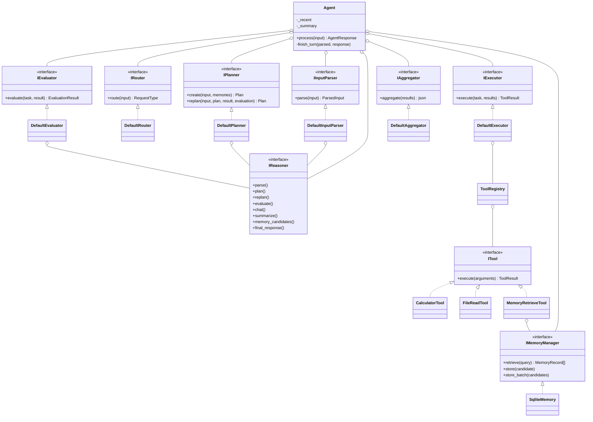
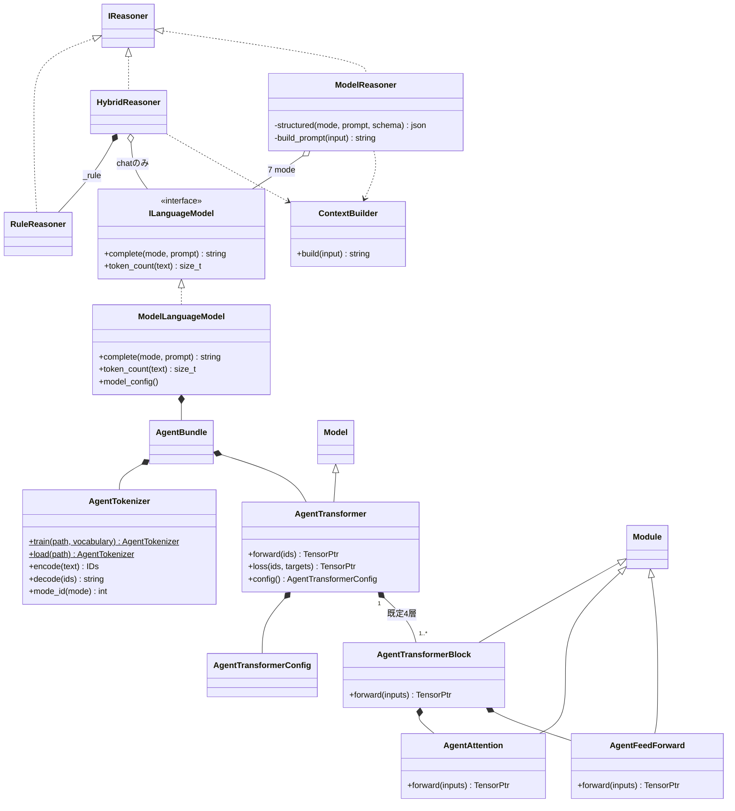
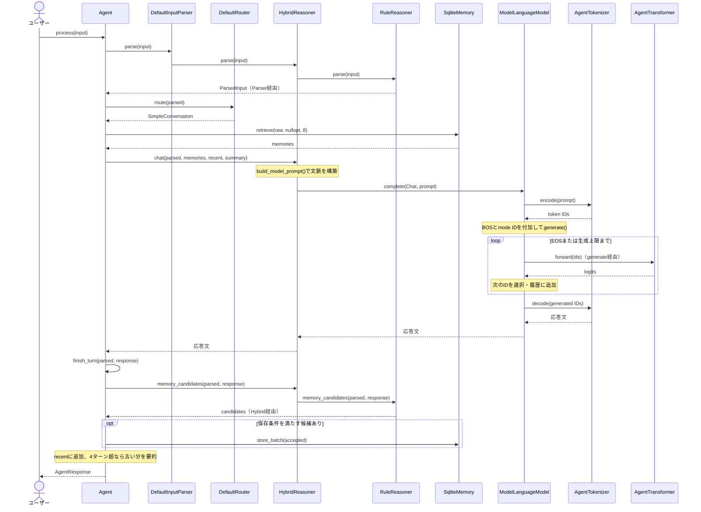
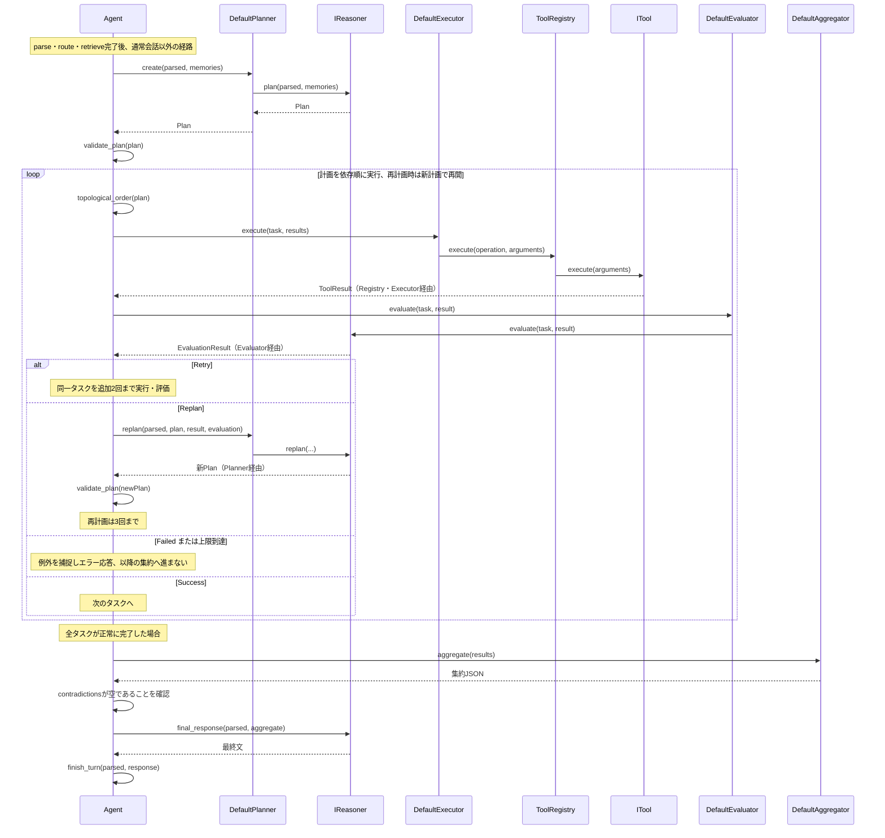

# AIAgent UML別紙

2026-09-16時点の作業ツリーに基づく主要クラスの抜粋。[概要・コード対応表](aiagent_overview.md)と併読してください。型・引数・補助メンバーは読みやすさのため一部省略しています。

凡例：白三角の破線はinterface実装、白三角の実線は継承、黒菱形は所有、白菱形は共有参照、点線矢印は利用です。

## 別紙A：Agent制御層のクラス図

## 別紙B：推論器とニューラルモデルのクラス図

`generate()`・`train()`・`validate()` はクラスではなく `ai::model` の自由関数です。`build_model_prompt()` も自由関数で、内部でContextBuilderを利用します。

## 別紙C：通常会話のシーケンス（hybrid）

## 別紙D：ツール実行のシーケンス

この図はTool型タスクの正常系を中心に示しています。`hybrid` では図中の `IReasoner` の計画・評価・最終文はすべてRuleReasonerへ委譲されます。`model` でも実際のツール実行はC++です。
