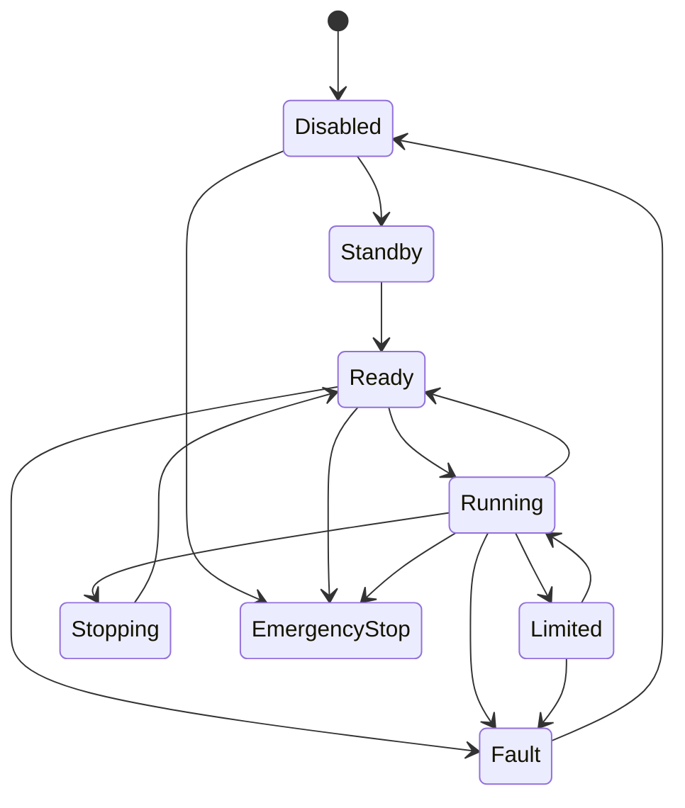

# ACT-MOD-003 Actuator Manager 詳細設計

# 1. 目的
各ActuatorのDescriptor、State、Driver、Command、Faultを一元管理する。

# 2. Registry
```cpp
struct ActuatorEntry
{
    ActuatorDescriptor descriptor;
    ActuatorState state;
    std::unique_ptr<IActuatorDriver> driver;
};
```

# 3. Interface
```cpp
class IActuatorManager
{
public:
    virtual ~IActuatorManager() = default;
    virtual void registerActuator(
        ActuatorDescriptor descriptor,
        std::unique_ptr<IActuatorDriver> driver
    ) = 0;
    virtual bool contains(const ActuatorId& id) const = 0;
    virtual ActuatorState getState(const ActuatorId& id) const = 0;
    virtual ActuatorDescriptor getDescriptor(const ActuatorId& id) const = 0;
};
```

# 4. 状態遷移


# 5. Recovery
```text
Fault/EmergencyStop → Disabled → Reset → Standby → Ready
```
Runningへ直接戻さない。

# 6. Command Correlation
Command IDとDrive Resultを対応付ける。

# 7. Test Point
register / duplicate ID / state transition / reset / command-result correlation


# 8. Hybrid Actuator管理

Actuator Managerは以下を同一Registryで管理する。

```text
ActuatorEntry
├── ActiveRotaryActuator
├── LinearActuator
├── BrakeControlledJoint
├── PassiveElasticJoint
└── TendonCableDrive
```

Passive Elastic JointはDrive Commandを持たなくても、Descriptor / State / Faultの管理対象とする。
Brake-Controlled Jointは角度制御ではなくLock / Release Commandを扱う。

# 9. Simulation Backend統合

実装の `ActuatorManager` は `ActuatorDescriptor` と `std::unique_ptr<IActuatorDriver>` を同一Registryで所有する。
ManagerはSimulation固有型を参照せず、以下を共通処理する。

- ID重複拒否
- enable / disable / stop
- `DriveCommand` のDriver転送
- `ActuatorState` の取得

Simulation時はFactoryが `SimActuatorDriver`、実機時は注入されたPhysical Driver Factoryが実機Driverを生成する。
決定論的なSimulation時間発展とPlant接続は `ISimActuatorDriver` 以下に限定し、Registryの処理は共通とする。
