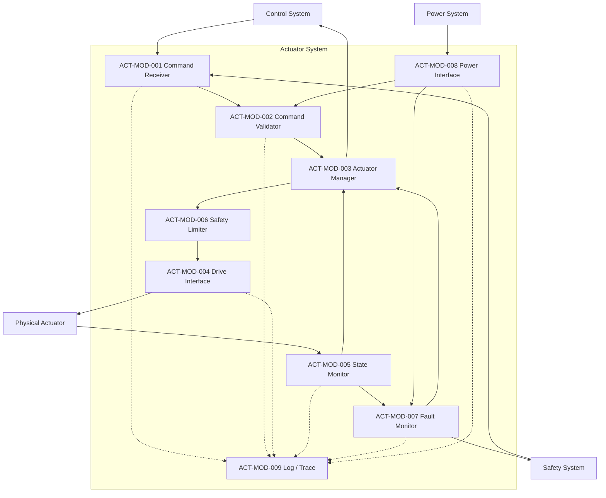

# Actuator System 詳細設計

# 1. 目的

本書は Actuator System 設計仕様書を基に、Actuator System の各モジュールおよび共通詳細設計を実装可能な粒度へ具体化するためのメイン文書である。

Actuator System は Control System から受信した Drive Command を安全に検証・制限し、Physical Actuator へ出力するとともに、Actuator State、Fault、Power State、Safety State を監視して上位Subsystemへ通知する。

本READMEでは全体構成と各詳細設計書へのリンクのみを示し、各モジュールのクラス構成、データ構造、状態遷移、処理フロー、Error処理、試験観点はリンク先に定義する。

# 2. 詳細設計一覧

## 2.1 モジュール詳細設計

| ID | モジュール | 概要 | 詳細設計 |
| :- | :- | :- | :- |
| ACT-MOD-001 | Command Receiver | Control / SafetyからDrive / Stop / EStop等を受信 | [詳細](./ACT-MOD-001_command_receiver.md) |
| ACT-MOD-002 | Command Validator | ID / Mode / Range / Timeout / Power / Faultを検証 | [詳細](./ACT-MOD-002_command_validator.md) |
| ACT-MOD-003 | Actuator Manager | Actuator登録、Descriptor、状態、Command統合管理 | [詳細](./ACT-MOD-003_actuator_manager.md) |
| ACT-MOD-004 | Drive Interface | Physical Actuator / Motor Driverへ駆動出力 | [詳細](./ACT-MOD-004_drive_interface.md) |
| ACT-MOD-005 | State Monitor | Position / Velocity / Torque / Current / Temperature取得 | [詳細](./ACT-MOD-005_state_monitor.md) |
| ACT-MOD-006 | Safety Limiter | Position / Velocity / Torque / Current / Temperature制限 | [詳細](./ACT-MOD-006_safety_limiter.md) |
| ACT-MOD-007 | Fault Monitor | OverCurrent / OverTemp / Sensor / Driver / Timeout等を監視 | [詳細](./ACT-MOD-007_fault_monitor.md) |
| ACT-MOD-008 | Power Interface | Power Available / Voltage / Current Limit / Fault取得 | [詳細](./ACT-MOD-008_power_interface.md) |
| ACT-MOD-009 | Log / Trace | Command / State / Fault / Safety / Versionを記録 | [詳細](./ACT-MOD-009_log_trace.md) |

## 2.2 共通詳細設計

| 詳細設計 | 内容 | 文書 |
| :- | :- | :- |
| Actuator Driver | Motor Driver Interface / PWM / Direction / Enable / Brake / Driver Fault | [詳細](./detail_actuator_driver.md) |
| Control Mode | Position / Velocity / Torque / Current / Stop / Disable | [詳細](./detail_control_modes.md) |
| Safety Sequence | Position Limit / SafeStop / EmergencyStop / Recovery | [詳細](./detail_safety_sequences.md) |
| Communication | Command / State Format / Timeout / Retry / Checksum | [詳細](./detail_communication.md) |
| Simulation Backend | Component model、Driver切替、Plant境界、Fault Injection | [詳細](./simulation_backend.md) |
| State Estimation | Velocity / Torque / Current / Temperature / Fusion | [詳細](./detail_state_estimation.md) |

## 2.3 採用市販Motor / Component Baseline
| 詳細設計 | 内容 | 文書 |
| :- | :- | :- |
| Commercial Motor Selection | Portescap 22ECT35 / 48 / 60、筋肉Group別本数、重量、Power Budget | [詳細](./detail_commercial_motor_selection.md) |
Prototype 1ではφ22 mm Portescap 22ECT Familyを標準Motor Familyとする。
# 3. システム構成



# 4. 共通優先順位

```text
EmergencyStop
    >
SafeStop
    >
SafetyLimit
    >
ControlCommand
```

Safety Eventを受信した場合は通常Command処理より優先する。

# 5. 共通型

```cpp
using ActuatorId = std::string;
using CommandId  = std::uint64_t;
using FaultId    = std::uint64_t;
using TraceId    = std::uint64_t;
using TimePoint  = std::chrono::steady_clock::time_point;
using Duration   = std::chrono::milliseconds;
```

Timeout、Stale判定には `steady_clock` を利用する。

# 6. 共通Enum

```cpp
enum class ControlMode
{
    Position,
    Velocity,
    Torque,
    Current,
    Stop,
    Disable,
    Lock,
    Release
};

enum class ActuatorStatus
{
    Disabled,
    Standby,
    Ready,
    Running,
    Limited,
    Stopping,
    Fault,
    EmergencyStop
};

enum class FaultLevel
{
    Normal = 0,
    Warning = 1,
    Limited = 2,
    Fault = 3,
    Critical = 4
};
```

# 7. 共通データ構造

## 7.1 ActuatorDescriptor

```cpp
struct ActuatorDescriptor
{
    ActuatorId actuatorId;
    ActuatorType type;
    Range positionLimit;
    Range velocityLimit;
    Range torqueLimit;
    Range currentLimit;
    Range temperatureLimit;
    std::vector<ControlMode> supportedModes;
    CommunicationInterface communication;

    std::optional<BrakeCapability> brake;
    std::optional<PassiveElasticParameters> passiveElastic;
    std::optional<LinearActuatorParameters> linear;
    std::optional<TendonDriveParameters> tendon;

    std::uint32_t version;
};
```

## 7.2 DriveCommand

```cpp
struct DriveCommand
{
    CommandId commandId;
    ActuatorId actuatorId;
    ControlMode mode;
    double target;
    std::optional<double> limit;
    TimePoint timestamp;
    Duration timeout;
};
```

## 7.3 ActuatorState

```cpp
struct ActuatorState
{
    ActuatorId actuatorId;
    double position;
    double velocity;
    double torque;
    double current;
    double temperature;
    ActuatorStatus status;
    std::optional<ActuatorFault> error;
    TimePoint timestamp;
};
```

# 8. 所有関係

```cpp
class ActuatorSystem
{
private:
    std::unique_ptr<ICommandReceiver>  _commandReceiver;
    std::unique_ptr<ICommandValidator> _commandValidator;
    std::unique_ptr<IActuatorManager>  _actuatorManager;
    std::unique_ptr<IDriveInterface>   _driveInterface;
    std::unique_ptr<IStateMonitor>     _stateMonitor;
    std::unique_ptr<ISafetyLimiter>    _safetyLimiter;
    std::unique_ptr<IFaultMonitor>     _faultMonitor;
    std::unique_ptr<IPowerInterface>   _powerInterface;
    std::unique_ptr<IActuatorLog>      _log;
};
```

単一所有でよいものは `std::unique_ptr` を基本とする。

# 9. 実行モデル

```text
Receive Command
    ↓
Validate
    ↓
Apply Safety Limit
    ↓
Drive Output
    ↓
Read State
    ↓
Fault Check
    ↓
Notify / Log
```

Safety入力は高優先Eventとして扱える構造とする。

# 10. 初期実装方針

実機未接続でも試験可能とする。

```text
IActuatorDriver
├── MockActuatorDriver
└── PhysicalActuatorDriver

IPowerInterface
├── FakePowerInterface
└── PhysicalPowerInterface
```

# 11. 実装構成案

```text
include/actuator/
├── ActuatorSystem.hpp
├── common/
├── command/
├── manager/
├── drive/
├── monitor/
├── safety/
├── fault/
├── power/
└── logging/

src/actuator/
├── ActuatorSystem.cpp
├── command/
├── manager/
├── drive/
├── monitor/
├── safety/
├── fault/
├── power/
└── logging/

tests/actuator/
```

# 12. 実装順序

```text
Phase 1  Common Types / Descriptor
Phase 2  Actuator Manager
Phase 3  Command Receiver / Validator
Phase 4  Mock Drive Interface
Phase 5  State Monitor
Phase 6  Safety Limiter
Phase 7  Fault Monitor
Phase 8  Power Interface
Phase 9  Log / Trace
Phase 10 Physical Driver
Phase 11 Position / Velocity / Torque / Current Control
```

# 13. 完了条件

- ACT-MOD-001〜009のInterfaceが存在する
- Mock DriverでDriveCommandを実行可能
- State Monitorで状態取得可能
- Safety Limitを適用可能
- EmergencyStopが通常Commandより優先される
- Fault検出を上位へ通知可能
- Power不可時にDriveCommandを実行しない
- Command IDとResultを追跡可能
- 実機なしでUnit Test可能


# 14. 採用機構アーキテクチャ

本詳細設計では以下の人型ロボット機構を初期対象とする。

| 部位 | 方式 | 詳細 |
| :- | :- | :- |
| Neck | Sternocleidomastoid + Splenius capitis muscle-like actuators | [詳細](./detail_neck_mechanism.md) |
| Shoulder / Scapular girdle | Free-joint concept + muscle-like actuators: Deltoid / Pectoralis major / Serratus anterior / Trapezius / Latissimus dorsi | [詳細](./detail_upper_limb_mechanism.md) |
| Elbow | Biceps brachii muscle-like actuator for flexion; extension side TBD | [上肢詳細](./detail_upper_limb_mechanism.md) |
| Waist | Dual Electric Linear Cylinder + Load-bearing Spine + Lock | [詳細](./detail_waist_linear_mechanism.md) |
| Hip / Thigh | Gluteus maximus / Rectus femoris / Biceps femoris / Adductor magnus muscle-like actuators | [詳細](./detail_lower_limb_hybrid_mechanism.md) |
| Knee | Passive Joint + Optional Electromagnetic Lock | [詳細](./detail_brake_controlled_joint.md) |
| Ankle | Passive Spring-Damper Joint | [詳細](./detail_passive_elastic_joint.md) |
| Muscle Actuator Common | Multi-motor bundle / transmission / line-of-action rules | [詳細](./detail_muscle_like_actuator.md) |

この構成により、Actuator SystemはMuscle-Like Multi-Motor / Linear Cylinder / Brake-Controlled / Passive Elastic / Tendon-Cable Transmissionを共通管理する。
