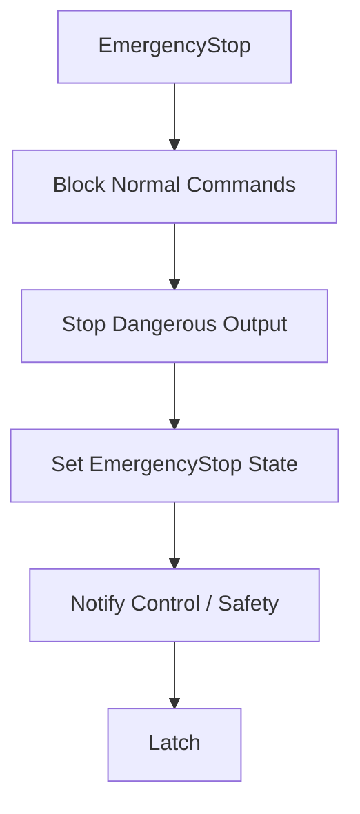

# Safety Sequence 共通詳細設計

# 1. 目的
Safety Limit、SafeStop、EmergencyStop、Recoveryの共通Sequenceを定義する。

# 2. EmergencyStop


# 3. Latch
EmergencyStopは明示Resetまで解除しない。

# 4. SafeStop
1. 新規Command受付停止
2. Velocity / Torqueを安全範囲へ低減
3. 姿勢維持
4. 把持物保持
5. Stop
6. Safe状態へ遷移

# 5. Recovery
```text
EmergencyStop
→ Safe Condition Check
→ Explicit Reset
→ Disabled
→ Standby
→ Ready
```
Runningへ直接戻さない。

# 6. Limit Violation
重大度に応じ Clamp / Reject / Limited / SafeStop / EmergencyStop を選択する。

# 7. Test Point
EStop priority / latch / explicit recovery / safe stop / held object preservation
