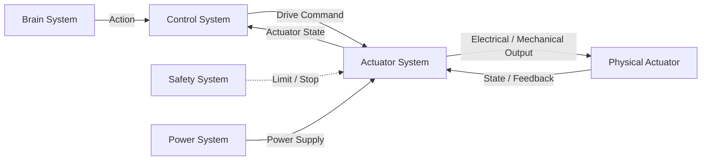
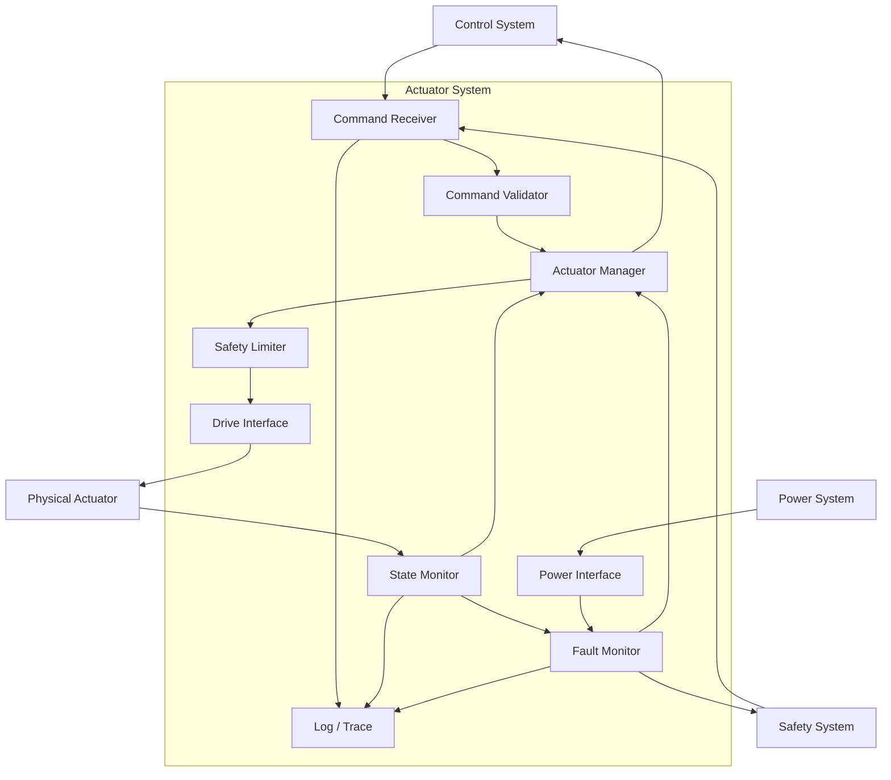
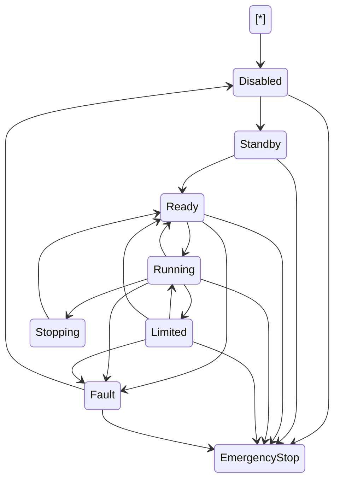
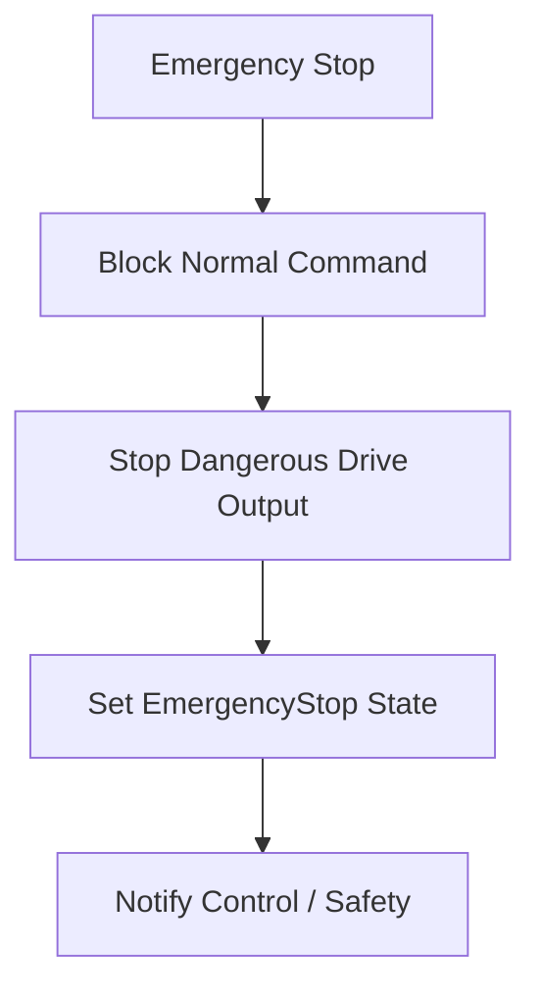
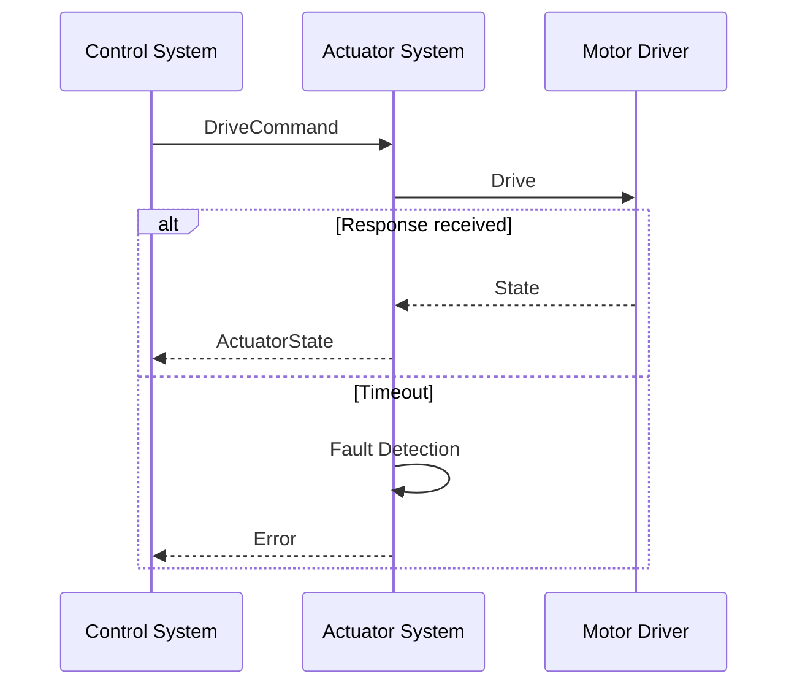

# Actuator System 設計仕様書

# 1. 目的

本書は、Actuator System 要求仕様書に基づき、人型ロボットに搭載する Actuator System の構成、機能分割、状態管理、駆動指令、インタフェース、安全設計、異常処理および拡張方針を定義する。

Actuator System は、Control System から受信した駆動指令に従い、関節、ハンド、グリッパ、脚部、頭部、頸部その他の可動部を駆動し、ロボットの物理動作を実現する。

本書では Actuator System の基本設計を対象とし、モータドライバ回路、PWM生成方式、電流制御則、モータ定数、減速機構、制御ゲイン等の詳細については各詳細設計書で定義する。

# 2. 関連文書

| 文書名 | 内容 |
| :- | :- |
| [Actuator System 要求仕様書](../requirement/README.md) | Actuator System が満たすべき要求 |
| [システム要求仕様書](../../../design_system/requirement/README.md) | ロボットシステム全体の要求 |
| [システム設計仕様書](../../../design_system/spec/README.md) | システム全体構成と Actuator System の位置付け |
| [Control System 要求仕様書](../../Control/requirement/README.md) | Actuator へ出力する制御指令に関する要求 |
| [Safety System 要求仕様書](../../Safety/requirement/README.md) | 制限、停止、非常停止に関する要求 |
| [Power System 要求仕様書](../../Power/requirement/README.md) | Actuator への電力供給に関する要求 |
| [Sensor System 要求仕様書](../../Sensor/requirement/README.md) | Position、Current、Temperature 等の状態取得に関する要求 |

# 3. 設計方針

## 3.1 責務

Actuator System は以下を担当する。

- 駆動指令の受信
- 指令値の妥当性確認
- アクチュエータへの駆動出力
- アクチュエータ状態の取得
- Safety 制限の適用
- 異常検出
- 状態および Error の上位通知
- 非常停止時の安全な出力停止

## 3.2 責務分離

Actuator System は高レベルの動作計画を行わない。



## 3.3 安全優先

Actuator System は通常の Control Command より Safety Command を優先する。

優先順位を以下とする。

```text
Emergency Stop
    >
Safe Stop
    >
Safety Limit
    >
Control Command
```

# 4. システム構成

Actuator System は以下のモジュールから構成する。

| ID | モジュール | 主な責務 |
| :- | :- | :- |
| ACT-MOD-001 | Command Receiver | Control / Safety 指令の受信 |
| ACT-MOD-002 | Command Validator | 指令値、範囲、状態の妥当性確認 |
| ACT-MOD-003 | Actuator Manager | 各 Actuator の識別・管理 |
| ACT-MOD-004 | Drive Interface | 実アクチュエータへの駆動出力 |
| ACT-MOD-005 | State Monitor | Position / Velocity / Torque 等の取得 |
| ACT-MOD-006 | Safety Limiter | Position / Velocity / Torque / Current 等の制限 |
| ACT-MOD-007 | Fault Monitor | 過電流、過熱、通信異常等の検出 |
| ACT-MOD-008 | Power Interface | Power System 状態の取得 |
| ACT-MOD-009 | Log / Trace | 指令、状態、Error の記録 |


# 5. Actuator 管理

## 5.1 Actuator ID

各 Actuator は一意に識別可能な ID を持つ。

例：

```text
right_shoulder_pitch
right_elbow
left_knee
right_gripper
neck_yaw
```

## 5.2 Actuator 種別

Actuator System は、モータ駆動関節だけでなく、直動、制動、受動弾性、腱・ワイヤ伝達を含む以下の Actuation Type を扱う。

| Type | 内容 | 代表用途 |
| :- | :- | :- |
| Muscle-Like Multi-Motor Actuator | 小型BLDCを複数連動し、人体筋肉の起始・停止方向を模倣して力を生成 | 首、肩・肩甲帯、肘、股関節・大腿部 |
| Linear Actuator | 直動アクチュエータ | 腰 Pitch / Roll |
| Brake-Controlled Joint | 駆動源を持たず Lock / Release を制御する関節 | 膝、腰 Spine Lock |
| Passive Elastic Joint | Spring / Damper を用いる受動関節 | 足首 |
| Tendon / Cable Transmission | 筋肉模倣Actuatorの力を腱・ワイヤで伝達 | 肩甲骨・上腕骨連動、必要に応じ各関節 |
| Hand | 多指ハンド | 手指 |
| Gripper | 把持機構 | グリッパ |
| Other | 拡張アクチュエータ | 将来拡張 |

Actuator の追加時に上位 System の処理を変更しないため、Actuation Type ごとの差異は Descriptor および Driver Interface で吸収する。

## 5.3 Actuator Descriptor**

Actuator ごとに以下の設定情報を保持可能とする。

```text
ActuatorDescriptor
├── Actuator ID
├── Type
├── Actuation Type
├── Transmission Type
├── Position Limit
├── Velocity Limit
├── Torque Limit
├── Current Limit
├── Temperature Limit
├── Control Mode
├── Communication Interface
├── Brake / Lock Capability
├── Passive Stiffness / Damping
├── Stroke / Linear Force Limit
├── Tendon / Cable Parameters
└── Version
```

# 6. 駆動指令設計

## 6.1 Drive Command

Control System から以下の形式で指令を受信可能とする。

```text
DriveCommand
├── Command ID
├── Actuator ID
├── Control Mode
├── Target
├── Limit
├── Timestamp
└── Timeout
```

## 6.2 Control Mode

少なくとも以下を扱える構成とする。

- Position
- Velocity
- Torque
- Current
- Stop
- Disable
- Lock
- Release

`Lock / Release` は Brake-Controlled Joint 等で使用する。Passive Elastic Joint は能動 Control Mode を持たず、状態監視対象として管理してよい。

すべての Actuator が全 Control Mode を実装する必要はなく、対応可否は Actuator Descriptor で定義する。

## 6.3 指令妥当性確認

受信した指令について以下を確認する。

- Actuator ID が有効か
- Control Mode が対応しているか
- Target が許容範囲内か
- Safety 制限に違反していないか
- Power State が駆動可能か
- Actuator が Error 状態でないか
- Command が Timeout していないか

不正な指令はそのまま実行しない。

# 7. 状態管理

## 7.1 Actuator State

各 Actuator は以下の状態を保持する。

```text
ActuatorState
├── Actuator ID
├── Position
├── Velocity
├── Torque
├── Current
├── Temperature
├── Brake / Lock State
├── Spring Deflection
├── Linear Stroke / Force
├── Tendon Tension
├── Status
├── Error
└── Timestamp
```

## 7.2 Status

以下の状態を扱う。

| Status | 内容 |
| :- | :- |
| Disabled | 無効 |
| Standby | 待機 |
| Ready | 駆動可能 |
| Running | 駆動中 |
| Limited | Safety制限中 |
| Stopping | 停止処理中 |
| Fault | 異常 |
| EmergencyStop | 非常停止 |
## 7.3 状態遷移



# 8. 状態取得

## 8.1 Position

Actuator の現在位置を取得する。

回転関節では角度、直動機構では変位として扱う。

## 8.2 Velocity

Actuator の現在速度を取得または算出する。

## 8.3 Torque

必要に応じて Torque Sensor、Motor Current 等から推定または取得する。

## 8.4 Current

Motor / Driver の Current を取得可能とする。

## 8.5 Temperature

Motor、Driver 等の Temperature を取得可能とする。

## 8.6 Error

Actuator または Driver から通知される Error を取得し、共通 Error へ変換する。

# 9. Safety Limiter

## 9.1 Position Limit

Target Position が許容範囲を超える場合、以下のいずれかを実行する。

- Reject
- Clamp
- SafeStop

具体的な動作は詳細設計で定義する。

## 9.2 Velocity Limit

Velocity Command または実速度が制限値を超えないよう制御する。

## 9.3 Torque / Current Limit

Torque および Current が許容値を超えないよう制限する。

## 9.4 Temperature Limit

Temperature に応じて以下を行う。

```text
Normal
   ↓
Warning
   ↓
Output Limited
   ↓
Stop
```

## 9.5 Safety Command

Safety System から以下を受信可能とする。

```text
SafetyCommand
├── Target Actuator
├── Safety Level
├── Position Limit
├── Velocity Limit
├── Torque Limit
├── Current Limit
├── Stop Request
└── Emergency Stop
```

# 10. Emergency Stop

Emergency Stop 受信時は通常指令処理を中断する。



Emergency Stop 復帰後も自動で Running へ戻らず、上位からの明示的な復帰処理を必要とする。

# 11. Safe Stop

Emergency Stop より緩やかな停止が許容される場合、Safe Stop を実行する。

Safe Stop は以下を考慮する。

- 姿勢維持
- 落下防止
- 把持物落下防止
- 急激なトルク解除防止
- 動作速度低下後の停止
- 支持脚膝 Brake の適切な Lock
- 腰 Spine Lock の適切な Lock
- 足首 Passive Elastic Joint の反力を考慮した停止
- Tendon / Cable tension の危険な急解放防止

具体的な Safe Stop Sequence は機体構成ごとの詳細設計で定義する。

# 12. Fault Monitor

## 12.1 監視対象

以下を監視する。

- Over Current
- Over Temperature
- Position Sensor Error
- Velocity Sensor Error
- Driver Error
- Communication Error
- Command Timeout
- Power Error
- Response Error

## 12.2 Fault Level

| Level | 内容 | 処置 |
| :- | :- | :- |
| 0 | Normal | 継続 |
| 1 | Warning | 通知・監視 |
| 2 | Limited | 出力制限 |
| 3 | Fault | 対象Actuator停止 |
| 4 | Critical | Emergency Stop要求 |

# 13. センサ不整合

複数情報から得られる状態に矛盾がある場合、Sensor Mismatch として扱う。

例：

```text
Commanded Position = 30 deg
Encoder Position   = 30 deg
Mechanical Limit   = 20 deg
→ inconsistent
```

不整合が安全性に影響する場合は対象 Actuator を停止する。

# 14. 指令応答監視

Command 送信後、Actuator が一定時間応答しない場合は Command Response Error とする。



# 15. Control System インタフェース

## 15.1 Input

- DriveCommand
- Enable / Disable
- Stop
- Reset
- Control Mode

## 15.2 Output

- ActuatorState
- Drive Result
- Error
- Warning
- Limit State

## 15.3 Command / Result 対応

Command ID を用いて指令と結果を対応付ける。

# 16. Safety System インタフェース

Actuator System は Safety System と以下を送受信する。

## Input

- Safety Level
- Limit Value
- SafeStop
- EmergencyStop

## Output

- Actuator State
- Fault
- Current
- Temperature
- Limit Violation

# 17. Power System インタフェース

Power System から以下を取得する。

- Power Available
- Voltage
- Current Limit
- Battery State
- Power Error

Power 状態が駆動不能の場合、新規 Drive Command を実行しない。

# 18. 通信断時設計

## 18.1 Control System 通信断

Control System との通信断を検出した場合、新規 Drive Command を受付停止する。

既存動作については Actuator 種別および Safety 設計に応じて以下のいずれかへ移行する。

- Hold
- Controlled Stop
- SafeStop

## 18.2 Safety System 通信断

Safety System との通信断は安全関連異常として扱う。

必要に応じて Safety Level を上げる。

# 19. Power 異常時設計

以下の場合に Power Fault とする。

- Under Voltage
- Over Voltage
- Power Supply Lost
- Current Limit Exceeded

Power Fault 時は危険な Drive Output を継続しない。

# 20. Log / Trace

以下を記録可能とする。

- DriveCommand
- Command Validation Result
- ActuatorState
- Safety Limit
- Safety Command
- Fault
- Warning
- Power State
- Control Mode
- EmergencyStop
- Software Version
- Actuator Configuration Version

各ログには Timestamp を付与する。

# 21. 拡張性設計

Actuator の追加または交換時に上位システムへの影響を最小限とするため、共通 Actuator Interface を使用する。

```text
Actuator Interface
├── configure()
├── enable()
├── disable()
├── command()
├── stop()
├── lock() / release()
├── getState()
├── resetFault()
└── getDescriptor()
```

具体的な C++ Interface は詳細設計で定義する。

# 22. 試験性設計

以下を個別に試験可能とする。

- Command Receiver
- Command Validator
- Position Limit
- Velocity Limit
- Torque / Current Limit
- Temperature Limit
- EmergencyStop
- SafeStop
- Fault Detection
- Communication Timeout
- Power Fault
- State Monitor
- Brake Lock / Release
- Linear Actuator Stroke / Force
- Passive Spring / Damper State
- Tendon / Cable Tension

実アクチュエータなしでも Driver 応答を模擬可能な構成とする。

# 23. 要求トレーサビリティ

| 要求ID | 設計項目 |
| :- | :- |
| REQ-ACT-SYS-001 | Command Receiver |
| REQ-ACT-SYS-002 | Drive Interface |
| REQ-ACT-SYS-003 | State Monitor |
| REQ-ACT-SYS-004 | Actuator Manager / Actuator ID |
| REQ-ACT-SYS-005 | Fault Monitor |
| REQ-ACT-SYS-006 | Safety Limiter |
| REQ-ACT-STATE-001 ～ 007 | Actuator State / State Monitor |
| REQ-ACT-DRV-001 ～ 004 | Drive Command / Drive Interface |
| REQ-ACT-DRV-005 | Command Validator / Safety Limiter |
| REQ-ACT-DRV-006 | Fault Monitor |
| REQ-ACT-SAFE-001 | Emergency Stop |
| REQ-ACT-SAFE-002 | Position Limit |
| REQ-ACT-SAFE-003 | Velocity Limit |
| REQ-ACT-SAFE-004 | Torque / Current Limit |
| REQ-ACT-SAFE-005 | Temperature Limit |
| REQ-ACT-SAFE-006 | 通信断時設計 |
| REQ-ACT-IF-001 | Control System Interface |
| REQ-ACT-IF-002 | Safety System Interface |
| REQ-ACT-IF-003 | Power System Interface |
| REQ-ACT-IF-004 | State / Fault Output |
| REQ-ACT-IF-005 | 共通 Actuator Interface |
| REQ-ACT-ERR-001 | Over Current Detection |
| REQ-ACT-ERR-002 | Over Temperature Detection |
| REQ-ACT-ERR-003 | Sensor Mismatch |
| REQ-ACT-ERR-004 | Command Response Monitor |
| REQ-ACT-ERR-005 | SafeStop / EmergencyStop |
| REQ-ACT-QUAL-001 | 試験性設計 |
| REQ-ACT-QUAL-002 | Log / Trace |
| REQ-ACT-QUAL-003 | Actuator Descriptor |
| REQ-ACT-QUAL-004 | 拡張性設計 |

# 24. 詳細設計対象

以下は詳細設計で定義する。

## 24.1 Actuator Driver

- Motor Driver Interface
- PWM
- Direction Control
- Enable / Disable
- Brake
- Driver Fault

## 24.2 Control Mode

- Position Control
- Velocity Control
- Torque Control
- Current Control
- Mode切替条件

## 24.3 Safety

- Position Limit値
- Velocity Limit値
- Torque Limit値
- Current Limit値
- Temperature Limit値
- SafeStop Sequence
- EmergencyStop Sequence

## 24.4 Communication

- Command Format
- State Format
- Protocol
- Timeout
- Retry
- Checksum

## 24.5 State Estimation

- Velocity算出
- Torque推定
- Current Filter
- Temperature Filter
- Sensor Fusion

# 25. 採用する機構アーキテクチャ

本設計では初期人型ロボットの機構方針として以下を採用する。

## 25.1 上肢

```text
胸 / 背中 Motor
    ↓ Tendon / Cable
肩甲骨 + 上腕骨連動機構
    ↓
肘 Local Motor
```

肩部へ多数の Motor を集中配置せず、Motor質量をTorso側へ寄せる。肩甲骨の回旋・前後移動と上腕骨運動を連動させ、少ない駆動源で広い作業域を得る。

## 25.2 腰

```text
Left Rib Attachment      Right Rib Attachment
        \                  /
         Linear Actuator x2
               \        /
          Load-bearing Spine
            + Spine Lock
                 |
               Pelvis
```

左右 Linear Actuator の同相・差動変位により主に Waist Pitch / Roll を生成する。中央 Spine は上半身の圧縮荷重・主要 Load Path を受け、Linear Actuator に不要な横荷重を与えない。Spine Lock は静止保持時の消費電力低減および安全保持に利用する。Yaw は初期構成では能動駆動対象外とし、必要に応じ Passive / Lock 機構として拡張する。

## 25.3 下肢

```text
Hip / Thigh      : Muscle-like multi-motor actuators
                   Gluteus maximus / Rectus femoris /
                   Biceps femoris / Adductor magnus
Knee             : Passive joint + optional electromagnetic lock
Ankle            : Passive Spring-Damper Joint
```

股関節・大腿部は人体筋肉の走行を参考に配置した複数の小型BLDC Actuator群で連続運動を生成する。膝は Motor で角度を能動生成せず、遊脚時は受動運動を許容し、必要に応じ支持脚時等でElectromagnetic Lockを使用する。膝角度SensorはLock timingの制御および状態監視に使用する。

足首は Motor を持たず、Spring-Damper により着地衝撃・高周波振動を吸収し、受動的な地面追従性を得る。

## 25.4 設計思想

- 動作エネルギーを供給する箇所には Active Actuator を使用する。
- 姿勢保持を主目的とする箇所には Brake / Lock を使用する。
- 衝撃吸収・エネルギー蓄積・地面追従には Passive Elastic Element を使用する。
- 重い Motor は可能な限り Torso / Pelvis 側へ集中し、末端慣性を低減する。
- Active DOF を減らした結果必要となる状態推定・Hybrid Control は Control System 側で扱う。

# 26. 未確定事項

- Motor FamilyはPortescap 22ECT35 / 22ECT48 / 22ECT60をBaseline採用済み。巻線・個別型式suffixは詳細選定TBD。
- Motor Driver
- Gear Ratio
- Encoder種類
- Position Range
- Maximum Velocity
- Maximum Torque
- Maximum Current
- Maximum Temperature
- Control Mode対応範囲
- Control Cycle
- Communication Protocol
- Command Timeout
- SafeStop方式
- Knee Brake 種類、保持Torque、Release時間
- Spine Lock 種類、保持Torque、Release時間
- Waist Linear Actuator 種類、Stroke、最大推力、最大速度
- Waist Linear Actuator 取付位置・実効Moment Arm
- Ankle Spring Constant / Damping Coefficient / Mechanical Limit
- Tendon / Cable 材質、Pretension、最大張力、Routing
- Shoulder linkage / differential geometry
- Brake方式
- Power Cut方式

# 27. 市販Motor Baseline
## 27.1 標準Family
筋肉模倣Active ActuatorのPrototype 1標準MotorはPortescap 22ECT Ultra ECシリーズとする。
| Class | Model | Diameter | Length | Max continuous mechanical power @25°C | Weight |
| :- | :- | --: | --: | --: | --: |
| S | 22ECT35 | 22 mm | 35 mm | 34 W | 67 g |
| M | 22ECT48 | 22 mm | 48 mm | 54 W | 98 g |
| L | 22ECT60 | 22 mm | 60 mm | 86 W | 123 g |
24 V windingを基本候補とする。
## 27.2 筋肉Groupへの割当
```text
Neck:
  Sternocleidomastoid : 22ECT35 ×1 / side
  Splenius capitis    : 22ECT35 ×1 / side
Upper body:
  Biceps brachii      : 22ECT35 ×2 / side
  Deltoid             : 22ECT35 ×3 / side
  Serratus anterior   : 22ECT35 ×2 / side
  Trapezius           : 22ECT35 ×2 / side
  Pectoralis major    : 22ECT48 ×2 / side
  Latissimus dorsi    : 22ECT48 ×2 / side
Lower body:
  Gluteus maximus     : 22ECT60 ×3 / side
  Rectus femoris      : 22ECT48 ×2 / side
  Biceps femoris      : 22ECT48 ×2 / side
  Adductor magnus     : 22ECT48 ×2 / side
Waist:
  Dual linear cylinder: 22ECT60 ×1 / cylinder (provisional)
```
合計50 MotorをBaselineとする。
## 27.3 Motor重量
Bare Motor合計は約4.42 kgとする。
Transmission、Driver、Harness、Bearing、Coolingは別途Mass Budgetへ計上する。
## 27.4 出力管理
Installed maximum continuous mechanical ratingの単純合算値は約2.52 kWである。
ただし全Motor同時最大運転を許容する意味ではない。
Control / Power SystemはGlobal Power Budgetを管理し、以下を制御する。
- Motor group simultaneous duty
- Current limit
- Thermal derating
- Battery state derating
- Safety level derating
## 27.5 Mission Power Target
30 kg Robotの初期Mission Target:
```text
Battery nominal energy : 約1.2 kWh
Usable ratio           : 0.8
Usable energy          : 約0.96 kWh
Nominal operation      : 平均 <= 190 W
Intense operation      : 平均 <= 1.2 kW
Short peak target      : <= 2.0 kW級
```
Nominal operationで5 h以上、Intense operationで45 min以上を目標とする。
## 27.6 詳細
Motor本数、Screw Lead、Stroke、Cable Routing、Moment Armの詳細は `../05_actuator_detail/detail_commercial_motor_selection.md` を参照する。
# 28. 未確定事項（更新）
- Shoulder / Hip各ActuatorのMoment Arm
- Ball Screw / Lead Screw選定
- Actuator Stroke
- Tendon / Cable材質およびPretension
- Knee Electromagnetic Lock型番
- Ankle Spring / Damper定数
- Waist Cylinder最終推力 / Stroke / Speed
- Motor Driver型番
- Cooling方式
- Elbow extension側のActuator要否
- Hand機構
