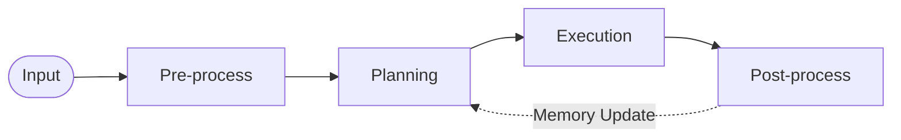
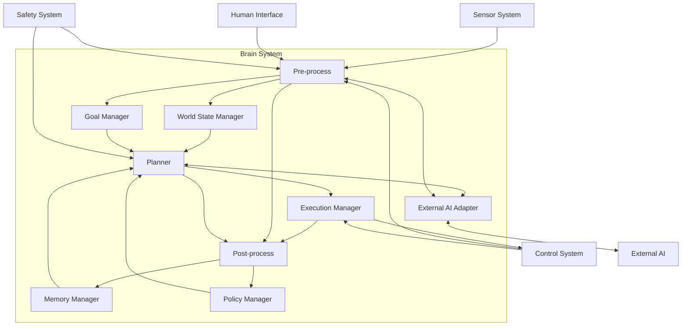
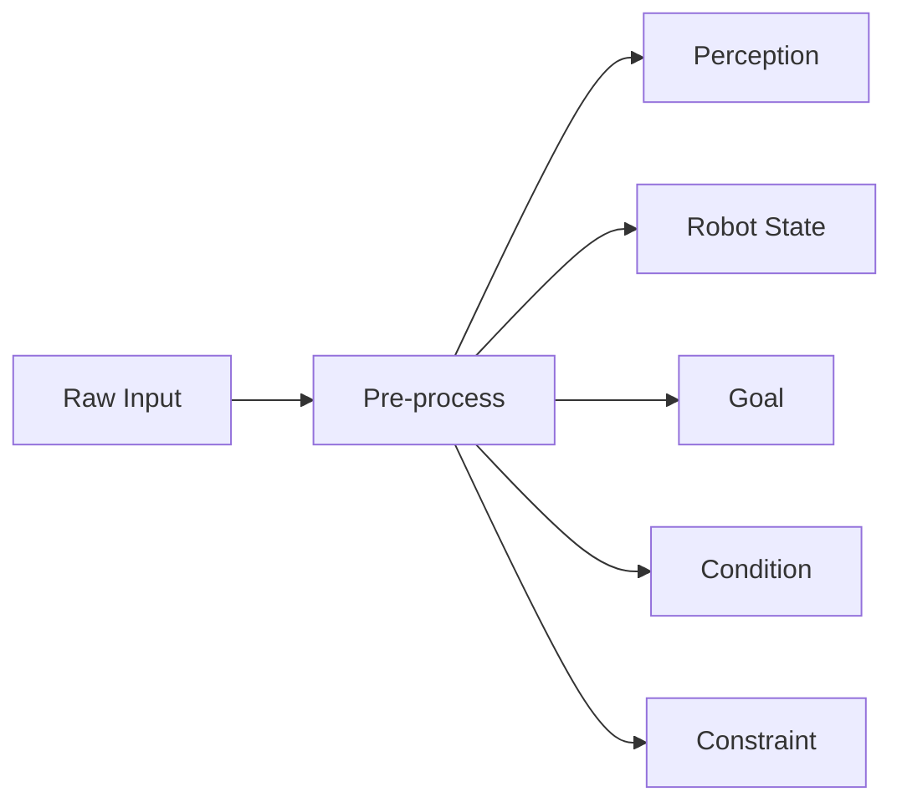
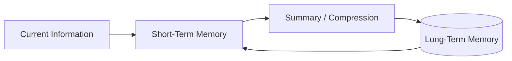
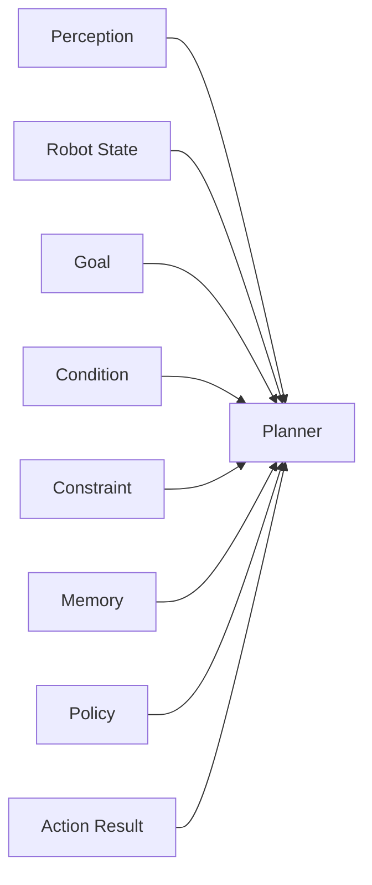
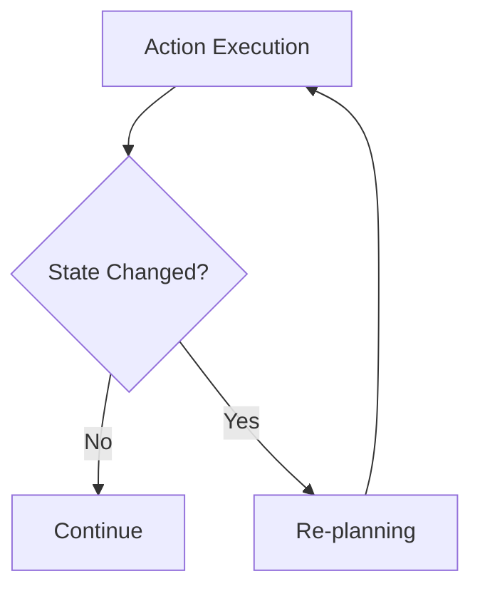
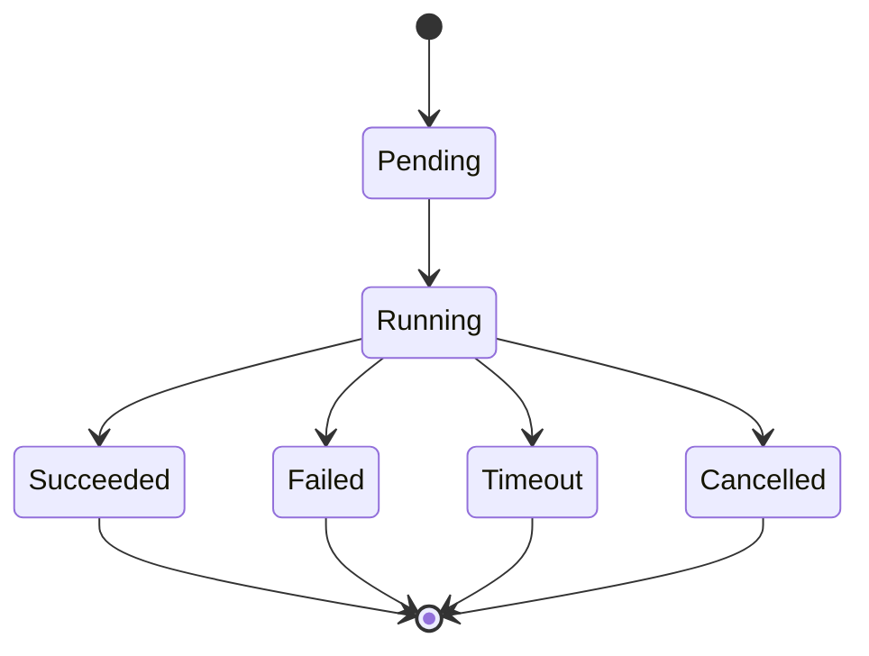
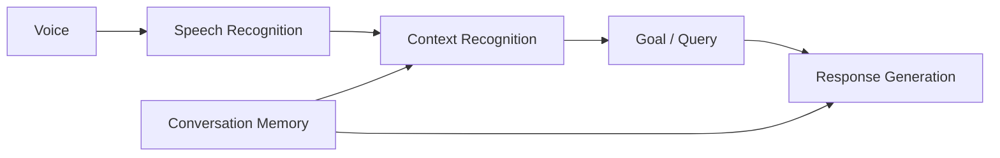
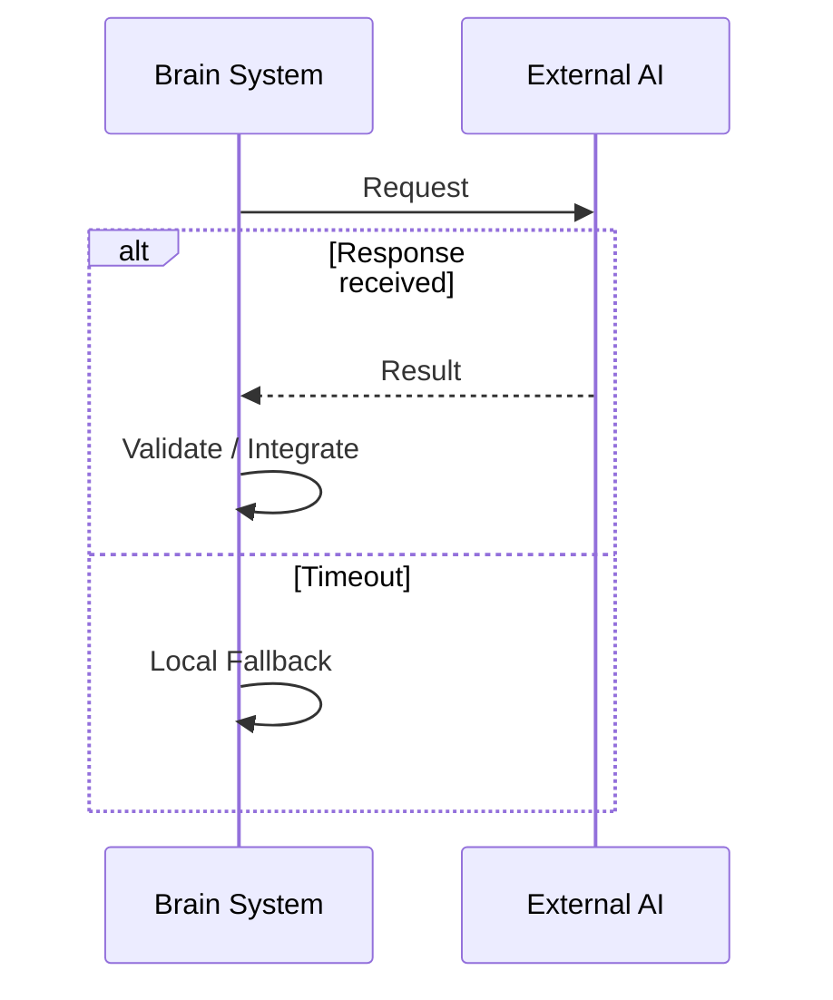
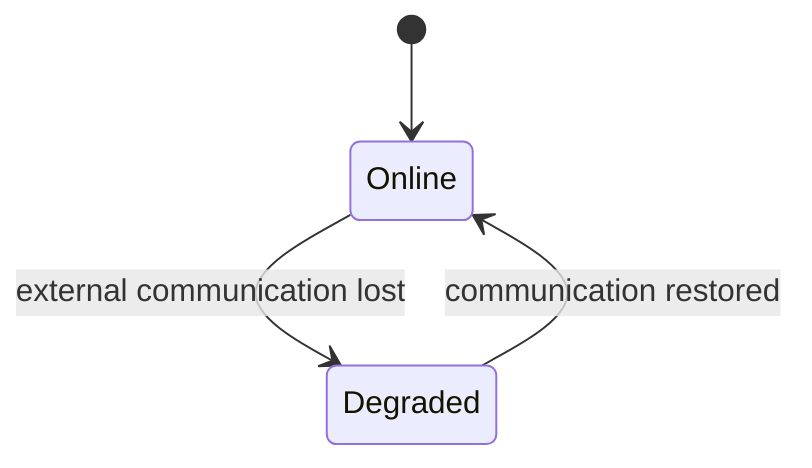

# Brain System 設計仕様書

# 1. 目的

本書は、Brain System 要求仕様書に基づき、人型ロボットにおける Brain System の内部構成、機能分割、データ構造、処理フロー、インタフェース、記憶、外部AI連携、異常時処理および拡張方針を定義する。

Brain System は、外界およびロボット自身の状態を認識し、Goal、Condition、Constraint、Memory、Policy 等を用いて Action Plan を生成し、その実行状態を管理する高レベル判断系として構成する。

本書ではシステムレベルの基本設計を対象とし、具体的なニューラルネットワーク層構成、学習アルゴリズム、CUDA Kernel、DB Schema、通信フレーム等については詳細設計書で定義する。

# 2. 関連文書

| 文書名 | 内容 |
| :- | :- |
| Brain System 要求仕様書 | Brain System が満たすべき要求 |
| システム要求仕様書 | ロボットシステム全体の要求 |
| システム設計仕様書 | システム全体構成と Brain System の位置付け |
| Control System 要求仕様書 | Action 実行および制御に関する要求 |
| Safety System 要求仕様書 | 安全監視および停止に関する要求 |
| Communication System 要求仕様書 | 内部通信および外部通信に関する要求 |

# 3. 設計方針

## 3.1 責務分離

Brain System は以下の4段階に分離する。



各段階の責務を以下とする。

| 処理 | 主な責務 |
| :- | :- |
| Pre-process | Sensor / Voice / Text / Robot State を意味情報へ変換 |
| Planning | Goal 達成に必要な Action Plan を生成 |
| Execution | Action Plan の実行状態を管理し Control System へ指示 |
| Post-process | 記憶更新、経験保存、知識更新、学習用データ生成 |

## 3.2 共通内部表現

異なる入力源から得た情報をそのまま Planning へ入力せず、意味単位の内部表現へ変換する。

Brain System 内部では少なくとも以下を区別する。

| Type | 内容 |
| :- | :- |
| Perception | 外界から認識した情報 |
| Robot State | ロボット自身の現在状態 |
| Goal | 達成すべき目的 |
| Condition | 現在成立している状態・前提 |
| Constraint | 行動時に守るべき制約 |
| Memory | 過去から取得した情報 |
| Policy | 行動方法または方策 |
| Action Result | 実行した Action の結果 |

## 3.3 安全分離

Brain System は安全判断の唯一の主体としない。

Safety System が生成する Constraint、SafeStop、EmergencyStop 等を Brain System の通常判断より優先して扱う。

## 3.4 ローカル / 外部AI分離

高負荷処理は外部AIへ委譲可能とする。

ただし、外部AIが利用できない場合でも、以下をローカルで継続可能とする。

- 最低限の外界認識
- 自己状態認識
- 基本的な Planning
- Control System への基本 Action 指示
- Safety Constraint の反映
- 通信状態管理

# 4. Brain System 構成



# 5. モジュール構成

| ID | モジュール | 主な責務 |
| :- | :- | :- |
| BRN-MOD-001 | Input Adapter | Sensor / HMI / Control / Safety から入力取得 |
| BRN-MOD-002 | Pre-process | 入力を意味情報へ変換 |
| BRN-MOD-003 | World State Manager | Perception / Robot State / Condition 管理 |
| BRN-MOD-004 | Goal Manager | Goal生成・更新・状態管理 |
| BRN-MOD-005 | Constraint Manager | Constraint登録・評価・更新 |
| BRN-MOD-006 | Memory Manager | Short-Term / Long-Term Memory管理 |
| BRN-MOD-007 | Policy Manager | Policy登録・検索・更新 |
| BRN-MOD-008 | Planner | Action Plan生成・再計画 |
| BRN-MOD-009 | Execution Manager | Action実行状態管理 |
| BRN-MOD-010 | Post-process | 結果評価・記憶更新・経験生成 |
| BRN-MOD-011 | External AI Adapter | 外部AIとの処理要求・結果受信 |
| BRN-MOD-012 | Log / Trace Manager | 判断過程・状態・結果の記録 |

# 6. Input Adapter

## 6.1 入力元

Brain System は以下から入力を受け付ける。

| 入力元 | 主な入力 |
| :- | :- |
| Sensor System | Camera / IMU / Force / Touch / Distance 等 |
| Human Interface | Voice / Text |
| Control System | Robot State / Action Result |
| Safety System | Safety State / Constraint / Stop Request |
| Communication System | Network State |
| External AI | Recognition / Planning / Knowledge Result |

## 6.2 共通入力属性

入力データには可能な範囲で以下を保持する。

| Field | 内容 |
| :- | :- |
| Source | 入力元 |
| ID | 入力識別子 |
| Timestamp | 取得時刻 |
| Status | 入力状態 |
| Payload | 入力内容 |

# 7. Pre-process

## 7.1 目的

Pre-process は、生の入力を Planning が利用可能な意味情報へ変換する。

## 7.2 機能

| ID | 機能 | 出力 |
| :- | :- | :- |
| BRN-PRE-001 | Spatial Perception | 空間構造、自己位置、障害物、移動可能領域 |
| BRN-PRE-002 | Object Detection | Object、Class、Position、Confidence |
| BRN-PRE-003 | Force Sensing | 接触、外力、方向 |
| BRN-PRE-004 | Speech Recognition | Text、Confidence |
| BRN-PRE-005 | Context Recognition | Intent、Target、Condition、Constraint |
| BRN-PRE-006 | Internal State Recognition | Robot State |

## 7.3 Pre-process 出力

Pre-process は以下の情報を生成する。



## 7.4 情報の共通属性

各内部情報は必要に応じて以下を持つ。

| Field | 必須 | 内容 |
| :- | :-: | :- |
| ID | ○ | 情報識別子 |
| Type | ○ | 情報種別 |
| Timestamp | ○ | 観測または生成時刻 |
| Source | ○ | 情報取得元 |
| Value | △ | 情報内容 |
| Relation | △ | 他情報との関係 |
| Confidence | △ | 信頼度 |
| Attributes | △ | 種別固有属性 |

Position、Priority、Target 等は共通Fieldとせず Attributes 側で扱う。

# 8. World State Manager

## 8.1 目的

現在の世界およびロボット自身の状態を、Planning が利用可能な統合状態として管理する。

## 8.2 管理対象

- Perception
- Robot State
- Condition
- Communication State
- Safety State

## 8.3 World State

```text
WorldState
├── Perceptions
├── RobotState
├── Conditions
├── CommunicationState
└── SafetyState
```

## 8.4 更新

World State は新しい認識結果を受信するたびに更新する。

古い情報については Timestamp を用いて有効性を判定する。

信頼度が低い情報は確定状態として扱わず、必要に応じて再認識対象とする。

# 9. Goal Manager

## 9.1 目的

現在の Goal を生成、保持、更新し、その状態を管理する。

## 9.2 Goal 構造

```text
Goal
├── ID
├── Type
├── Target
├── Priority
├── CompletionCondition
├── Status
├── Source
└── Timestamp
```

## 9.3 Goal Status

| 状態 | 内容 |
| :- | :- |
| Pending | 未処理 |
| Active | 実行対象 |
| Achieved | 達成 |
| Failed | 失敗 |
| Cancelled | 取消 |

## 9.4 Goal生成元

- Human instruction
- Robot State
- Safety State
- Scheduled task
- Existing Goal の下位Goal

# 10. Condition Manager

## 10.1 目的

現在成立している状態を Condition として管理する。

## 10.2 Condition例

```text
object_visible(ball_01) = true
right_hand_available = true
robot_stable = true
network_available = false
```

## 10.3 利用

Condition は以下で利用する。

- Action 実行可否
- Goal 達成判定
- 再計画判定
- Policy 選択
- Safety判断補助

# 11. Constraint Manager

## 11.1 目的

Brain System の行動計画に適用する制約を管理する。

## 11.2 Constraint 構造

```text
Constraint
├── ID
├── Description
├── Critical
├── Source
├── Scope
├── Active
└── Timestamp
```

## 11.3 Critical

`Critical == true` の Constraint は必須制約とし、違反する Action Plan を採用しない。

`Critical == false` の Constraint は Planning における評価項目として扱う。

## 11.4 Constraint生成元

- Safety System
- Human instruction
- Robot State
- Environment
- Internal rule
- Policy

# 12. Memory Manager

## 12.1 構成



## 12.2 Short-Term Memory

以下を保持する。

- Current Goal
- Current Plan
- Recent Perception
- Recent Robot State
- Recent Conversation
- Recent Actions
- Recent Action Results
- Recent Errors

## 12.3 Long-Term Memory

以下を保存対象とする。

- Person
- Object
- Place
- Word / Term
- Domain Knowledge
- Successful Action
- Failed Action
- Environment-specific Knowledge
- Learned Policy

## 12.4 Memory操作

Memory Manager は以下を提供する。

- Store
- Search
- Update
- Remove
- Summarize
- Promote STM to LTM

# 13. Policy Manager

## 13.1 目的

Planning で利用する方策または行動知識を管理する。

## 13.2 Policy種別

- Predefined Policy
- Learned Policy
- Experience-derived Policy
- Domain-specific Policy

## 13.3 Policy構造

```text
Policy
├── ID
├── Name
├── ApplicableCondition
├── ActionTemplate
├── Priority
├── Confidence
├── Source
└── Version
```

# 14. Planning

## 14.1 入力



## 14.2 処理

Planner は以下の順で処理する。

1. Active Goal を取得
2. World State を取得
3. Constraint を取得
4. Relevant Memory を検索
5. Applicable Policy を取得
6. Goal を Action に分解
7. 各 Action の Condition を評価
8. Critical Constraint 違反を除外
9. Action Plan を生成
10. Execution Manager へ渡す

## 14.3 Action

```text
Action
├── ID
├── Type
├── Target
├── Parameters
├── Preconditions
├── CompletionCondition
├── FailureCondition
├── Timeout
├── Priority
└── Resource
```

## 14.4 Action Plan

```text
ActionPlan
├── Plan ID
├── Goal ID
├── Actions[]
├── Constraints[]
├── Status
├── CreatedAt
└── Version
```

## 14.5 Action関係

Action 間では以下を表現可能とする。

- Sequential
- Parallel
- Conditional
- Dependency

# 15. Re-planning

以下の場合に再計画を実行する。

- Goal変更
- Target移動
- Condition変化
- Constraint追加・変更
- Action失敗
- Action Timeout
- Safety State変更
- Communication State変更
- Robot State異常
- Action実行不能



# 16. Execution Manager

## 16.1 目的

Action Plan を Control System へ順次出力し、その実行状態を管理する。

## 16.2 Action State



## 16.3 Control System出力

Execution Manager は少なくとも以下を出力する。

```text
ActionCommand
├── Action ID
├── Action Type
├── Target
├── Parameters
├── Timeout
└── Priority
```

## 16.4 Action Result

Control System から以下を受信する。

```text
ActionResult
├── Action ID
├── Result
├── Reason
├── StartTime
├── EndTime
└── ObservedState
```

# 17. Post-process

## 17.1 目的

Action 実行後に結果を整理し、Memory、Policy、Goal、World State を更新する。

## 17.2 処理内容

- Action Result評価
- Goal達成判定
- Short-Term Memory更新
- Long-Term Memory候補生成
- 成功・失敗経験保存
- 新規語句登録
- 新規Object登録
- 新規Place登録
- Policy候補生成
- 学習用データ生成

# 18. 会話処理

## 18.1 処理フロー



## 18.2 会話出力

会話出力は以下を区別する。

- Answer
- Confirmation
- Clarification Request
- Warning
- Error Notification

# 19. External AI Adapter

## 19.1 目的

高負荷認識、Large Model、専門知識処理、Heavy Planning 等を外部計算資源へ委譲する。

## 19.2 処理



## 19.3 外部AI結果

外部AI結果は以下を満たすまで内部状態へ確定反映しない。

- Requestとの対応確認
- Timeout確認
- Result形式確認
- Safety Constraint確認
- 必要に応じたConfidence評価

# 20. 通信断時設計



Degraded 状態では以下を継続する。

- Local Perception
- Robot State Recognition
- Local Planning
- Execution Management
- Safety Constraint Handling
- Memory参照

外部AI依存処理については停止、代替または簡略化する。

# 21. Safety System連携

## 21.1 Safety入力

Brain System は以下を受信する。

- Safety State
- Constraint
- SafeStop
- EmergencyStop
- Recovery State

## 21.2 優先順位

```text
EmergencyStop
    >
SafeStop
    >
Critical Constraint
    >
Normal Planning
```

## 21.3 動作

EmergencyStop 中は新規 Action を開始しない。

SafeStop 中は通常 Plan の継続を停止する。

Critical Constraint 変更時は現在の Plan を再評価する。

# 22. Error Handling

## 22.1 Error情報

```text
BrainError
├── Error ID
├── Module
├── Level
├── Timestamp
├── Description
├── Cause
└── Recovery
```

## 22.2 Recovery

Error Levelに応じて以下を実行する。

- Retry
- Fallback
- Re-recognition
- Re-planning
- Module Disable
- Degraded Operation
- SafeStop Request

# 23. Log / Trace

以下を記録可能とする。

- Input
- Perception
- Robot State
- Goal
- Condition
- Constraint
- Memory Query
- Policy Selection
- Action Plan
- Action Command
- Action Result
- External AI Request / Result
- Error
- Safety State
- Model Version
- Software Version

すべての主要ログには Timestamp を付与する。

# 24. 処理優先度

Brain System の処理優先順位を以下とする。

1. Safety関連入力処理
2. Control Systemからの異常・Action Result処理
3. Robot State更新
4. Goal / Constraint更新
5. Re-planning
6. Perception更新
7. 通常Planning
8. Memory更新
9. 学習用処理
10. 非重要ログ・整理処理

# 25. リソース管理

Brain System は以下を監視する。

- CPU Usage
- GPU / NPU Usage
- Memory Usage
- Storage Usage
- Network State
- Process Health

リソース不足時には以下の順で処理を縮退可能とする。

1. 学習関連処理停止
2. 非重要Post-process停止
3. 高負荷認識の頻度低下
4. 外部AI依存処理停止
5. Local Basic Modeへ移行

Safety関連処理は縮退対象外とする。

# 26. 拡張性設計

以下を交換または追加可能な構成とする。

- Recognition Module
- Language Model
- Planner
- Policy
- Action Type
- Memory Backend
- External AI Provider
- Tokenizer
- Embedding
- Compute Device

各機能は共通Interfaceを介して接続する。

# 27. 要求トレーサビリティ

| Brain要求 | 設計項目 |
| :- | :- |
| REQ-BRN-SYS-* | Brain System全体構成 |
| REQ-BRN-PER-* | Pre-process / World State Manager |
| REQ-BRN-FRC-* | Force Sensing / World State Manager |
| REQ-BRN-STATE-* | Internal State Recognition / World State Manager |
| REQ-BRN-SPC-* | Speech Recognition |
| REQ-BRN-CTX-* | Context Recognition |
| REQ-BRN-INFO-* | 共通内部表現 |
| REQ-BRN-GOAL-* | Goal Manager |
| REQ-BRN-CND-* | Condition Manager |
| REQ-BRN-CST-* | Constraint Manager |
| REQ-BRN-PLN-* | Planner |
| REQ-BRN-REPLN-* | Re-planning |
| REQ-BRN-EXEC-* | Execution Manager |
| REQ-BRN-CNV-* | 会話処理 |
| REQ-BRN-STM-* | Short-Term Memory |
| REQ-BRN-LTM-* | Long-Term Memory |
| REQ-BRN-LRN-* | Post-process / Policy Manager |
| REQ-BRN-EXT-* | External AI Adapter |
| REQ-BRN-OFF-* | 通信断時設計 |
| REQ-BRN-SAFE-* | Safety連携 |
| REQ-BRN-CTRL-* | Control System Interface |
| REQ-BRN-PERF-* | 処理優先度 / リソース管理 |
| REQ-BRN-ERR-* | Error Handling |
| REQ-BRN-LOG-* | Log / Trace |
| REQ-BRN-EXTN-* | 拡張性設計 |
| REQ-BRN-TST-* | Test Interface |
| REQ-BRN-QUAL-* | Version / Module管理 |

# 28. 詳細設計対象

以下は詳細設計で定義する。

## 28.1 Pre-process

- Spatial Perception Algorithm
- Object Detection Model
- Force Recognition
- Speech Recognition
- Context Recognition
- Confidence算出

## 28.2 Internal Representation

- Token ID体系
- Data Structure
- Serialization
- Relation表現
- Attributes構造
- Timestamp管理

## 28.3 Planning

- Transformer構造
- Attention構造
- Policy Token
- Goal Token
- Condition Token
- Constraint Token
- Action Token
- Plan生成アルゴリズム
- Re-planningアルゴリズム

## 28.4 Memory

- Short-Term Memory構造
- Long-Term Memory構造
- DB Schema
- Search方式
- Ranking方式
- Summary方式
- Forgetting Policy

## 28.5 Execution

- Action Interface
- Action State Machine
- Parallel Action管理
- Resource Lock
- Timeout
- Cancel処理

## 28.6 External AI

- Request形式
- Response形式
- Timeout
- Retry
- Fallback
- Authentication
- Connection管理

# 29. 未確定事項

- ローカルAIモデル構成
- 外部AIとの処理分担
- Transformer構造
- Token形式
- Embedding形式
- Context長
- Planningアルゴリズム
- Policy表現
- Memory保存方式
- DB選定
- Memory検索方式
- Online Learningの有無
- Model Update方式
- Confidence算出方式
- Planning周期
- Recognition周期
- Action Timeout標準値
- Resource閾値
