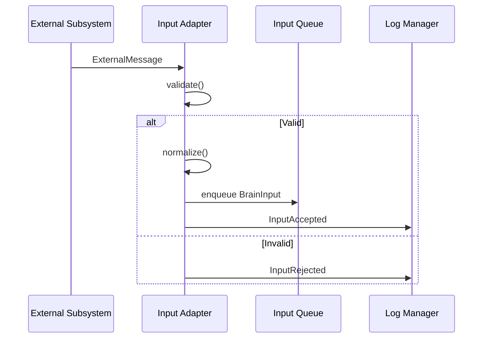

# BRN-MOD-001 Input Adapter 詳細設計書

> 親文書: `Brain System モジュール詳細設計 README`
>
> 本書は、親文書で定義した共通型、所有関係、Event / Queueベース実行モデル、初期実装方針、ディレクトリ構成、実装フェーズおよびCodex実装制約に従う。


# 1. 目的

Input Adapter は Brain System 外部から入力される情報を受信し、Brain内部で共通利用可能な `BrainInput` へ正規化して後段へ配送する。

本モジュールは外部Subsystem固有の通信形式やデバイス形式をBrain Coreへ漏らさないための境界とする。

# 2. 責務

- Sensor / HMI / Control / Safety / Communication / External AI からの入力受付
- 入力Sourceの識別
- Message Version確認
- Timestamp保持
- Payload型確認
- Stale判定
- 優先度付与
- Input Queue投入
- Invalid Inputの拒否
- Input受信Log出力

# 3. 非責務

以下はInput Adapterでは行わない。

- Object Detection
- Speech Recognition
- Context Recognition
- World State更新
- Goal生成
- Safety判断
- Planning

# 4. 入出力

## 4.1 入力

```text
ExternalMessage
├── source
├── messageType
├── schemaVersion
├── timestamp
├── payload
└── sequence
```

## 4.2 出力

```cpp
struct BrainInput
{
    std::uint64_t id;
    InputSource source;
    TimePoint timestamp;
    InputStatus status;
    BrainInputType type;
    Payload payload;
};
```

# 5. 型定義

```cpp
enum class InputSource
{
    Sensor,
    HumanInterface,
    Control,
    Safety,
    Communication,
    ExternalAI
};

enum class InputStatus
{
    Valid,
    Warning,
    Invalid,
    Timeout,
    Stale
};

enum class BrainInputType
{
    CameraFrame,
    Imu,
    Force,
    Touch,
    Distance,
    Voice,
    Text,
    RobotState,
    ActionResult,
    SafetyState,
    Constraint,
    StopRequest,
    NetworkState,
    ExternalAIResult
};
```

# 6. クラス構成

```cpp
class IInputAdapter
{
public:
    virtual ~IInputAdapter() = default;

    virtual void push(const ExternalMessage& message) = 0;
    virtual std::vector<BrainInput> poll() = 0;
};

class InputAdapter final : public IInputAdapter
{
public:
    explicit InputAdapter(
        std::shared_ptr<IClock> clock,
        std::shared_ptr<ILogManager> logger
    );

    void push(const ExternalMessage& message) override;
    std::vector<BrainInput> poll() override;

private:
    BrainInput normalize(const ExternalMessage& message) const;
    InputStatus validate(const ExternalMessage& message) const;

    InputQueues _queues;
    std::shared_ptr<IClock> _clock;
    std::shared_ptr<ILogManager> _logger;
};
```

# 7. Queue構成

```text
InputQueues
├── SafetyQueue
├── ControlQueue
├── SensorQueue
├── HmiQueue
└── ExternalQueue
```

処理優先度:

```text
Safety
>
Control
>
Sensor
>
HMI
>
External
```

同一優先度ではFIFOを基本とする。

# 8. 処理シーケンス



# 9. Stale判定

```text
age = current_monotonic_time - input_timestamp
```

入力種別ごとに `maxAge` を設定する。

例:

```text
IMU             : short
RobotState      : short
CameraFrame     : medium
Text            : long
SafetyState     : short
```

具体値はConfigurationで定義する。

# 10. Thread方針

初期実装ではInput Adapter自体に専用Threadを必須としない。

`push()` は通信受信側から呼び出し、Brain Event Loopが `poll()` を呼ぶ方式を標準とする。

将来的な並列化に備えQueue操作はThread-safeにする。

# 11. Error処理

| Error | 動作 |
| :- | :- |
| Unknown Source | Reject |
| Unknown Type | Reject |
| Schema mismatch | Reject + Error Log |
| Missing Field | Reject |
| Stale Safety Data | Critical Warning |
| Queue Overflow | Priority別Drop Policy |
| Payload Parse Error | Reject |

Safety Queueは通常Queueより大きな保護を行い、可能な限りDropしない。

# 12. Log

- Input ID
- Source
- Type
- Timestamp
- Status
- Rejection reason
- Queue size

# 13. ファイル構成

```text
include/brain/input/
├── InputAdapter.hpp
├── InputTypes.hpp
└── InputQueue.hpp

src/brain/input/
├── InputAdapter.cpp
└── InputQueue.cpp

tests/brain/
└── test_input_adapter.cpp
```

# 14. Unit Test

- Source別変換
- Type別変換
- Invalid schema
- Missing field
- Stale判定
- Safety優先
- FIFO
- Queue overflow
- Concurrent push
- Log出力

# 15. 完了条件

- 全InputSourceをBrainInputへ変換可能
- Safety入力が最優先で取得される
- Invalid Inputを後段へ流さない
- Thread-safe Queueとして動作
- Unit Testが成功する
