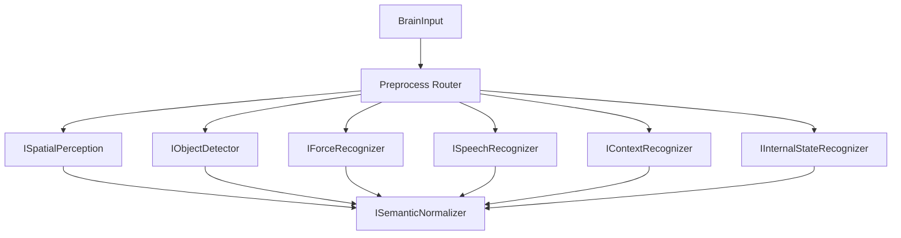

# BRN-MOD-002 Pre-process 詳細設計書

> 親文書: `Brain System モジュール詳細設計 README`
>
> 本書は、親文書で定義した共通型、所有関係、Event / Queueベース実行モデル、初期実装方針、ディレクトリ構成、実装フェーズおよびCodex実装制約に従う。


# 1. 目的

Pre-process は `BrainInput` を認識・解釈し、Brain内部共通表現である `Perception / RobotState / Goal / Condition / Constraint` を生成する。

# 2. 内部構成



# 3. 責務

- BrainInput Typeに応じたRecognizer選択
- 認識実行
- Confidence付与
- Semantic Normalization
- Recognition Error通知
- Fake / Real Recognizer差し替え

# 4. Preprocessor Interface

```cpp
class IPreprocessor
{
public:
    virtual ~IPreprocessor() = default;

    virtual std::vector<SemanticItem> process(
        const BrainInput& input
    ) = 0;
};
```

# 5. Recognizer Interface

```cpp
template<class InputT,class ResultT>
class IRecognizer
{
public:
    virtual ~IRecognizer() = default;
    virtual ResultT recognize(const InputT& input) = 0;
};
```

C++実装上template interfaceが扱いにくい場合は各Recognizer専用Interfaceを用意する。

# 6. Object Detection

```cpp
struct ObjectDetectionResult
{
    SemanticId objectId;
    ObjectClass objectClass;
    Vector3 position;
    Quaternion orientation;
    TrackingId trackingId;
    float confidence;
    TimePoint timestamp;
};
```

初期実装:

```text
IObjectDetector
└── FakeObjectDetector
```

将来:

```text
IObjectDetector
├── FakeObjectDetector
├── LocalCnnObjectDetector
└── ExternalObjectDetector
```

# 7. Speech Recognition

```cpp
struct SpeechRecognitionResult
{
    std::string text;
    float confidence;
    std::string language;
    std::optional<SpeakerId> speaker;
    TimePoint start;
    TimePoint end;
};
```

# 8. Context Recognition

```cpp
struct ContextRecognitionResult
{
    Intent intent;
    std::optional<SemanticId> target;
    std::vector<Goal> goals;
    std::vector<Condition> conditions;
    std::vector<Constraint> constraints;
    float confidence;
};
```

# 9. Internal State Recognition

入力対象:

- Robot State
- Battery
- Communication
- Safety
- Current Action
- Joint State

出力は共通 `RobotState` とする。

# 10. Confidence

Confidence範囲:

```text
0.0 <= confidence <= 1.0
```

初期方針:

```text
High      : 確定利用可
Medium    : Plannerへ不確実性付きで提供
Low       : 再認識または確認要求
Invalid   : 破棄
```

閾値はRecognizerごとのConfigurationで定義する。

# 11. Semantic Normalizer

```cpp
class ISemanticNormalizer
{
public:
    virtual ~ISemanticNormalizer() = default;

    virtual std::vector<SemanticItem> normalize(
        const RecognitionVariant& result
    ) = 0;
};
```

# 12. 非同期性

各Recognizerは同期Interfaceから開始する。

外部AI等の長時間処理は `External AI Adapter` を経由し、Pre-process Event LoopをBlockしない。

# 13. Error処理

- Unsupported Input
- Model Failure
- Low Confidence
- Invalid Output
- External Timeout
- Missing Sensor
- Timestamp mismatch

Recognition失敗は必要に応じ `Condition` または `BrainError` として上位へ通知する。

# 14. Fake実装

Fake Recognizerは固定Seedまたは固定Mappingを使用し決定論的にする。

例:

```text
input: "pick blue ball"
output:
  intent = command
  goal.type = Acquire
  target = blue_ball
```

# 15. ファイル構成

```text
include/brain/preprocess/
├── Preprocessor.hpp
├── ObjectDetector.hpp
├── SpeechRecognizer.hpp
├── ContextRecognizer.hpp
├── ForceRecognizer.hpp
├── SpatialPerception.hpp
└── SemanticNormalizer.hpp
```

# 16. Unit Test

- Input Type routing
- Fake Object Detection
- Fake ASR
- Context parsing
- Low confidence
- Unsupported input
- Semantic normalization
- External timeout
- Determinism

# 17. 完了条件

- BrainInputから共通SemanticItemを生成可能
- Fake Recognizerで全経路を試験可能
- Confidenceが保持される
- External AI依存でEvent LoopをBlockしない
