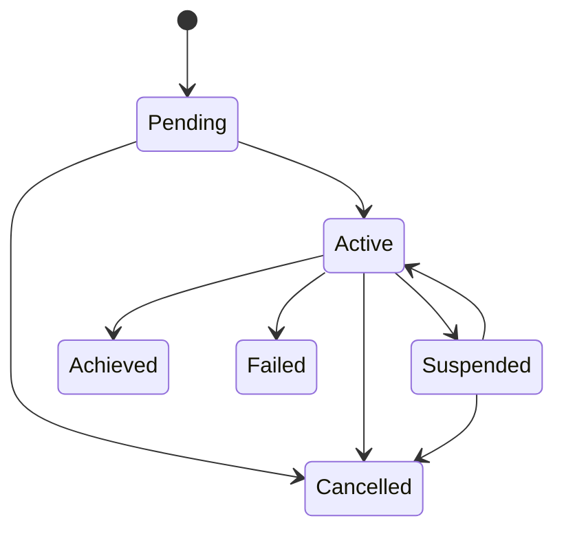

# BRN-MOD-004 Goal Manager 詳細設計書

> 親文書: `Brain System モジュール詳細設計 README`
>
> 本書は、親文書で定義した共通型、所有関係、Event / Queueベース実行モデル、初期実装方針、ディレクトリ構成、実装フェーズおよびCodex実装制約に従う。


# 1. 目的

Goal Manager はGoal候補の登録、優先順位付け、Active Goal選択、状態遷移、Sub Goal関係を管理する。

# 2. Goal構造

```cpp
struct Goal
{
    GoalId id;
    GoalType type;

    std::optional<SemanticId> target;
    int priority;

    ConditionExpression completionCondition;

    GoalStatus status;
    GoalSource source;

    std::optional<GoalId> parentGoal;

    TimePoint createdAt;
    TimePoint updatedAt;
};
```

# 3. GoalStatus

```cpp
enum class GoalStatus
{
    Pending,
    Active,
    Suspended,
    Achieved,
    Failed,
    Cancelled
};
```

# 4. GoalSource

- Human
- Internal
- Safety
- Scheduled
- SubGoal

# 5. State Transition



# 6. Priority

基本スコア:

```text
priority_score =
    explicit_priority
  + safety_bonus
  + urgency
  + dependency_bonus
```

Safety由来Goalは通常Goalより優先可能とする。

# 7. Active Goal

初期実装は同時Active Goalを1つに限定してよい。

将来Multi-Goal Planningへ拡張可能なInterfaceにする。

# 8. Preemption

高優先Goal発生時:

1. Current GoalをSuspended
2. PlannerへCancel / Re-plan
3. New GoalをActive
4. Executionへ必要なCancel通知

# 9. Completion

`completionCondition` をWorldStateへ評価しAchieved判定する。

# 10. Interface

```cpp
class IGoalManager
{
public:
    virtual ~IGoalManager() = default;

    virtual GoalId add(const Goal& goal) = 0;
    virtual void update(const Goal& goal) = 0;
    virtual void cancel(GoalId id) = 0;

    virtual std::optional<Goal> activeGoal() const = 0;
    virtual std::vector<Goal> pendingGoals() const = 0;
};
```

# 11. Error処理

- Invalid Goal
- Missing Target
- Parent Goal not found
- Duplicate ID
- Completion expression error

# 12. Unit Test

- Goal add
- Priority
- Active selection
- Preemption
- Suspend/resume
- Completion
- Failure
- Cancel
- Parent/Sub Goal

# 13. 完了条件

- Goal Queueが機能
- Active Goal選択が決定論的
- PriorityとSafety優先が反映
- Goal状態遷移がTest済み
