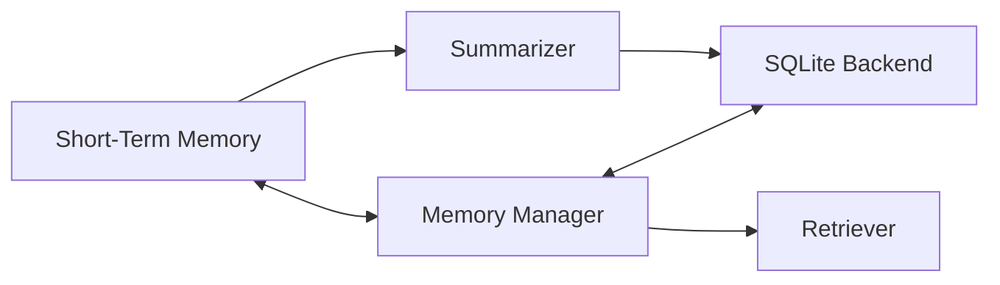

# BRN-MOD-006 Memory Manager 詳細設計書

> 親文書: `Brain System モジュール詳細設計 README`
>
> 本書は、親文書で定義した共通型、所有関係、Event / Queueベース実行モデル、初期実装方針、ディレクトリ構成、実装フェーズおよびCodex実装制約に従う。


# 1. 目的

Memory Manager はShort-Term MemoryとLong-Term Memoryを管理し、Planner / Context Recognition / Post-processへ検索・保存機能を提供する。

# 2. 構成



# 3. MemoryItem

```cpp
struct MemoryItem
{
    MemoryId id;
    MemoryType type;

    SemanticItem content;

    float importance;
    float confidence;

    TimePoint createdAt;
    TimePoint updatedAt;
    TimePoint lastAccessed;

    std::uint64_t accessCount;
    std::uint32_t version;
};
```

# 4. Short-Term Memory

```cpp
class ShortTermMemory
{
private:
    std::optional<Goal> _currentGoal;
    std::optional<ActionPlan> _currentPlan;

    RingBuffer<SemanticItem> _recentPerceptions;
    RingBuffer<ActionResult> _recentActions;
    RingBuffer<ConversationItem> _conversation;
    RingBuffer<BrainError> _errors;
};
```

# 5. LTM Backend

初期実装はSQLite。

DBアクセスは `IMemoryBackend` で隠蔽する。

```cpp
class IMemoryBackend
{
public:
    virtual ~IMemoryBackend() = default;

    virtual MemoryId store(const MemoryItem&) = 0;
    virtual void update(const MemoryItem&) = 0;
    virtual void remove(MemoryId) = 0;
    virtual std::optional<MemoryItem> get(MemoryId) = 0;
    virtual std::vector<MemoryItem> search(
        const MemoryQuery&
    ) = 0;
};
```

# 6. SQLite Schema

```sql
CREATE TABLE memory (
    id              INTEGER PRIMARY KEY,
    type            INTEGER NOT NULL,
    content_json    TEXT NOT NULL,
    importance      REAL NOT NULL,
    confidence      REAL NOT NULL,
    created_at      INTEGER NOT NULL,
    updated_at      INTEGER NOT NULL,
    last_accessed   INTEGER NOT NULL,
    version         INTEGER NOT NULL
);

CREATE TABLE memory_tag (
    memory_id       INTEGER NOT NULL,
    tag             TEXT NOT NULL
);

CREATE TABLE memory_relation (
    source_id       INTEGER NOT NULL,
    relation        TEXT NOT NULL,
    target_id       INTEGER NOT NULL
);
```

# 7. Search

```cpp
struct MemoryQuery
{
    std::optional<MemoryType> type;
    std::vector<std::string> tags;
    std::optional<SemanticId> target;
    std::size_t maxResults = 20;
};
```

# 8. Ranking

初期Rank:

```text
score =
    0.45 * relevance
  + 0.20 * recency
  + 0.20 * importance
  + 0.15 * confidence
```

値はConfiguration化する。

# 9. STM→LTM

昇格候補:

- New Person/Object/Place
- New Vocabulary
- Goal outcome
- Significant Failure
- High importance
- Repeated access

# 10. Summarization

初期実装ではRule-based summaryまたは単純圧縮でよい。

LLM要約は後からAdapterとして追加する。

# 11. Forgetting

自動削除候補:

- expired
- duplicate
- obsolete
- low importance

Safety / explicit persistent memoryは対象外。

# 12. Transaction

複数Table更新はSQLite transaction内で行う。

# 13. Failure

DB利用不能時:

```text
Normal
↓
Retry
↓
Read-only
↓
STM-only mode
```

Brain CoreはMemory DB障害だけで停止しない。

# 14. ファイル構成

```text
include/brain/memory/
├── MemoryManager.hpp
├── MemoryBackend.hpp
├── ShortTermMemory.hpp
└── MemoryTypes.hpp

src/brain/memory/
├── MemoryManager.cpp
├── SQLiteMemoryBackend.cpp
└── ShortTermMemory.cpp
```

# 15. Unit Test

- insert/update/delete
- search
- ranking
- transaction rollback
- duplicate
- STM ring buffer
- DB unavailable
- read-only fallback
- schema version

# 16. 完了条件

- SQLiteへの永続化
- STM/LTM検索
- Ranking
- DB障害Fallback
- Unit Test成功
