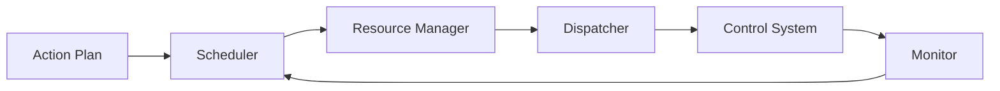

# BRN-MOD-009 Execution Manager 詳細設計書

> 親文書: `Brain System モジュール詳細設計 README`
>
> 本書は、親文書で定義した共通型、所有関係、Event / Queueベース実行モデル、初期実装方針、ディレクトリ構成、実装フェーズおよびCodex実装制約に従う。


# 1. 目的

Execution Manager はAction PlanのActionを依存関係とResource制約に従ってControl SystemへDispatchし、実行状態を管理する。

# 2. ActionState

```cpp
enum class ActionState
{
    Pending,
    Ready,
    Running,
    Succeeded,
    Failed,
    Cancelled,
    Timeout
};
```

# 3. ExecutionContext

```cpp
struct ExecutionContext
{
    PlanId planId;
    GoalId goalId;

    std::unordered_map<ActionId, ActionRuntimeState> actions;

    ExecutionStatus status;
    TimePoint startedAt;
};
```

# 4. 構成



# 5. Scheduler

Ready条件:

- Dependencies Succeeded
- Preconditions true
- Resource available
- Safety permits
- Plan active

# 6. Resource

```cpp
struct ResourceRequest
{
    ResourceId id;
    ResourceAccess access;
};

enum class ResourceAccess
{
    Shared,
    Exclusive
};
```

# 7. Deadlock回避

複数Resource取得順序をResourceId順に統一する。

# 8. Dispatch

```cpp
struct ActionCommand
{
    ActionId id;
    ActionType type;

    std::optional<SemanticId> target;
    AttributeMap parameters;

    Duration timeout;
    int priority;
};
```

# 9. Control Result

```cpp
struct ActionResult
{
    ActionId actionId;
    ActionResultCode result;

    std::string reason;

    TimePoint startTime;
    TimePoint endTime;

    AttributeMap observedState;
};
```

# 10. Timeout

```text
elapsed = now - action.startTime
```

Timeout:

1. ControlへCancel
2. State=Timeout
3. Result生成
4. Resource release
5. PlannerへReplan Event

# 11. Cancel

Running ActionはControlから停止確認を受けるまではResourceを即解放しない。

# 12. EmergencyStop

- Dispatch禁止
- Pending / ReadyをCancelled
- RunningへStop要求
- Resume禁止
- Control停止確認後Resource解放

# 13. Parallel Execution

Dependencyなし + Resource競合なしの場合のみ並列実行。

# 14. Interface

```cpp
class IExecutionManager
{
public:
    virtual ~IExecutionManager() = default;

    virtual void submit(const ActionPlan&) = 0;
    virtual void update(const ActionResult&) = 0;
    virtual void cancel(PlanId) = 0;

    virtual ExecutionStatus status() const = 0;
};
```

# 15. Unit Test

- sequential
- parallel
- dependency
- exclusive resource
- shared resource
- timeout
- cancel
- control failure
- emergency stop
- deadlock prevention

# 16. 完了条件

- Dependency通りDispatch
- Resource競合防止
- Timeout機能
- EmergencyStop時に新規Dispatchなし
