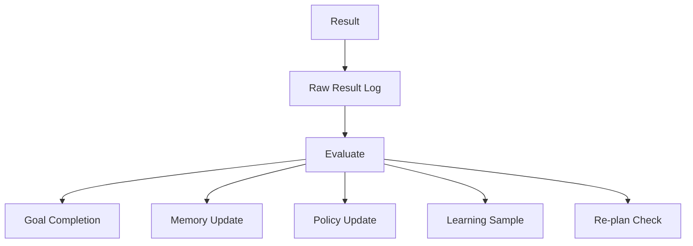

# BRN-MOD-010 Post-process 詳細設計書

> 親文書: `Brain System モジュール詳細設計 README`
>
> 本書は、親文書で定義した共通型、所有関係、Event / Queueベース実行モデル、初期実装方針、ディレクトリ構成、実装フェーズおよびCodex実装制約に従う。


# 1. 目的

Post-process はAction実行・認識・会話の結果を評価し、Goal、Memory、Policy、World State、Learning Sampleへ反映する。

# 2. 入力

```text
PostProcessInput
├── Goal
├── Plan
├── ActionResult
├── WorldState
├── RecognitionResult
├── ConversationResult
└── Errors
```

# 3. 出力

- Goal update
- STM update
- LTM candidate
- Policy statistics update
- World State update
- Learning Sample
- Re-plan trigger

# 4. 処理シーケンス



# 5. Raw Result保全

評価処理失敗で結果を失わないよう、最初にLogへ保存する。

# 6. Goal評価

CompletionConditionを最新WorldStateに対して評価する。

# 7. Memory更新

保存候補:

- success/failure
- new entity
- new place
- new term
- significant error
- repeated successful sequence

# 8. Policy統計

更新:

- success count
- failure count
- success rate
- confidence

# 9. LearningSample

```cpp
struct LearningSample
{
    PlanningContext context;
    GoalId goalId;
    PlanId planId;
    Action action;
    ActionResult result;

    float evaluation;
    TimePoint timestamp;
};
```

# 10. Online Learning

初期実装ではモデルWeight更新は行わない。

Learning Sample保存までを本モジュールの責務とする。

# 11. Re-plan Trigger

Action Failure等からPlannerへRe-plan Eventを発行可能とする。

# 12. Interface

```cpp
class IPostProcessor
{
public:
    virtual ~IPostProcessor() = default;

    virtual PostProcessResult process(
        const PostProcessInput&
    ) = 0;
};
```

# 13. Unit Test

- success
- failure
- goal achieved
- LTM promotion
- policy stats
- learning sample
- evaluation failure
- raw result preservation

# 14. 完了条件

- ActionResultがMemoryへ反映
- Goal完了判定
- Policy統計更新
- Learning Sample生成
