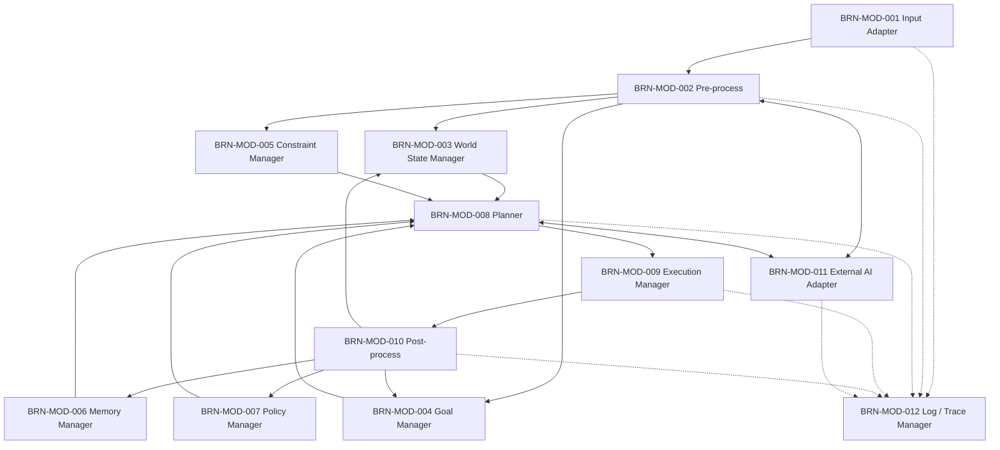
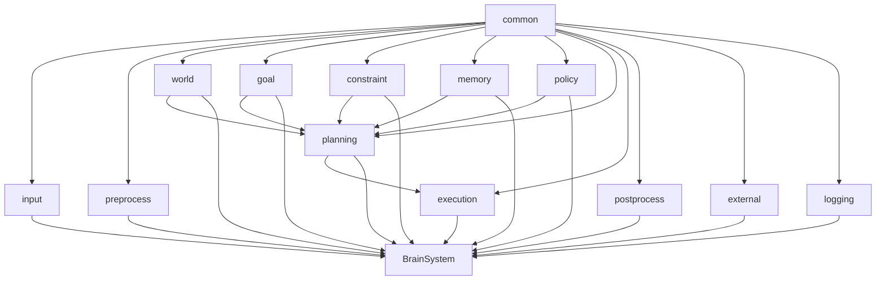

# Brain System モジュール詳細設計

# 1. 目的

本書は Brain System 設計仕様書で定義した各モジュールの詳細設計を束ねるメイン文書である。

Brain System は高レベル判断系として、入力取得、意味情報生成、World State管理、Goal管理、Constraint管理、Memory、Policy、Planning、Execution、Post-process、External AI連携、Log / Traceを分離して構成する。

# 2. モジュール一覧

| ID | モジュール | 概要 | 詳細設計 |
| :- | :- | :- | :- |
| BRN-MOD-001 | Input Adapter | Sensor / HMI / Control / Safety 等から入力を取得し共通形式へ変換 | [詳細](./BRN-MOD-001_input_adapter.md) |
| BRN-MOD-002 | Pre-process | Raw InputをPerception / Robot State / Goal / Condition / Constraintへ変換 | [詳細](./BRN-MOD-002_preprocess.md) |
| BRN-MOD-003 | World State Manager | 現在の外界・Robot State・Conditionを統合管理 | [詳細](./BRN-MOD-003_world_state_manager.md) |
| BRN-MOD-004 | Goal Manager | Goal生成・優先度・状態・完了を管理 | [詳細](./BRN-MOD-004_goal_manager.md) |
| BRN-MOD-005 | Constraint Manager | Hard / Soft Constraintの登録・評価・更新 | [詳細](./BRN-MOD-005_constraint_manager.md) |
| BRN-MOD-006 | Memory Manager | STM / LTMの保存・検索・要約・忘却を管理 | [詳細](./BRN-MOD-006_memory_manager.md) |
| BRN-MOD-007 | Policy Manager | 行動Policyの登録・選択・更新を管理 | [詳細](./BRN-MOD-007_policy_manager.md) |
| BRN-MOD-008 | Planner | Goalと状態からAction Planを生成・再計画 | [詳細](./BRN-MOD-008_planner.md) |
| BRN-MOD-009 | Execution Manager | ActionのDispatch、状態、Resource、Timeoutを管理 | [詳細](./BRN-MOD-009_execution_manager.md) |
| BRN-MOD-010 | Post-process | Action結果を評価しMemory / Policy / Goal等を更新 | [詳細](./BRN-MOD-010_post_process.md) |
| BRN-MOD-011 | External AI Adapter | 外部AIへのRequest / Response / Timeout / Fallbackを管理 | [詳細](./BRN-MOD-011_external_ai_adapter.md) |
| BRN-MOD-012 | Log / Trace Manager | Brain内部の判断・状態・Errorを記録 | [詳細](./BRN-MOD-012_log_trace_manager.md) |

# 3. モジュール関係



# 4. 共通設計方針

- モジュール間は共通Interface経由で接続する。
- 各モジュールは他モジュールの内部実装へ直接依存しない。
- 時間依存データにはTimestampを付与する。
- Goal / Plan / Action IDを利用して処理を追跡可能にする。
- Safety関連入力を通常Planningより優先する。
- 外部AI利用不能時にもLocal Basic Modeで最低限動作可能とする。
- Module単位でMock / Unit Test可能な構成とする。

# 5. 実装構成案

```text
brain/

├── input/
├── preprocess/
├── world/
├── goal/
├── constraint/
├── memory/
├── policy/
├── planning/
├── execution/
├── postprocess/
├── external/
├── logging/
└── common/
```

# 6. 詳細設計の扱い

本READMEには各モジュールの概要のみを記載する。

各モジュールのデータ構造、状態遷移、Interface、Error処理、試験観点については上記リンク先の各詳細設計書を参照する。

# 7. 共通型の基本方針

Codex等による実装時に型定義を個別判断させないため、Brain System全体で利用する共通型を `common/` 配下へ集約する。

基本型は以下を標準とする。

```cpp
using SemanticId      = std::uint64_t;
using GoalId          = std::uint64_t;
using PlanId          = std::uint64_t;
using ActionId        = std::uint64_t;
using ConstraintId    = std::uint64_t;
using PolicyId        = std::uint64_t;
using MemoryId        = std::uint64_t;
using RequestId       = std::uint64_t;
using TraceId         = std::uint64_t;
using ErrorId         = std::uint64_t;

using TimePoint =
    std::chrono::steady_clock::time_point;

using Duration =
    std::chrono::milliseconds;
```

Wall Clockが必要な場合は `std::chrono::system_clock` を別途利用し、状態更新・Timeout・Stale判定には `steady_clock` を使用する。

共通列挙型、ID型、時刻型、共通Error型、共通Attribute型は各モジュールで重複定義しない。

# 8. 所有関係

Brain System全体のライフサイクルは `BrainSystem` が管理する。

各主要モジュールは原則として `BrainSystem` が所有する。

```cpp
class BrainSystem
{
private:
    std::unique_ptr<IInputAdapter>      _inputAdapter;
    std::unique_ptr<IPreprocessor>      _preprocessor;
    std::unique_ptr<IWorldStateManager> _worldStateManager;
    std::unique_ptr<IGoalManager>       _goalManager;
    std::unique_ptr<IConstraintManager> _constraintManager;
    std::unique_ptr<IMemoryManager>     _memoryManager;
    std::unique_ptr<IPolicyManager>     _policyManager;
    std::unique_ptr<IPlanner>           _planner;
    std::unique_ptr<IExecutionManager>  _executionManager;
    std::unique_ptr<IPostProcessor>     _postProcessor;
    std::unique_ptr<IExternalAI>        _externalAI;
    std::unique_ptr<ILogManager>        _logManager;
};
```

所有権を共有する必要がない限り `std::unique_ptr` を基本とする。

`std::shared_ptr` は複数モジュール間で実際に共有所有が必要な場合に限定して使用する。

モジュール間参照は所有権を持たない参照またはInterface Pointerとして扱う。

# 9. 実行モデル

Brain Systemは単一巨大ループではなく、Event / Queueベースを基本とする。

初期実装では以下の論理Queueを設ける。

```text
Safety Event Queue
Control Event Queue
Sensor Event Queue
HMI Event Queue
External AI Event Queue
Execution Result Queue
```

処理優先度は以下とする。

```text
Safety
    >
Control Result / Error
    >
Robot State
    >
Goal / Constraint
    >
Re-planning
    >
Perception
    >
Normal Planning
    >
Memory / Learning
```

初期実装では必ずしも各モジュールを個別Threadにせず、QueueベースのEvent Loopとして実装してよい。

ただしInterfaceおよびQueue設計は、将来的に以下を独立Thread化できる構成とする。

- Input
- Recognition
- Planning
- Execution
- Memory
- External AI

# 10. 初期実装方針

最初の実装ではBrain System全体の骨格を完成させることを優先する。

初期実装で実AIモデルを必須としない。

以下はFakeまたはRule-based実装を許容する。

| Module | 初期実装 |
| :- | :- |
| Input Adapter | 実装 |
| World State Manager | 実装 |
| Goal Manager | 実装 |
| Constraint Manager | 実装 |
| Memory Manager | SQLite Backendで実装 |
| Policy Manager | Rule-based |
| Planner | RuleBasedPlanner |
| Execution Manager | 実装 |
| Post-process | 実装 |
| External AI Adapter | Fake / Stub可 |
| Object Detection | Fake可 |
| Speech Recognition | Fake可 |
| Context Recognition | Rule-based / Fake可 |

Fake実装は決定論的とし、同一入力に対して同一結果を返すこと。

# 11. Fake実装と実モデルの境界

AI処理は必ずInterface越しに接続し、Brain System本体からモデル実装を分離する。

例：

```cpp
class IObjectDetector
{
public:
    virtual ~IObjectDetector() = default;

    virtual ObjectDetectionResult detect(
        const ImageInput& input
    ) = 0;
};
```

初期：

```text
IObjectDetector
    └── FakeObjectDetector
```

将来：

```text
IObjectDetector
    ├── FakeObjectDetector
    ├── CnnObjectDetector
    └── ExternalObjectDetector
```

同様に以下もInterface化する。

- Speech Recognition
- Context Recognition
- Planner
- Memory Backend
- External AI
- Log Backend

# 12. Planner初期実装

初期Plannerは `RuleBasedPlanner` とする。

構成：

```text
IPlanner
    ├── RuleBasedPlanner
    ├── TransformerPlanner
    └── ExternalAIPlanner
```

初期段階では `RuleBasedPlanner` のみ実動作必須とする。

RuleBasedPlannerは以下を実装する。

- Goal Typeに応じたAction Template選択
- Preconditions確認
- Critical Constraint確認
- Resource確認
- Action Plan生成
- 実行不能時のFailure返却

Transformer PlannerおよびExternal AI PlannerはInterfaceとStubまで実装してよい。

# 13. Memory初期DB設計

初期Long-Term Memory BackendはSQLiteを標準とする。

論理Schemaは以下を基本とする。

```sql
CREATE TABLE memory (
    id              INTEGER PRIMARY KEY,
    type            INTEGER NOT NULL,
    content_json    TEXT NOT NULL,
    importance      REAL NOT NULL,
    confidence      REAL NOT NULL,
    created_at      INTEGER NOT NULL,
    updated_at      INTEGER NOT NULL,
    last_accessed   INTEGER NOT NULL,
    version         INTEGER NOT NULL
);

CREATE TABLE memory_tag (
    memory_id       INTEGER NOT NULL,
    tag             TEXT NOT NULL
);

CREATE TABLE memory_relation (
    source_id       INTEGER NOT NULL,
    relation        TEXT NOT NULL,
    target_id       INTEGER NOT NULL
);
```

初期実装では `content_json` を利用し、Memory種別ごとのTable分割は行わない。

性能上問題が確認された場合にSchemaを分割する。

# 14. 具体的なディレクトリ構成

実装時は以下を基本とする。

```text
include/
└── brain/
    ├── BrainSystem.hpp
    ├── common/
    │   ├── Types.hpp
    │   ├── Semantic.hpp
    │   ├── Error.hpp
    │   ├── Time.hpp
    │   └── Attribute.hpp
    ├── input/
    │   └── InputAdapter.hpp
    ├── preprocess/
    │   ├── Preprocessor.hpp
    │   ├── ObjectDetector.hpp
    │   ├── SpeechRecognizer.hpp
    │   └── ContextRecognizer.hpp
    ├── world/
    │   └── WorldStateManager.hpp
    ├── goal/
    │   └── GoalManager.hpp
    ├── constraint/
    │   └── ConstraintManager.hpp
    ├── memory/
    │   ├── MemoryManager.hpp
    │   └── MemoryBackend.hpp
    ├── policy/
    │   └── PolicyManager.hpp
    ├── planning/
    │   ├── Planner.hpp
    │   ├── RuleBasedPlanner.hpp
    │   ├── TransformerPlanner.hpp
    │   └── ExternalAIPlanner.hpp
    ├── execution/
    │   └── ExecutionManager.hpp
    ├── postprocess/
    │   └── PostProcessor.hpp
    ├── external/
    │   └── ExternalAIAdapter.hpp
    └── logging/
        └── LogManager.hpp

src/
└── brain/
    ├── BrainSystem.cpp
    ├── input/
    ├── preprocess/
    ├── world/
    ├── goal/
    ├── constraint/
    ├── memory/
    ├── policy/
    ├── planning/
    ├── execution/
    ├── postprocess/
    ├── external/
    └── logging/

tests/
└── brain/
    ├── test_input_adapter.cpp
    ├── test_preprocess.cpp
    ├── test_world_state.cpp
    ├── test_goal_manager.cpp
    ├── test_constraint_manager.cpp
    ├── test_memory_manager.cpp
    ├── test_policy_manager.cpp
    ├── test_planner.cpp
    ├── test_execution_manager.cpp
    ├── test_post_process.cpp
    ├── test_external_ai.cpp
    └── test_log_manager.cpp
```

# 15. 実装依存関係

実装依存は以下の方向を基本とする。



循環依存を作らない。

モジュール間通信はInterfaceまたは共通DTOを介する。

# 16. 実装フェーズ

現在の初期実装範囲、検証方法、および意図的な制限は
[Phase 1〜8 実装状況](../implementation_phases.md) に記録する。

Codex等による実装は以下の順序を基本とする。

## Phase 1 Common

実装対象：

- Common ID
- TimePoint
- Duration
- Semantic Type
- Attribute
- Error
- Result
- 共通DTO

この段階では他モジュールを実装しない。

## Phase 2 Core State

実装対象：

- Input Adapter
- World State Manager
- Goal Manager
- Constraint Manager

Unit Testを作成する。

## Phase 3 Memory / Policy

実装対象：

- Memory Manager
- SQLite Memory Backend
- Policy Manager

DB Testを作成する。

## Phase 4 Planner v1

実装対象：

- IPlanner
- RuleBasedPlanner
- Action
- ActionPlan
- Preconditions
- Constraint Check

Transformerはまだ実装しない。

## Phase 5 Execution

実装対象：

- Execution Manager
- Action State Machine
- Resource Lock
- Timeout
- Cancel
- Control Interface Mock

## Phase 6 Post-process

実装対象：

- Action Result評価
- Goal Update
- Memory Update
- Policy Update Candidate
- Learning Sample

## Phase 7 External AI

実装対象：

- External AI Adapter
- Request / Response
- Timeout
- Retry
- Fallback
- Fake External AI

## Phase 8 Recognition / AI Model

実装対象：

- Object Detection
- Speech Recognition
- Context Recognition
- Transformer Planner

Brain Core完成後に実モデルへ差し替える。

# 17. Codex実装時の制約

Codex等の自動実装ツールには以下を遵守させる。

- 未定義仕様を独自判断で大きく変更しない。
- Interface変更が必要な場合は変更理由を明示する。
- Public API変更時は関連Testも更新する。
- 新規依存Libraryを無断で追加しない。
- AI ModelをCore Logicへ直接埋め込まない。
- Safety関連処理を省略しない。
- Fake実装は決定論的にする。
- 各Phase終了時にUnit Testを通す。
- TODOで重大機能を隠さない。
- 未実装箇所はStubとして明示する。
- 循環依存を作らない。
- 既存の共通型を重複定義しない。

# 18. 完了条件

Brain System Coreの初期実装完了条件を以下とする。

- BRN-MOD-001～012のInterfaceが存在する。
- BrainSystemから各Moduleを生成・接続可能である。
- Fake Inputで一連の処理を実行可能である。
- GoalからRuleBasedPlannerでAction Planを生成可能である。
- Execution ManagerがMock ControlへActionを送信可能である。
- Action ResultをPost-processへ戻せる。
- Memoryへ結果を保存可能である。
- Safety ConstraintがPlannerへ反映される。
- External AI Timeout時にLocal Fallbackできる。
- 各主要ModuleにUnit Testが存在する。
- 全Testが成功する。
