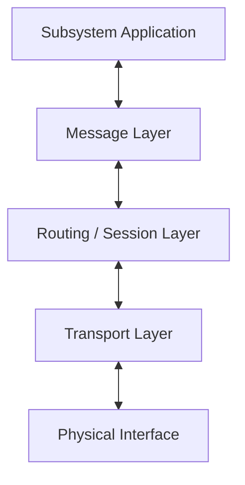
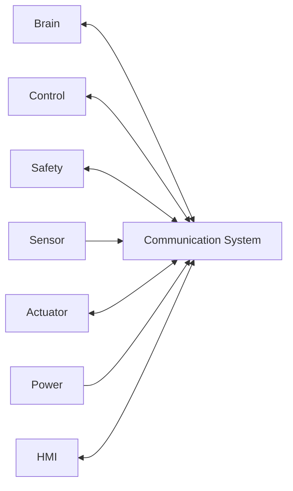
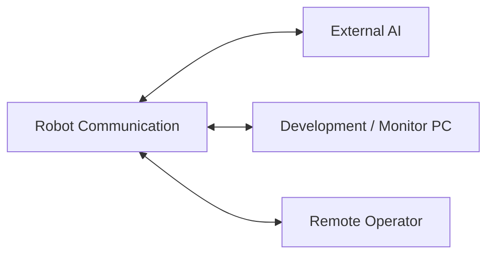
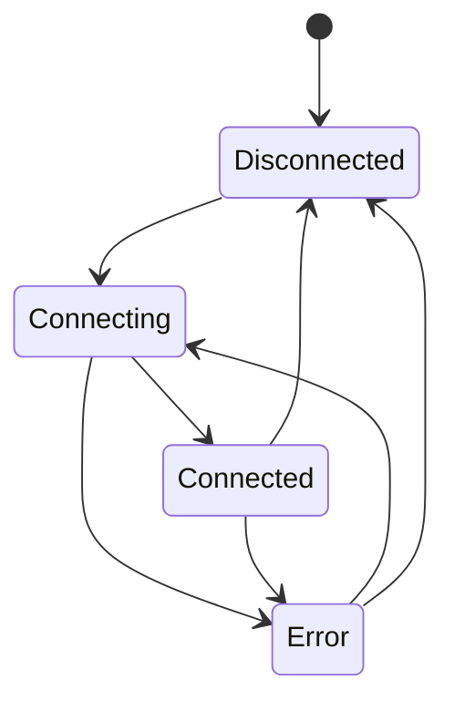
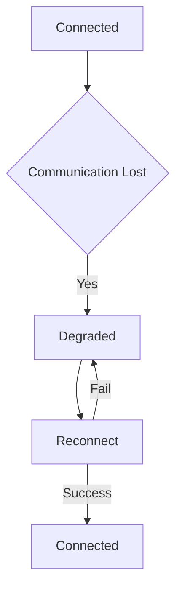

# Communication System 設計仕様書

# 1. 目的

本書は、Communication System 要求仕様書に基づき、人型ロボットに搭載する Communication System の構成、内部通信、外部通信、Message管理、Timeout、再接続、通信異常処理、セキュリティおよび拡張方針を定義する。

Communication System は、ロボット内部サブシステム間および外部計算機との間で、指令、状態、認識結果、安全情報、Error 等を確実に送受信することを目的とする。

本書では基本設計を対象とし、具体的な通信フレーム、Socket実装、CAN ID、UART Baud Rate、暗号アルゴリズム等は詳細設計で定義する。

# 2. 関連文書

| 文書名 | 内容 |
| :- | :- |
| Communication System 要求仕様書 | Communication System が満たすべき要求 |
| システム要求仕様書 | ロボットシステム全体の要求 |
| システム設計仕様書 | システム全体構成 |
| Brain System 設計仕様書 | Brainとの通信要求 |
| Control System 設計仕様書 | Controlとの通信要求 |
| Safety System 設計仕様書 | Safety通信および優先通信要求 |

# 3. 設計方針

## 3.1 責務

Communication System は以下を担当する。

- 内部通信
- 外部通信
- Message識別
- Routing
- Timeout監視
- 通信状態監視
- 再接続
- Sequence管理
- Error検出
- Safety関連Message優先
- 通信ログ

## 3.2 通信層分離



上位モジュールは Ethernet、UART、CAN 等の物理通信方式へ直接依存しない構成とする。

# 4. システム構成

| ID | モジュール | 主な責務 |
| :- | :- | :- |
| COM-MOD-001 | Message Manager | Message生成・解析・識別 |
| COM-MOD-002 | Router | 送信元・送信先に応じたRouting |
| COM-MOD-003 | Internal Transport | 内部通信 |
| COM-MOD-004 | External Transport | 外部通信 |
| COM-MOD-005 | Session Manager | 接続・切断・再接続管理 |
| COM-MOD-006 | Timeout Monitor | Timeout検出 |
| COM-MOD-007 | Priority Manager | Message優先度管理 |
| COM-MOD-008 | Integrity Checker | 欠損・破損検出 |
| COM-MOD-009 | Security Adapter | 認証・保護 |
| COM-MOD-010 | Log / Trace | 通信記録 |

# 5. Message設計

## 5.1 共通Message

```text
Message
├── Message ID
├── Message Type
├── Source
├── Destination
├── Priority
├── Sequence
├── Timestamp
├── Payload Length
├── Payload
└── Integrity Data
```

## 5.2 Message Type

少なくとも以下を扱えること。

- Sensor Data
- Robot State
- Action Command
- Control Command
- Action Result
- Safety State
- Error
- Warning
- Heartbeat
- External AI Request
- External AI Response
- Log
- Configuration

## 5.3 Priority

| Priority | 内容 |
| :- | :- |
| Critical | EmergencyStop 等 |
| High | Safety State / Control Fault |
| Normal | Action / Robot State |
| Low | Log / 非重要Telemetry |

Critical Message は通常Messageより優先して送信する。

# 6. 内部通信設計



内部通信では以下を保証する。

- 宛先識別
- Message Type識別
- Timeout管理
- Error通知
- Priority処理
- 必要に応じた再送

# 7. 外部通信設計

外部通信は以下を対象とする。

- External AI Server
- Development PC
- Monitoring Tool
- Update Server
- Remote Operator



# 8. Session管理

Session Manager は通信相手ごとに以下を管理する。

```text
Session
├── Peer ID
├── Interface
├── State
├── Connected At
├── Last Received
├── Last Sent
├── Timeout
└── Error Count
```

## 8.1 Session State



# 9. Timeout設計

通信ごとに以下を設定可能とする。

- Response Timeout
- Heartbeat Timeout
- Command Timeout
- Session Timeout

Timeout発生時は対象通信を異常状態へ遷移させ、必要に応じて上位へ通知する。

# 10. 通信断時設計



通信断時には以下を行う。

- 古いCommandを新規Commandとして扱わない
- 対象Subsystemへ通信断通知
- Safety関連通信断は高優先異常として扱う
- 外部AI断ではローカル処理へ移行
- 再接続後にSessionを再同期

# 11. Sequence管理

必要なMessageについて Sequence Number を保持する。

Sequence を用いて以下を検出する。

- Duplicate
- Missing Message
- Out-of-order Message

# 12. Integrity設計

通信方式に応じて以下を使用可能とする。

- Checksum
- CRC
- Transport Layer Error Detection

Integrity Error を検出したMessageは無条件に使用しない。

# 13. Security設計

外部通信について必要に応じて以下を実施する。

- Peer Authentication
- Access Control
- Encryption
- Message Authentication
- Replay防止

Safety / Control に影響する外部Messageは認証済みの送信元からのみ受け付ける構成とする。

# 14. Heartbeat

重要な接続について Heartbeat を送受信可能とする。

Heartbeatには少なくとも以下を含む。

```text
Heartbeat
├── Source
├── Timestamp
├── Sequence
└── System State
```

# 15. Error処理

| Error | 処理 |
| :- | :- |
| Timeout | Disconnect / Retry / Notify |
| Integrity Error | Discard / Count / Notify |
| Unknown Message | Reject |
| Invalid Destination | Reject |
| Authentication Error | Reject / Log |
| Repeated Failure | Session Error |
| Safety Link Loss | Safety通知 |

# 16. Log / Trace

以下を記録可能とする。

- Connect / Disconnect
- Message Type
- Source / Destination
- Sequence
- Timeout
- Retry
- Integrity Error
- Authentication Error
- Communication State
- Interface State

# 17. 拡張性設計

Transport Interface を共通化する。

```text
Transport Interface
├── open()
├── close()
├── send()
├── receive()
├── getState()
└── reset()
```

Ethernet、UART、SPI、I2C、CAN、USB 等を同一上位Interfaceから扱える構成とする。

# 18. 試験性設計

以下を個別に試験可能とする。

- Message Encode / Decode
- Routing
- Timeout
- Retry
- Sequence
- Integrity Error
- Communication Loss
- Reconnect
- Priority
- Security

# 19. 要求トレーサビリティ

| 要求ID | 設計項目 |
| :- | :- |
| REQ-COM-SYS-001 ～ 006 | Communication System全体構成 |
| REQ-COM-INT-001 ～ 008 | 内部通信 / Message設計 |
| REQ-COM-EXT-001 ～ 005 | 外部通信 |
| REQ-COM-QLT-001 ～ 006 | Timeout / Sequence / Priority / Integrity |
| REQ-COM-OFF-001 ～ 005 | 通信断時設計 / Session管理 |
| REQ-COM-SEC-001 ～ 003 | Security設計 |
| REQ-COM-EXTN-001 ～ 003 | Transport Interface / Version管理 |

# 20. 詳細設計対象

- Message Binary Format
- Message ID
- CAN ID
- Ethernet Protocol
- UART Format
- Timeout値
- Retry回数
- Heartbeat周期
- CRC方式
- Encryption
- Authentication
- Access Control

# 21. 未確定事項

- 各通信Interface
- 通信速度
- Message最大長
- Protocol
- Timeout
- Retry
- Security方式
