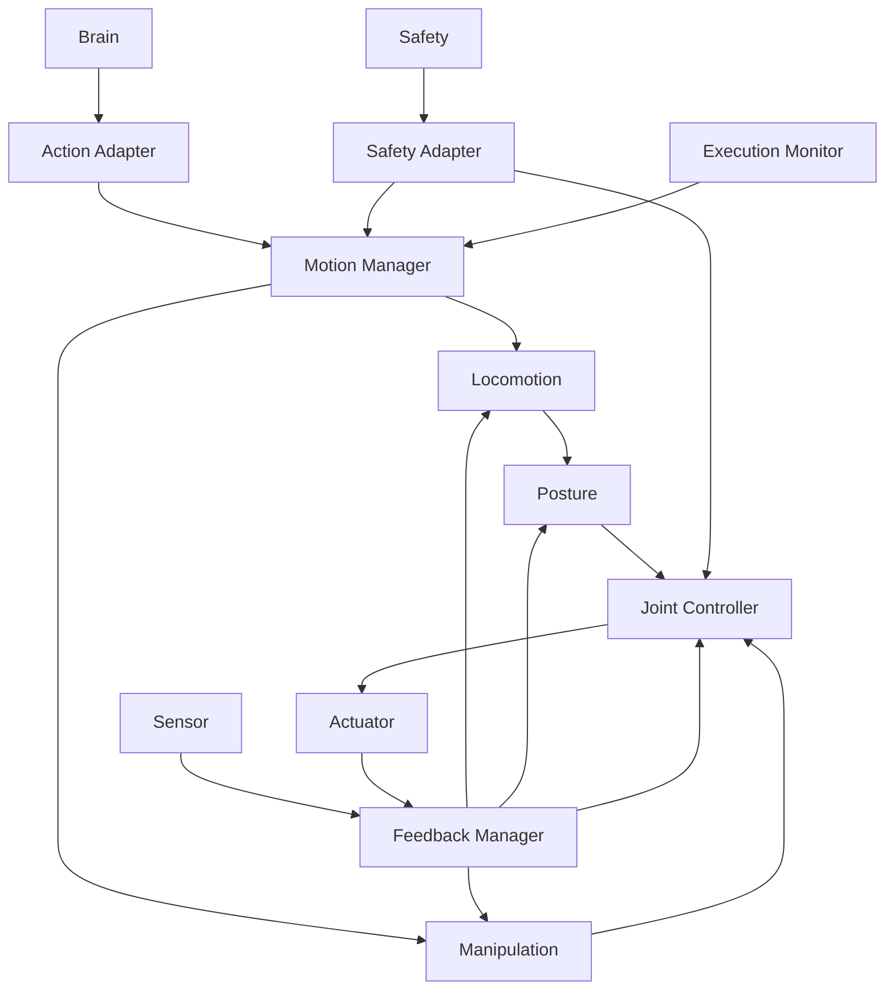

# Control System 詳細設計 README
# 1. 目的
本書は `control_system_design_spec_updated.md` を上位設計とし、Control Systemを実装可能なモジュール粒度へ分解する。
Prototype 1のHybrid Actuation構成、30 kg級Robot、筋肉模倣Actuator、Knee Optional Lock、Passive Ankle、Dual Waist Cylinderを前提とする。
# 2. 設計構成
```text
Control System 設計仕様書
└── detail/README.md
    ├── modules/
    │   ├── CTRL-MOD-001 Action Adapter
    │   ├── CTRL-MOD-002 Motion Manager
    │   ├── CTRL-MOD-003 Locomotion Controller
    │   ├── CTRL-MOD-004 Manipulation Controller
    │   ├── CTRL-MOD-005 Posture Controller
    │   ├── CTRL-MOD-006 Joint Controller
    │   ├── CTRL-MOD-007 Feedback Manager
    │   ├── CTRL-MOD-008 Safety Adapter
    │   ├── CTRL-MOD-009 Execution Monitor
    │   └── CTRL-MOD-010 Log / Trace
    └── common/
        ├── control_types.md
        ├── hybrid_actuation_model.md
        ├── locomotion_algorithm.md
        ├── manipulation_algorithm.md
        ├── posture_algorithm.md
        ├── joint_control.md
        ├── feedback_state_estimation.md
        ├── realtime_execution.md
        ├── safety_stop.md
        └── interface_configuration.md
test/
├── unit/
│   ├── UT-CTRL-MOD-001_action_adapter.md
│   ├── UT-CTRL-MOD-002_motion_manager.md
│   ├── UT-CTRL-MOD-003_locomotion_controller.md
│   ├── UT-CTRL-MOD-004_manipulation_controller.md
│   ├── UT-CTRL-MOD-005_posture_controller.md
│   ├── UT-CTRL-MOD-006_joint_controller.md
│   ├── UT-CTRL-MOD-007_feedback_manager.md
│   ├── UT-CTRL-MOD-008_safety_adapter.md
│   ├── UT-CTRL-MOD-009_execution_monitor.md
│   └── UT-CTRL-MOD-010_log_trace.md
└── integration/
    └── IT-CONTROL_control_integration_test.md
```
# 3. Module一覧
| ID | Module | 責務 | 詳細 |
| :- | :- | :- | :- |
| CTRL-MOD-001 | Action Adapter | Brain Action受信 / Validation / Normalization | [詳細](./modules/CTRL-MOD-001_action_adapter.md) |
| CTRL-MOD-002 | Motion Manager | Motion Sequence / Controller Coordination | [詳細](./modules/CTRL-MOD-002_motion_manager.md) |
| CTRL-MOD-003 | Locomotion Controller | Footstep / Walking / Hybrid Leg Control | [詳細](./modules/CTRL-MOD-003_locomotion_controller.md) |
| CTRL-MOD-004 | Manipulation Controller | Reach / Carry / Shoulder-Arm Coordination | [詳細](./modules/CTRL-MOD-004_manipulation_controller.md) |
| CTRL-MOD-005 | Posture Controller | Attitude / Balance Stabilization | [詳細](./modules/CTRL-MOD-005_posture_controller.md) |
| CTRL-MOD-006 | Joint Controller | ActuationClass別Low-Level Target生成 | [詳細](./modules/CTRL-MOD-006_joint_controller.md) |
| CTRL-MOD-007 | Feedback Manager | Sensor / Actuator State統合 | [詳細](./modules/CTRL-MOD-007_feedback_manager.md) |
| CTRL-MOD-008 | Safety Adapter | Safety Limit / Stop反映 | [詳細](./modules/CTRL-MOD-008_safety_adapter.md) |
| CTRL-MOD-009 | Execution Monitor | Action完了 / 失敗 / Timeout判定 | [詳細](./modules/CTRL-MOD-009_execution_monitor.md) |
| CTRL-MOD-010 | Log / Trace | Control State / Cycle / Fault記録 | [詳細](./modules/CTRL-MOD-010_log_trace.md) |
# 4. Common詳細
| 文書 | 内容 |
| :- | :- |
| [control_types.md](./common/control_types.md) | 共通型 |
| [hybrid_actuation_model.md](./common/hybrid_actuation_model.md) | 筋肉/腰/膝/足首のHybrid Model |
| [locomotion_algorithm.md](./common/locomotion_algorithm.md) | LIPM / Foot Placement / Hybrid MPC候補 |
| [manipulation_algorithm.md](./common/manipulation_algorithm.md) | Shoulder / Scapular / Arm制御 |
| [posture_algorithm.md](./common/posture_algorithm.md) | 姿勢安定化 |
| [joint_control.md](./common/joint_control.md) | ActuationClass別Target変換 |
| [feedback_state_estimation.md](./common/feedback_state_estimation.md) | State統合 / 推定 |
| [realtime_execution.md](./common/realtime_execution.md) | Cycle / Scheduling |
| [safety_stop.md](./common/safety_stop.md) | SafeStop / EmergencyStop |
| [interface_configuration.md](./common/interface_configuration.md) | Interface / Config |
# 5. 依存方向

# 6. Control Cycle
```text
Read Feedback
→ Update ControlState
→ Apply Safety / Power Constraint
→ Motion / Locomotion / Manipulation / Posture Compute
→ Joint Target Allocation
→ Actuator Command Output
→ Execution Monitor
→ Log / Trace
```
# 7. Hybrid Actuation Principle
Control Systemは全Actuatorを同じJoint Servoとして扱わない。
```text
MuscleLike
  → force / displacement / velocity allocation
LinearCylinder
  → length / velocity / force command
BrakeControlled
  → lock / release command
PassiveElastic
  → no direct actuation; model / state used by controller
```
# 8. 実装順序
```text
Phase 1 Common Types / Interfaces / Feedback Manager
Phase 2 Action Adapter / Motion Manager
Phase 3 Joint Controller + Fake Actuator
Phase 4 Posture Controller
Phase 5 Locomotion Controller
Phase 6 Manipulation Controller
Phase 7 Safety Adapter / Execution Monitor
Phase 8 Real-time tuning / MPC / State Estimation
```
# 9. Test方針
単体Testは各CTRL-MODに対して独立実施する。
結合TestはControl System全体Pipeline、Sensor/Actuator/Safety Mockを用いて実施する。
Test詳細は `../test/` を参照する。
