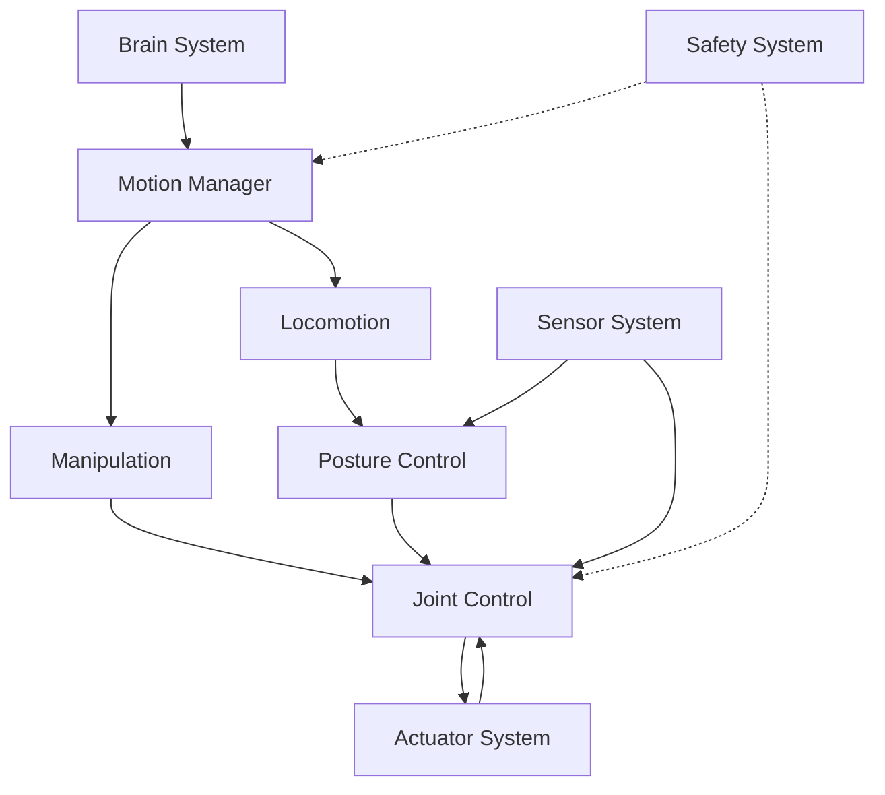
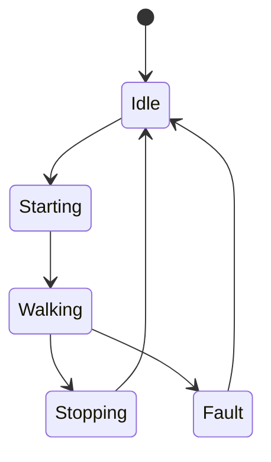
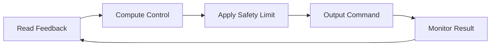

# Control System 設計仕様書

# 1. 目的

本書は、Control System 要求仕様書に基づき、人型ロボットに搭載する Control System の構成、Motion Control、Locomotion、Manipulation、Posture、Joint Control、リアルタイム処理、安全連携および異常処理を定義する。

Control System は Brain System から受信した Action Command を、物理ロボットが実行可能な制御目標へ変換し、Actuator System を通じて動作を実現する。

# 2. 関連文書

| 文書名 | 内容 |
| :- | :- |
| [Control System 要求仕様書](../requirement/README.md) | Control System が満たすべき要求 |
| [Brain System 設計仕様書](../../Brain/spec/README.md) | Action Command |
| [Actuator System 設計仕様書](../../Actuator/spec/README.md) | Drive Command / Actuator State |
| [Safety System 要求仕様書](../../Safety/requirement/README.md) | 制限・停止要求 |
| [Sensor System 要求仕様書](../../Sensor/requirement/README.md) | Feedback情報 |

# 3. 設計方針



高レベルActionと低レベル制御を分離する。

# 4. モジュール構成

| ID | モジュール | 主な責務 |
| :- | :- | :- |
| CTRL-MOD-001 | Action Adapter | Brain Action受信 |
| CTRL-MOD-002 | Motion Manager | 全身動作管理 |
| CTRL-MOD-003 | Locomotion Controller | 歩行・移動 |
| CTRL-MOD-004 | Manipulation Controller | 腕・手・把持 |
| CTRL-MOD-005 | Posture Controller | 姿勢安定化 |
| CTRL-MOD-006 | Joint Controller | 関節目標・制御 |
| CTRL-MOD-007 | Feedback Manager | Sensor / Actuator状態統合 |
| CTRL-MOD-008 | Safety Adapter | Safety制限反映 |
| CTRL-MOD-009 | Execution Monitor | 完了・失敗判定 |
| CTRL-MOD-010 | Log / Trace | 制御状態記録 |

# 5. Action Command

```text
ActionCommand
├── Action ID
├── Action Type
├── Target
├── Parameters
├── Completion Condition
├── Timeout
└── Priority
```

Control System は Action Type に応じて適切な Controller へ分配する。

# 6. Motion Manager

Motion Manager は以下を行う。

- Action解析
- 必要Controller選択
- 複数部位の協調
- Motion Sequence管理
- Completion判定
- Failure判定
- Cancel処理

# 7. Locomotion Control

## 7.1 入力

- Target Position
- Target Direction
- Target Velocity
- Environment Constraint
- Robot State

## 7.2 出力

- Footstep Target
- Body Target
- Joint Target
- Velocity Target

## 7.3 状態



# 8. Manipulation Control

以下を扱う。

- Reach
- Grasp
- Release
- Carry
- Place

Manipulationでは対象位置、手先状態、接触情報を利用する。

# 9. Posture Control

Posture Controller は以下を入力とする。

- IMU
- Joint State
- Contact State
- Force / Torque
- Motion Target

出力は Body / Joint 補正量とする。

姿勢異常が一定条件を超えた場合、Execution Monitor および Safety System へ通知する。

# 10. Joint Control

## 10.1 Joint Target

```text
JointTarget
├── Joint ID
├── Position
├── Velocity
├── Torque
├── Control Mode
├── Limit
└── Timestamp
```

## 10.2 Feedback

- Joint Position
- Joint Velocity
- Torque
- Current
- Temperature
- Error

# 11. Control Mode

関節ごとに必要に応じて以下を使用する。

- Position Control
- Velocity Control
- Torque Control
- Current Control

Control Mode は Action、機体構成、Safety State に応じて選択する。

# 12. Feedback Manager

Sensor System および Actuator System から取得した状態を統合し、各Controllerへ提供する。

```text
ControlState
├── Robot Attitude
├── Joint States[]
├── Contact States[]
├── Force States[]
├── Actuator Errors[]
└── Timestamp
```

# 13. リアルタイム処理

制御処理は周期処理として実行する。



各制御Loopは規定周期超過を監視する。

# 14. Safety連携

Safety Adapter は以下を受信する。

- Velocity Limit
- Torque Limit
- Joint Limit
- SafeStop
- EmergencyStop

優先順位：

```text
EmergencyStop
    >
SafeStop
    >
Safety Limit
    >
Normal Control
```

# 15. SafeStop

SafeStopでは以下を考慮する。

- 急激な姿勢崩壊を防止
- 移動を減速停止
- 必要に応じて支持姿勢維持
- 把持物落下防止
- Actuator Systemへ安全な停止指令

# 16. Execution Monitor

Action の状態を以下で管理する。

| State | 内容 |
| :- | :- |
| Pending | 待機 |
| Running | 実行中 |
| Succeeded | 成功 |
| Failed | 失敗 |
| Cancelled | 中止 |
| Timeout | 時間超過 |

# 17. Action Result

```text
ActionResult
├── Action ID
├── Result
├── Reason
├── Start Time
├── End Time
├── Final State
└── Error
```

Brain Systemへ返却する。

# 18. エラー処理

検出対象：

- Controller Timeout
- Actuator Response Error
- Sensor Error
- Unstable Posture
- Target Unreachable
- Joint Limit
- Control Divergence

異常レベルに応じて以下を実行する。

- Retry
- Reduce Speed
- Cancel Action
- SafeStop
- EmergencyStop Request

# 19. 通信断時設計

Brainとの通信断時でも下位Controllerは即時停止せず、安全な既定挙動へ移行可能とする。

Actuator Systemとの通信断は高優先Faultとして扱う。

# 20. Log / Trace

以下を記録する。

- Action Command
- Motion State
- Joint Target
- Feedback
- Control Mode
- Safety Limit
- Action Result
- Error
- Cycle Time

# 21. 拡張性設計

Controller Interface を共通化する。

```text
Controller Interface
├── initialize()
├── setTarget()
├── update()
├── stop()
├── getState()
└── reset()
```

新しい Motion / Controller を追加可能とする。

# 22. 試験性設計

- Motion Manager単体試験
- Locomotion試験
- Manipulation試験
- Posture試験
- Joint Control試験
- Sensor Mock
- Actuator Mock
- Safety Input Mock
- Cycle Overrun試験

# 23. 要求トレーサビリティ

| 要求ID | 設計項目 |
| :- | :- |
| REQ-CTRL-SYS-001 ～ 006 | Control System全体構成 |
| REQ-CTRL-MOT-001 ～ 005 | Motion Manager |
| REQ-CTRL-LOC-001 ～ 004 | Locomotion Controller |
| REQ-CTRL-MAN-001 ～ 004 | Manipulation Controller |
| REQ-CTRL-POS-001 ～ 004 | Posture Controller |
| REQ-CTRL-JNT-001 ～ 005 | Joint Controller |
| REQ-CTRL-RT-001 ～ 004 | リアルタイム処理 |
| REQ-CTRL-SAFE-001 ～ 005 | Safety連携 |
| REQ-CTRL-ERR-001 ～ 004 | Error処理 |
| REQ-CTRL-QUAL-001 ～ 004 | 試験 / Log / Version管理 |

# 24. 詳細設計対象

- Motion Planning Algorithm
- Walking Algorithm
- IK / FK
- MPC / LQR / PID
- Joint Control
- Control Cycle
- Filter
- State Estimation
- SafeStop Sequence
- Interface Format

# 25. 未確定事項

- 制御周期
- Locomotion方式
- Manipulation方式
- Posture Control方式
- Joint Control方式
- State Estimator
- SafeStop方式
