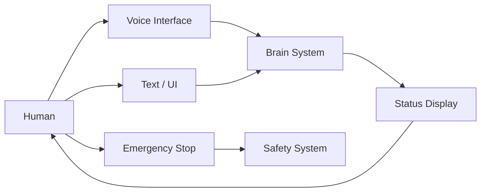
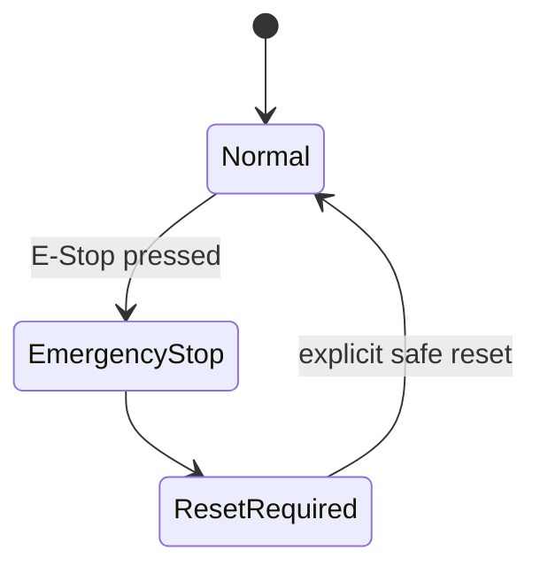

# Human Interface System 設計仕様書

# 1. 目的

本書は、Human Interface System 要求仕様書に基づき、人間とロボット間の音声、テキスト、状態表示、警告および非常停止に関するインタフェース設計を定義する。

# 2. 関連文書

| 文書名 | 内容 |
| :- | :- |
| Human Interface System 要求仕様書 | HMI要求 |
| Brain System 設計仕様書 | Voice / Text入力、応答 |
| Safety System 要求仕様書 | EmergencyStop |
| Communication System 設計仕様書 | Remote UI通信 |

# 3. 設計方針

HMIは通常操作と安全操作を分離する。



# 4. モジュール構成

| ID | モジュール | 主な責務 |
| :- | :- | :- |
| HMI-MOD-001 | Voice Input | 音声取得 |
| HMI-MOD-002 | Text Input | テキスト指示 |
| HMI-MOD-003 | Response Output | 音声・テキスト応答 |
| HMI-MOD-004 | Status Display | 状態表示 |
| HMI-MOD-005 | Warning Manager | Warning表示 |
| HMI-MOD-006 | Error Display | Error表示 |
| HMI-MOD-007 | Emergency Stop Interface | 非常停止 |
| HMI-MOD-008 | Event Logger | 操作ログ |

# 5. Voice Input

Voice Inputは以下を扱う。

```text
VoiceInput
├── Input ID
├── Audio Data
├── Start Time
├── End Time
├── Device State
└── Source
```

取得音声は Brain System の Speech Recognition へ渡す。

# 6. Text Input

```text
TextInput
├── Input ID
├── Text
├── Source
├── Timestamp
└── User Context
```

Text Input は Brain System へ転送する。

# 7. Response Output

以下を出力可能とする。

- Speech
- Text
- Confirmation
- Clarification
- Warning
- Error

# 8. Status Display

少なくとも以下を表示可能とする。

- Power State
- Robot State
- Brain State
- Control State
- Communication State
- Safety State
- Current Action
- Current Goal
- Battery State

# 9. Warning表示

Warningは通常情報より明確に区別する。

Warningには以下を含む。

```text
Warning
├── ID
├── Level
├── Source
├── Message
└── Timestamp
```

# 10. Error表示

Errorは以下を表示可能とする。

- Error ID
- Error Level
- Source
- Description
- Recovery Guidance

# 11. Emergency Stop

Emergency Stopは通常HMI処理から独立可能な構成とする。



EmergencyStop入力は Safety System へ直接通知可能とする。

# 12. 操作状態

| State | 内容 |
| :- | :- |
| Idle | 操作待機 |
| Input | 入力中 |
| Processing | Brain処理中 |
| Responding | 応答中 |
| Warning | 警告 |
| Error | 異常 |
| EmergencyStop | 非常停止 |

# 13. Remote UI

必要に応じてRemote UIを追加可能とする。

Remote UI経由の制御要求はCommunication / Safety要求に従う。

Remote UIからEmergencyStop相当の指令を扱う場合、物理EmergencyStopと同等扱いとするかは詳細設計で定義する。

# 14. Accessibility / 操作性

- 通常状態と異常状態を識別可能にする
- 重要警告を埋没させない
- EmergencyStop位置を明確にする
- 入力受付状態を人間が確認可能とする

# 15. Error処理

- Microphone Error
- Speaker Error
- Display Error
- UI Communication Error
- Input Device Error

重要なHMI異常は上位システムへ通知する。

# 16. Log / Trace

以下を記録する。

- Voice Input Event
- Text Input Event
- User Operation
- Warning
- Error
- EmergencyStop
- State Change

# 17. 拡張性設計

以下を追加可能とする。

- Touch Display
- Mobile UI
- Web UI
- Remote Console
- Additional Microphone
- Additional Speaker
- Physical Button

# 18. 試験性設計

- Voice Input Mock
- Text Input
- Warning
- Error
- EmergencyStop
- Display Failure
- Communication Failure

# 19. 要求トレーサビリティ

| 要求ID | 設計項目 |
| :- | :- |
| REQ-HMI-SYS-001 ～ 005 | HMI全体構成 |
| REQ-HMI-VOICE-001 ～ 004 | Voice Input |
| REQ-HMI-TXT-001 ～ 003 | Text Input |
| REQ-HMI-OUT-001 ～ 006 | Response / Status Display |
| REQ-HMI-EST-001 ～ 004 | Emergency Stop |
| REQ-HMI-USR-001 ～ 003 | 操作性 |
| REQ-HMI-QUAL-001 ～ 003 | Test / Log / 拡張性 |

# 20. 詳細設計対象

- UI Layout
- Voice Device
- Audio Format
- Display Format
- Remote UI Protocol
- EmergencyStop Hardware
- Reset Procedure

# 21. 未確定事項

- UI Device
- Audio Device
- Screen
- Remote UI
- Physical E-Stop仕様
