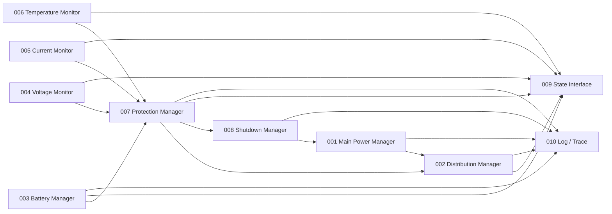

# Power System 詳細設計
# 1. 目的
本書は `../power_system_design_spec_updated.md` を上位設計とし、Power Systemを実装可能なModule単位へ分解して定義する詳細設計の親文書である。
30 kg級Humanoid Robot、筋肉模倣Actuator 50 Motor、24 V Actuator Bus、24 V / 50 Ah class Battery、Nominal 5 h / Intense 45 minのMissionを前提とする。
Test仕様は本詳細設計から分離し、`../test/` 配下で管理する。
# 2. 設計階層
```text
Power System 設計仕様書
└── detail/README.md  ← 本書
    ├── modules/
    │   ├── PWR-MOD-001_main_power_manager.md
    │   ├── PWR-MOD-002_distribution_manager.md
    │   ├── PWR-MOD-003_battery_manager.md
    │   ├── PWR-MOD-004_voltage_monitor.md
    │   ├── PWR-MOD-005_current_monitor.md
    │   ├── PWR-MOD-006_temperature_monitor.md
    │   ├── PWR-MOD-007_protection_manager.md
    │   ├── PWR-MOD-008_shutdown_manager.md
    │   ├── PWR-MOD-009_state_interface.md
    │   └── PWR-MOD-010_log_trace.md
    └── common/
        ├── power_architecture.md
        ├── actuator_power_budget.md
        ├── battery_pack.md
        ├── distribution.md
        ├── monitoring.md
        ├── protection.md
        ├── shutdown_sequence.md
        ├── grounding_isolation.md
        ├── charging.md
        └── interfaces_configuration.md
test/
└── PWR_TEST_DESIGN.md
```
# 3. Module一覧
| ID | Module | 主責務 | 詳細 |
| :- | :- | :- | :- |
| PWR-MOD-001 | Main Power Manager | Main Power State、Startup、Main Contactor | [詳細](./modules/PWR-MOD-001_main_power_manager.md) |
| PWR-MOD-002 | Distribution Manager | Rail / Branch分配、Enable、Priority | [詳細](./modules/PWR-MOD-002_distribution_manager.md) |
| PWR-MOD-003 | Battery Manager | SOC / SOH / Battery Fault / Charge State | [詳細](./modules/PWR-MOD-003_battery_manager.md) |
| PWR-MOD-004 | Voltage Monitor | Main / Logic / Actuator / Aux電圧監視 | [詳細](./modules/PWR-MOD-004_voltage_monitor.md) |
| PWR-MOD-005 | Current Monitor | Main / Branch電流、Power算出 | [詳細](./modules/PWR-MOD-005_current_monitor.md) |
| PWR-MOD-006 | Temperature Monitor | Battery / Power Board / Driver温度 | [詳細](./modules/PWR-MOD-006_temperature_monitor.md) |
| PWR-MOD-007 | Protection Manager | Limit / Branch Cut / Main Cut判断 | [詳細](./modules/PWR-MOD-007_protection_manager.md) |
| PWR-MOD-008 | Shutdown Manager | Normal / Safe / Emergency Shutdown | [詳細](./modules/PWR-MOD-008_shutdown_manager.md) |
| PWR-MOD-009 | State Interface | Brain / Control / Safetyへの状態公開 | [詳細](./modules/PWR-MOD-009_state_interface.md) |
| PWR-MOD-010 | Log / Trace | Power Event / State / Fault記録 | [詳細](./modules/PWR-MOD-010_log_trace.md) |
# 4. Prototype 1 Baseline
```text
Robot mass              30 kg
Actuator bus             24 V nominal
Battery                  24 V / 50 Ah class
Nominal energy           ≈ 1.2 kWh
Usable ratio             0.8
Usable energy            ≈ 0.96 kWh
Nominal operation        >= 5 h
Intense operation        >= 45 min
Nominal average target   <= 190 W
Intense average target   <= 1.2 kW
Short peak target        <= 2.0 kW class
Active motors            50
Installed mech. rating   ≈ 2.516 kW
```
# 5. Muscle Power Group
| Group | 構成 | Installed mechanical rating |
| :- | :- | --: |
| Neck | 22ECT35 ×4 | 136 W |
| Upper Body | 22ECT35 ×18 + 22ECT48 ×8 | 1.044 kW |
| Waist | 22ECT60 ×2 | 172 W |
| Lower Body | 22ECT48 ×12 + 22ECT60 ×6 | 1.164 kW |
Power SystemはInstalled Rating合計を同時許容Powerとして扱わない。
Mission、SOC、Temperature、Safety、Motion Priorityに応じてGlobal Power Budgetを配分する。
詳細は [Actuator Power Budget](./common/actuator_power_budget.md) を参照する。
# 6. Rail / Branch
```text
Battery / BMS
├── Main Fuse
├── Main Contactor
├── Logic DC/DC
├── Sensor / Aux DC/DC
└── 24 V Actuator Bus
    ├── PWR-NECK
    ├── PWR-UPPER-L
    ├── PWR-UPPER-R
    ├── PWR-WAIST-L
    ├── PWR-WAIST-R
    ├── PWR-LOWER-L
    └── PWR-LOWER-R
```
各Actuator BranchはCurrent Monitor、Enable、Current Limit、Power Limit、Priority、Faultを持つ。
詳細は [Power Architecture](./common/power_architecture.md) と [Distribution](./common/distribution.md) を参照する。
# 7. 共通Data Type
```cpp
enum class PowerMode
{
    Off,
    Starting,
    On,
    Warning,
    Limited,
    Fault,
    Shutdown
};
enum class PowerPriority
{
    P0_Essential,
    P1_LowerBody,
    P2_Waist,
    P3_UpperBody,
    P4_Neck
};
struct RailState
{
    std::string id;
    float voltage;
    float current;
    float power;
    bool enabled;
    bool fault;
};
struct BranchState
{
    std::string id;
    float current;
    float power;
    float currentLimit;
    float powerLimit;
    PowerPriority priority;
    bool enabled;
    bool limited;
    bool fault;
};
struct BatteryState
{
    float voltage;
    float current;
    float soc;
    float soh;
    float minCellVoltage;
    float maxCellVoltage;
    float minTemperature;
    float maxTemperature;
    bool chargeAllowed;
    bool dischargeAllowed;
    bool fault;
};
struct PowerState
{
    PowerMode mode;
    BatteryState battery;
    std::vector<RailState> rails;
    std::vector<BranchState> branches;
    float totalPower;
    float availablePower;
    bool warning;
    bool fault;
    std::uint64_t timestampUs;
};
```
# 8. Main Interface
```cpp
class IPowerSystem
{
public:
    virtual ~IPowerSystem() =default;
    virtual PowerState getState() const =0;
    virtual bool setBranchEnabled(const std::string& id,bool enabled) =0;
    virtual bool setBranchCurrentLimit(const std::string& id,float ampere) =0;
    virtual bool setBranchPowerLimit(const std::string& id,float watt) =0;
    virtual void requestSafeShutdown() =0;
    virtual void requestEmergencyShutdown() =0;
};
```
# 9. Module依存方向

監視Moduleは判断材料を提供し、Protection Managerが保護判断を統合する。
Shutdown Managerは停止Sequenceを管理し、Main Power Manager / Distribution Managerへ実行要求を出す。
# 10. Update Cycle
```text
1. Battery / Voltage / Current / Temperature取得
2. Derived Power / Energy更新
3. Protection判定
4. Available Power計算
5. Group / Branch Budget更新
6. Branch Enable / Limit適用
7. PowerState生成
8. Brain / Control / SafetyへPublish
9. Log / Trace
```
Fast Hardware ProtectionはこのSoftware Cycleより上位で独立動作可能とする。
# 11. Global Power Budget
```text
P_available
= f(
    SOC,
    BatteryTemperature,
    BusVoltage,
    SafetyState,
    ThermalMargin
  )
```
要求合計が許容Powerを超過した場合、Priorityの低いGroupからClampする。
```text
P0 Safety / Control / Compute
P1 Lower Body stance / fall prevention
P2 Waist stabilization
P3 Upper Body task
P4 Neck / non-critical motion
```
# 12. Fault Escalation
```text
Local Warning
→ Module Warning
→ Branch Limit
→ Branch Cut
→ SafeShutdown
→ Main Cut
```
Fault種類によって途中Stageを省略可能とする。
Short Circuit、Battery Critical Fault等はHardware Protection / Main Cutへ直行可能とする。
# 13. EmergencyStop
EmergencyStopではActive Muscle Actuatorへの駆動Powerを停止可能とする一方、Safety / Logic / Logに必要なPowerは必要時間維持可能とする。
Knee Electromagnetic Lock、Waist Lock等の最終挙動はSafety SystemとのInterfaceで決定する。
# 14. Configuration
共通Config:
```text
battery_nominal_voltage
battery_capacity_ah
usable_ratio
nominal_power_limit
intense_power_limit
short_peak_limit
rail_limits[]
branch_limits[]
priority[]
thermal_limits[]
shutdown_timing[]
```
詳細は [Interface / Configuration](./common/interfaces_configuration.md) を参照する。
# 15. 横断詳細設計
| 文書 | 内容 |
| :- | :- |
| [power_architecture.md](./common/power_architecture.md) | Rail / Module Architecture |
| [actuator_power_budget.md](./common/actuator_power_budget.md) | Muscle Group別Power Budget |
| [battery_pack.md](./common/battery_pack.md) | Battery / BMS |
| [distribution.md](./common/distribution.md) | Fuse / Contactor / Branch |
| [monitoring.md](./common/monitoring.md) | Sampling / Derived State |
| [protection.md](./common/protection.md) | Protection階層 |
| [shutdown_sequence.md](./common/shutdown_sequence.md) | Shutdown Sequence |
| [grounding_isolation.md](./common/grounding_isolation.md) | Ground / EMI / Isolation |
| [charging.md](./common/charging.md) | Charge State / Interlock |
| [interfaces_configuration.md](./common/interfaces_configuration.md) | C++ Interface / Config |
# 16. Test
Test CaseおよびFault Injectionは本書から分離する。
[Test Design](../test/PWR_TEST_DESIGN.md) を参照する。
# 17. 実装順序
```text
Phase 1  Common Type / Config / Interface
Phase 2  PWR-MOD-003/004/005/006 Monitoring
Phase 3  PWR-MOD-001 Main Power
Phase 4  PWR-MOD-002 Distribution
Phase 5  PWR-MOD-007 Protection
Phase 6  PWR-MOD-008 Shutdown
Phase 7  PWR-MOD-009 State Interface
Phase 8  PWR-MOD-010 Log / Trace
Phase 9  Hardware-in-the-loop / Mission validation
```
# 18. 完了条件
- 全PWR-MOD-001～010のInterfaceと責務が実装される。
- 24 V Actuator Branchを独立監視・制限・遮断できる。
- Muscle Group別Power Budgetが動的に適用される。
- Logic RailがActuator transientから保護される。
- SafeShutdown / EmergencyStop SequenceがSafety Systemと整合する。
- Testは`test/`配下で独立管理される。
