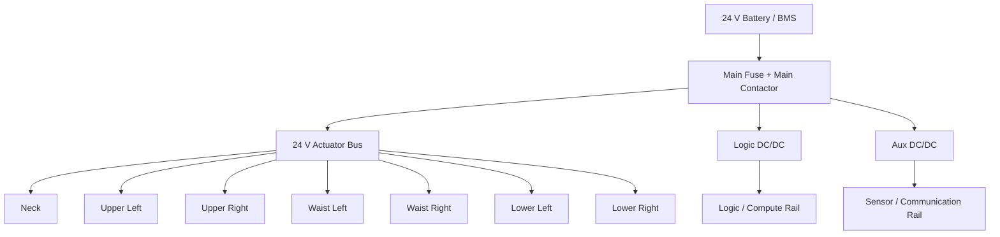

# PWR-DTL-001 Power Architecture
# 1. 目的
Power System全体のRail、Branch、Module間責務を定義する。
# 2. Rail構成

# 3. Module責務
| Module | 責務 |
| :- | :- |
| Main Power Manager | Main Contactor / Startup / Shutdown |
| Distribution Manager | Branch Enable / Priority / Limit |
| Battery Manager | SOC / SOH / Temperature / Charge |
| Voltage Monitor | Rail voltage supervision |
| Current Monitor | Main / Branch current supervision |
| Temperature Monitor | Battery / Driver / Power board thermal supervision |
| Protection Manager | Limit / Cut / Fault escalation |
| Shutdown Manager | SafeShutdown / EmergencyStop sequence |
| State Interface | Brain / Control / Safety state publication |
| Log / Trace | Power event persistence |
# 4. Startup
```text
Off
→ BMS healthy
→ Precheck
→ Logic Rail ON
→ Safety / Control boot
→ Actuator Bus precheck
→ Main Actuator Contactor ON
→ Branches disabled
→ Branches enable by state machine
→ On
```
# 5. Failure Containment
- Neck faultはNeck branchで封じ込める。
- Upper Body faultでLower Body branchを遮断しない。
- Lower Body severe faultはSafetyへ即時通知する。
- Main Bus shortのみMain CutへEscalateする。
