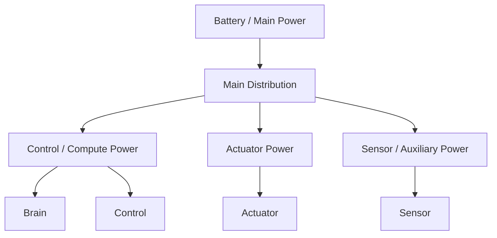
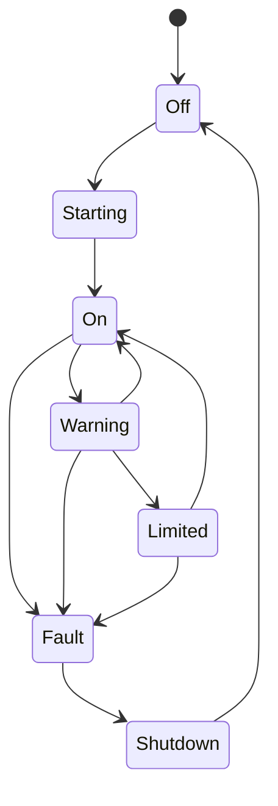

# Power System 設計仕様書

# 1. 目的

本書は、Power System 要求仕様書に基づき、人型ロボット各サブシステムへ安全かつ安定した電力を供給するための構成、監視、保護、遮断、バッテリー管理および上位システム連携を定義する。

# 2. 関連文書

| 文書名 | 内容 |
| :- | :- |
| [Power System 要求仕様書](../requirement/README.md) | Power要求 |
| [Actuator System 設計仕様書](../../Actuator/spec/README.md) | Actuator電力 |
| [Safety System 要求仕様書](../../Safety/requirement/README.md) | Power Fault / EmergencyStop |
| [Sensor System 要求仕様書](../../Sensor/requirement/README.md) | Voltage / Current / Temperature計測 |

# 3. 設計方針

制御系電源と高出力アクチュエータ系電源を可能な範囲で分離する。



# 4. モジュール構成

| ID | モジュール | 主な責務 |
| :- | :- | :- |
| PWR-MOD-001 | Main Power Manager | 主電源管理 |
| PWR-MOD-002 | Distribution Manager | 系統分配 |
| PWR-MOD-003 | Battery Manager | Battery状態 |
| PWR-MOD-004 | Voltage Monitor | 電圧監視 |
| PWR-MOD-005 | Current Monitor | 電流監視 |
| PWR-MOD-006 | Temperature Monitor | 温度監視 |
| PWR-MOD-007 | Protection Manager | 過電流等保護 |
| PWR-MOD-008 | Shutdown Manager | 遮断 |
| PWR-MOD-009 | State Interface | 上位通知 |
| PWR-MOD-010 | Log / Trace | 電源記録 |

# 5. Power State

```text
PowerState
├── Main Voltage
├── Logic Voltage
├── Actuator Voltage
├── Current
├── Battery Level
├── Battery State
├── Temperature
├── Fault
└── Timestamp
```

# 6. 電源状態遷移



# 7. Voltage監視

監視対象：

- Main Voltage
- Logic Voltage
- Actuator Voltage
- Auxiliary Voltage

各系統について以下を設定可能とする。

- Under Voltage Warning
- Under Voltage Stop
- Over Voltage Warning
- Over Voltage Stop

# 8. Current監視

各重要系統のCurrentを監視する。

過電流時は以下を段階的に実施可能とする。

```text
Warning
→ Output Limit
→ Branch Cut
→ Main Cut
```

# 9. Battery Manager

管理対象：

- Voltage
- Current
- Estimated Remaining Capacity
- Temperature
- Charge State
- Health State

Battery低残量時は Brain / Safety へ通知する。

# 10. Protection Manager

以下を保護対象とする。

- Over Current
- Short Circuit
- Over Voltage
- Under Voltage
- Over Temperature
- Reverse / Abnormal Supply
- Battery Fault

# 11. EmergencyStop連携

EmergencyStop時には必要なActuator系電力を遮断可能とする。

一方、制御系・Safety系については状態記録や復帰処理に必要な電力を保持する構成を選択可能とする。

# 12. Safe Shutdown

電力不足またはFault時に以下の順序でShutdown可能とする。

1. BrainへPower Warning
2. Controlへ停止要求
3. Actuator停止確認
4. Log Flush
5. 非重要系統停止
6. Main Shutdown

# 13. 状態通知

Power System は以下を通知する。

- Power Available
- Voltage
- Current
- Battery State
- Temperature
- Warning
- Fault
- Shutdown Request

# 14. Error処理

| Error | 処理 |
| :- | :- |
| Over Current | Limit / Cut |
| Under Voltage | Warning / SafeShutdown |
| Over Voltage | Cut |
| Over Temperature | Limit / Shutdown |
| Battery Fault | Warning / Shutdown |
| Monitor Fault | Safety通知 |

# 15. Log / Trace

以下を記録する。

- Voltage
- Current
- Battery Level
- Temperature
- Protection Event
- Power State
- Shutdown Event
- Fault

# 16. 拡張性設計

Power Channelを共通単位として扱う。

```text
PowerChannel
├── ID
├── Voltage
├── Current
├── Enabled
├── Limits
├── Fault
└── Priority
```

新しいPower Railを追加可能な構成とする。

# 17. 試験性設計

- Over Current
- Under Voltage
- Over Voltage
- Battery Low
- Temperature High
- EmergencyStop
- Branch Cut
- SafeShutdown

# 18. 要求トレーサビリティ

| 要求ID | 設計項目 |
| :- | :- |
| REQ-PWR-SYS-001 ～ 005 | Power System全体構成 |
| REQ-PWR-VLT-001 ～ 005 | Voltage Monitor |
| REQ-PWR-CUR-001 ～ 004 | Current Monitor / Protection |
| REQ-PWR-BAT-001 ～ 004 | Battery Manager |
| REQ-PWR-SAFE-001 ～ 005 | Protection / EmergencyStop / Shutdown |
| REQ-PWR-STATE-001 ～ 004 | State Interface |
| REQ-PWR-QUAL-001 ～ 003 | Log / Test / Configuration |

# 19. 詳細設計対象

- Battery Type
- Fuse / Breaker
- DC/DC
- Power Distribution
- Threshold
- Shutdown Sequence
- Charging
- Grounding
- Isolation
- Monitoring IC

# 20. 未確定事項

- 公称電圧
- Battery容量
- 最大電流
- Rail構成
- 保護閾値
- Shutdown方式
