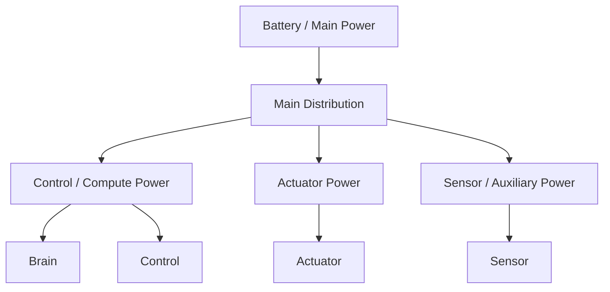
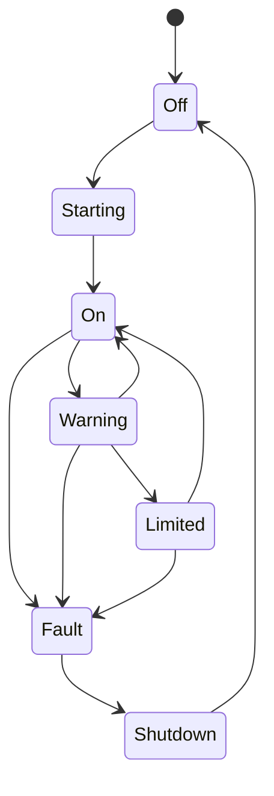

# Power System 設計仕様書

# 1. 目的

本書は、Power System 要求仕様書に基づき、人型ロボット各サブシステムへ安全かつ安定した電力を供給するための構成、監視、保護、遮断、バッテリー管理および上位システム連携を定義する。

# 2. 関連文書

| 文書名 | 内容 |
| :- | :- |
| Power System 要求仕様書 | Power要求 |
| Actuator System 設計仕様書 | Actuator電力 |
| Safety System 要求仕様書 | Power Fault / EmergencyStop |
| Sensor System 要求仕様書 | Voltage / Current / Temperature計測 |

# 3. 設計方針

制御系電源と高出力アクチュエータ系電源を可能な範囲で分離する。



# 4. モジュール構成

| ID | モジュール | 主な責務 |
| :- | :- | :- |
| PWR-MOD-001 | Main Power Manager | 主電源管理 |
| PWR-MOD-002 | Distribution Manager | 系統分配 |
| PWR-MOD-003 | Battery Manager | Battery状態 |
| PWR-MOD-004 | Voltage Monitor | 電圧監視 |
| PWR-MOD-005 | Current Monitor | 電流監視 |
| PWR-MOD-006 | Temperature Monitor | 温度監視 |
| PWR-MOD-007 | Protection Manager | 過電流等保護 |
| PWR-MOD-008 | Shutdown Manager | 遮断 |
| PWR-MOD-009 | State Interface | 上位通知 |
| PWR-MOD-010 | Log / Trace | 電源記録 |

# 5. Power State

```text
PowerState
├── Main Voltage
├── Logic Voltage
├── Actuator Voltage
├── Current
├── Battery Level
├── Battery State
├── Temperature
├── Fault
└── Timestamp
```

# 6. 電源状態遷移



# 7. Voltage監視

監視対象：

- Main Voltage
- Logic Voltage
- Actuator Voltage
- Auxiliary Voltage

各系統について以下を設定可能とする。

- Under Voltage Warning
- Under Voltage Stop
- Over Voltage Warning
- Over Voltage Stop

# 8. Current監視

各重要系統のCurrentを監視する。

過電流時は以下を段階的に実施可能とする。

```text
Warning
→ Output Limit
→ Branch Cut
→ Main Cut
```

# 9. Battery Manager

管理対象：

- Voltage
- Current
- Estimated Remaining Capacity
- Temperature
- Charge State
- Health State

Battery低残量時は Brain / Safety へ通知する。

# 10. Protection Manager

以下を保護対象とする。

- Over Current
- Short Circuit
- Over Voltage
- Under Voltage
- Over Temperature
- Reverse / Abnormal Supply
- Battery Fault

# 11. EmergencyStop連携

EmergencyStop時には必要なActuator系電力を遮断可能とする。

一方、制御系・Safety系については状態記録や復帰処理に必要な電力を保持する構成を選択可能とする。

# 12. Safe Shutdown

電力不足またはFault時に以下の順序でShutdown可能とする。

1. BrainへPower Warning
2. Controlへ停止要求
3. Actuator停止確認
4. Log Flush
5. 非重要系統停止
6. Main Shutdown

# 13. 状態通知

Power System は以下を通知する。

- Power Available
- Voltage
- Current
- Battery State
- Temperature
- Warning
- Fault
- Shutdown Request

# 14. Error処理

| Error | 処理 |
| :- | :- |
| Over Current | Limit / Cut |
| Under Voltage | Warning / SafeShutdown |
| Over Voltage | Cut |
| Over Temperature | Limit / Shutdown |
| Battery Fault | Warning / Shutdown |
| Monitor Fault | Safety通知 |

# 15. Log / Trace

以下を記録する。

- Voltage
- Current
- Battery Level
- Temperature
- Protection Event
- Power State
- Shutdown Event
- Fault

# 16. 拡張性設計

Power Channelを共通単位として扱う。

```text
PowerChannel
├── ID
├── Voltage
├── Current
├── Enabled
├── Limits
├── Fault
└── Priority
```

新しいPower Railを追加可能な構成とする。

# 17. 試験性設計

- Over Current
- Under Voltage
- Over Voltage
- Battery Low
- Temperature High
- EmergencyStop
- Branch Cut
- SafeShutdown

# 18. 要求トレーサビリティ

| 要求ID | 設計項目 |
| :- | :- |
| REQ-PWR-SYS-001 ～ 005 | Power System全体構成 |
| REQ-PWR-VLT-001 ～ 005 | Voltage Monitor |
| REQ-PWR-CUR-001 ～ 004 | Current Monitor / Protection |
| REQ-PWR-BAT-001 ～ 004 | Battery Manager |
| REQ-PWR-SAFE-001 ～ 005 | Protection / EmergencyStop / Shutdown |
| REQ-PWR-STATE-001 ～ 004 | State Interface |
| REQ-PWR-QUAL-001 ～ 003 | Log / Test / Configuration |

# 19. 詳細設計対象

- Battery Type
- Fuse / Breaker
- DC/DC
- Power Distribution
- Threshold
- Shutdown Sequence
- Charging
- Grounding
- Isolation
- Monitoring IC

# 20. 未確定事項

- 公称電圧
- Battery容量
- 最大電流
- Rail構成
- 保護閾値
- Shutdown方式
# 21. Prototype 1 Power Baseline
## 21.1 Mission
30 kg Robotについて以下を初期Mission Requirementとする。
```text
Nominal operation : 5 h以上
Intense operation : 45 min以上
Usable ratio      : 0.8
```
## 21.2 Battery Energy
初期候補:
```text
24 V nominal
50 Ah nominal
≈ 1.2 kWh
Usable energy ≈ 0.96 kWh
```
Battery chemistry / series-parallel cell configurationは詳細設計で確定する。
## 21.3 Average Power Limit
Mission成立条件:
```text
Nominal:
0.96 kWh / 5 h = 192 W
→ System target <= 190 W average
Intense:
0.96 kWh / 0.75 h = 1.28 kW
→ System target <= 1.2 kW average
```
Short Peakは2.0 kW級を初期検討値とする。
## 21.4 Bus
Prototype 1は24 V Actuator Busを基本とする。
Compute / Sensor / CommunicationはDC/DCにより12 V / 5 V等へ分配する。
## 21.5 Global Power Budget
Power Managerは以下のGroupにPower Allocationを行う。
- Lower Body
- Waist
- Upper Body
- Neck
- Compute
- Sensor / Communication
Battery SOC、Temperature、Safety LevelによりActuator Current Limitを動的変更する。
## 21.6 Brownout / Peak
激しい運動時の瞬時電流でCompute系がBrownoutしないようActuator系とLogic系のDC/DC / Capacitor / Wiringを分離する。
# 22. Muscle Actuator Power Architecture
## 22.1 目的
Prototype 1の筋肉模倣Actuator構成をPower Systemへ明示的に反映し、各筋肉GroupをPower Branchとして監視・制限・遮断できる構成とする。
## 22.2 Actuator Motor Baseline
筋肉模倣Active ActuatorはPortescap 22ECT Ultra EC Familyを標準とする。
| Class | Model | Max continuous mechanical rating @25°C | Initial count |
| :- | :- | --: | --: |
| S | 22ECT35 | 34 W | 22 |
| M | 22ECT48 | 54 W | 20 |
| L | 22ECT60 | 86 W | 8 |
Installed maximum continuous mechanical ratingの単純合算は約2.516 kWである。
これは全Motorの同時最大連続運転を許容する意味ではなく、Power SystemはMission Power Budget内に同時稼働を制限する。
## 22.3 Muscle Power Groups
| Power Group | Muscle / Mechanism | Motor構成 | Installed mechanical rating |
| :- | :- | :- | --: |
| Neck | Sternocleidomastoid, Splenius capitis | 22ECT35 ×4 | 136 W |
| Upper Body | Biceps brachii, Deltoid, Serratus anterior, Trapezius, Pectoralis major, Latissimus dorsi | 22ECT35 ×18 + 22ECT48 ×8 | 1.044 kW |
| Waist | Dual electric linear cylinders | 22ECT60 ×2 | 172 W |
| Lower Body | Gluteus maximus, Rectus femoris, Biceps femoris, Adductor magnus | 22ECT48 ×12 + 22ECT60 ×6 | 1.164 kW |
| Total | Active muscle-like + waist actuators | 50 motors | 2.516 kW |
## 22.4 Branching Policy
Actuator Power Railは少なくとも以下のBranchへ分割する。
```text
24 V Actuator Bus
├── NECK
│   ├── Left SCM / Splenius
│   └── Right SCM / Splenius
├── UPPER_LEFT
│   ├── Shoulder / Scapular group
│   └── Biceps brachii
├── UPPER_RIGHT
│   ├── Shoulder / Scapular group
│   └── Biceps brachii
├── WAIST_LEFT
├── WAIST_RIGHT
├── LOWER_LEFT
│   ├── Gluteus maximus
│   ├── Rectus femoris
│   ├── Biceps femoris
│   └── Adductor magnus
└── LOWER_RIGHT
    ├── Gluteus maximus
    ├── Rectus femoris
    ├── Biceps femoris
    └── Adductor magnus
```
各Branchは独立してCurrent Monitor、Enable、Current Limit、Fault、Priorityを持つ。
## 22.5 Mission Power Budget
```text
Battery nominal       : 24 V / 50 Ah class
Nominal energy        : ≈ 1.2 kWh
Usable ratio          : 0.8
Usable energy         : ≈ 0.96 kWh
Nominal average target: <= 190 W
Intense average target: <= 1.2 kW
Short peak target     : <= 2.0 kW class
```
Global Power BudgetはInstalled Motor RatingではなくBattery State、Thermal State、Safety State、Motion Priorityにより動的に配分する。
## 22.6 Priority
初期Priorityは以下を基本とする。
| Priority | Group | 方針 |
| :- | :- | :- |
| P0 | Safety / Control / Compute essential | 原則維持 |
| P1 | Lower Body stance / fall prevention | 最優先Actuator |
| P2 | Waist stabilization | 姿勢保持に必要な範囲で維持 |
| P3 | Upper Body task-critical | 作業内容に応じて配分 |
| P4 | Neck / non-critical upper body | 最初にDerating可能 |
## 22.7 Brownout Isolation
Actuator Current StepによるLogic Rail低下を防止するため、Actuator BusとLogic / Sensor BusはDistribution段で分離し、DC/DC、Bulk Capacitor、配線、Ground Returnを独立管理する。
## 22.8 詳細設計参照
詳細はPower詳細設計READMEおよび以下を参照する。
- power_architecture.md
- actuator_power_budget.md
- battery_pack.md
- distribution.md
- monitoring.md
- protection.md
- shutdown_sequence.md
- grounding_isolation.md
- charging.md
- interfaces_configuration.md
- test_design.md
