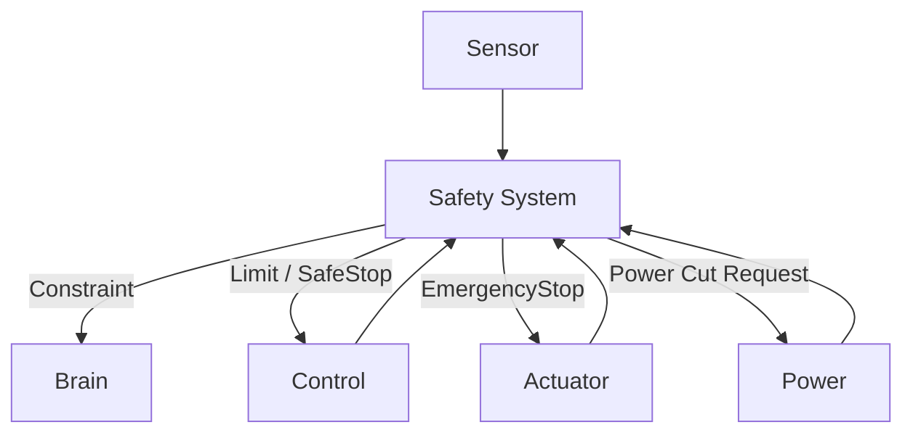
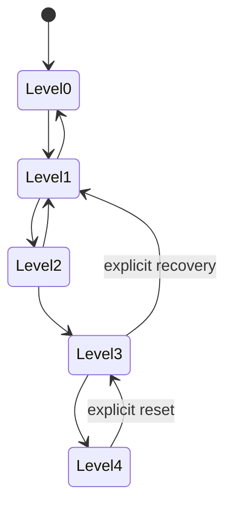
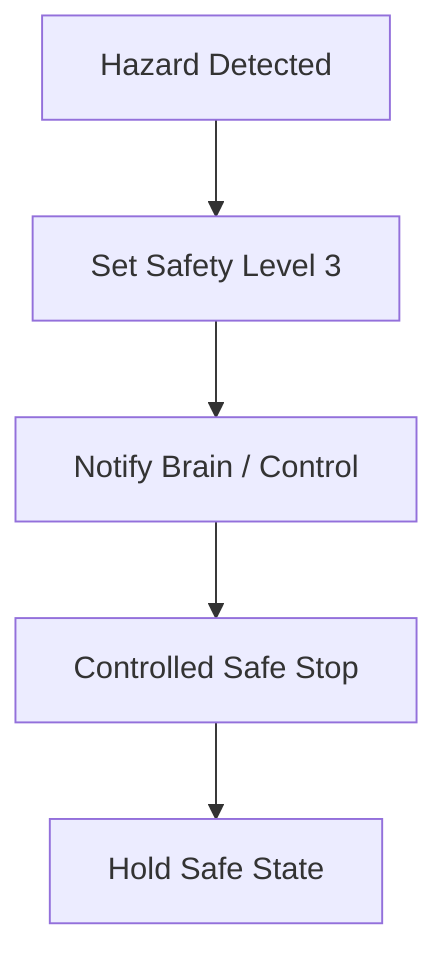

# Safety System 設計仕様書

# 1. 目的

本書は、Safety System 要求仕様書に基づき、人型ロボットに搭載する Safety System の監視、Safety Level、Limit、SafeStop、EmergencyStop、Fault Detection、通信断処理および他Subsystemとの連携を定義する。

Safety System は Brain System から独立して動作可能とし、AIまたは通常制御の判断に依存せず危険状態を検出・制限・停止可能とする。

# 2. 関連文書

| 文書名 | 内容 |
| :- | :- |
| [Safety System 要求仕様書](../requirement/README.md) | Safety要求 |
| [Brain System 設計仕様書](../../Brain/spec/README.md) | Constraint / Stop連携 |
| [Control System 設計仕様書](../../Control/spec/README.md) | SafeStop / Limit |
| [Actuator System 設計仕様書](../../Actuator/spec/README.md) | EmergencyStop |
| [Power System 設計仕様書](../../Power/spec/README.md) | Power Cut |
| [Sensor System 設計仕様書](../../Sensor/spec/README.md) | Safety監視入力 |

# 3. 設計方針

Safety System は通常制御経路と独立した監視経路を持つ。



# 4. モジュール構成

| ID | モジュール | 主な責務 |
| :- | :- | :- |
| SAFE-MOD-001 | Safety Monitor | 状態監視 |
| SAFE-MOD-002 | Limit Evaluator | 閾値評価 |
| SAFE-MOD-003 | Safety Level Manager | Level管理 |
| SAFE-MOD-004 | SafeStop Manager | 安全停止 |
| SAFE-MOD-005 | EmergencyStop Manager | 非常停止 |
| SAFE-MOD-006 | Watchdog Manager | Heartbeat監視 |
| SAFE-MOD-007 | Fault Classifier | 異常分類 |
| SAFE-MOD-008 | Recovery Manager | 復帰条件管理 |
| SAFE-MOD-009 | Safety Interface | 他Subsystem連携 |
| SAFE-MOD-010 | Log / Trace | Safety記録 |

# 5. 監視対象

- Joint Position
- Joint Velocity
- Torque
- Current
- Temperature
- Voltage
- Force
- Robot Attitude
- Communication
- Controller Status
- Sensor Status
- Power Status

# 6. Safety State

```text
SafetyState
├── Level
├── Active Faults[]
├── Active Limits[]
├── SafeStop
├── EmergencyStop
├── RecoveryAllowed
└── Timestamp
```

# 7. Safety Level

| Level | 名称 | 動作 |
| :-: | :- | :- |
| 0 | Normal | 通常動作 |
| 1 | Warning | 警告・監視 |
| 2 | Limited | 出力制限 |
| 3 | SafeStop | 安全停止 |
| 4 | EmergencyStop | 非常停止 |



# 8. Limit設計

以下をLimit対象とする。

- Joint Position
- Joint Velocity
- Torque
- Current
- Force
- Temperature
- Voltage

Safety Limit は Control / Actuator側の通常Limitより優先可能とする。

# 9. Fault分類

```text
SafetyFault
├── Fault ID
├── Source
├── Type
├── Level
├── Value
├── Limit
├── Timestamp
└── Latched
```

# 10. SafeStop

SafeStopは可能な範囲で制御された停止を行う。



# 11. EmergencyStop

EmergencyStopは危険を即時抑制する。

処理：

1. Safety Level 4
2. 通常Command無効化
3. ActuatorへEmergencyStop
4. 必要に応じてPowerへ遮断要求
5. Brain / HMIへ状態通知
6. 状態Latch

# 12. Watchdog

重要SubsystemについてHeartbeatを監視可能とする。

- Brain
- Control
- Actuator
- Sensor
- Communication
- Power

Timeout時のSafety Levelは対象Subsystemごとに設定する。

# 13. Sensor Fault

Sensor Fault時は以下を判断する。

- 代替Sensor利用可否
- 制御継続可否
- Degraded Operation可否
- SafeStop要否

# 14. Communication Fault

外部通信断では Safety System 自体は継続する。

内部Safety通信断は高優先Faultとして扱う。

# 15. Recovery

Safety状態からの復帰には明示的な条件確認を必要とする。

Recovery条件例：

- Fault解消
- Sensor正常
- Controller正常
- Actuator正常
- Power正常
- EmergencyStop Release
- Operator Reset

EmergencyStopから自動復帰しない。

# 16. Safety Constraint

Brain Systemへ以下の形式でConstraintを通知可能とする。

```text
SafetyConstraint
├── Constraint ID
├── Target
├── Type
├── Limit
├── Critical
├── Active
└── Timestamp
```

# 17. Error / Event Log

記録対象：

- Safety Level Change
- Fault
- Limit Violation
- SafeStop
- EmergencyStop
- Watchdog Timeout
- Recovery
- Manual Reset
- Power Cut Request

# 18. Fail-safe設計

Safety System自身の一部異常時にも危険側へ遷移しない設計を優先する。

例：

- Safety Sensor不明 → 制限または停止側
- Safety通信不明 → Safety Link Fault
- Watchdog停止 → 上位Safety Levelへ遷移

# 19. 試験性設計

- 各Limit超過
- Sensor Fault
- Communication Fault
- Controller Fault
- Actuator Fault
- Power Fault
- SafeStop
- EmergencyStop
- Recovery
- Watchdog

# 20. 要求トレーサビリティ

| 要求ID | 設計項目 |
| :- | :- |
| REQ-SAFE-SYS-001 ～ 005 | Safety System全体構成 |
| REQ-SAFE-MON-001 ～ 011 | Safety Monitor |
| REQ-SAFE-LVL-001 ～ 006 | Safety Level |
| REQ-SAFE-LIM-001 ～ 006 | Limit設計 |
| REQ-SAFE-STOP-001 ～ 004 | SafeStop |
| REQ-SAFE-EST-001 ～ 005 | EmergencyStop / Recovery |
| REQ-SAFE-ERR-001 ～ 009 | Fault Detection |
| REQ-SAFE-NET-001 ～ 003 | Communication Fault / Watchdog |
| REQ-SAFE-QUAL-001 ～ 004 | Log / Test / Configuration |

# 21. 詳細設計対象

- Safety Threshold
- Watchdog周期
- SafeStop Sequence
- EmergencyStop Hardware
- Interlock
- Power Cut
- Recovery Procedure
- Fault Matrix
- FMEA / FTA

# 22. 未確定事項

- 各Safety閾値
- Safety監視周期
- Hardware Interlock
- E-Stop方式
- Recovery方式
