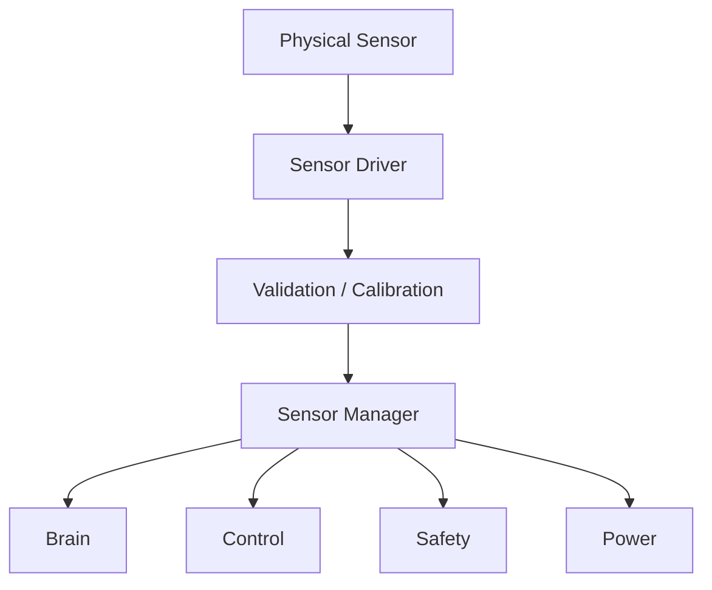
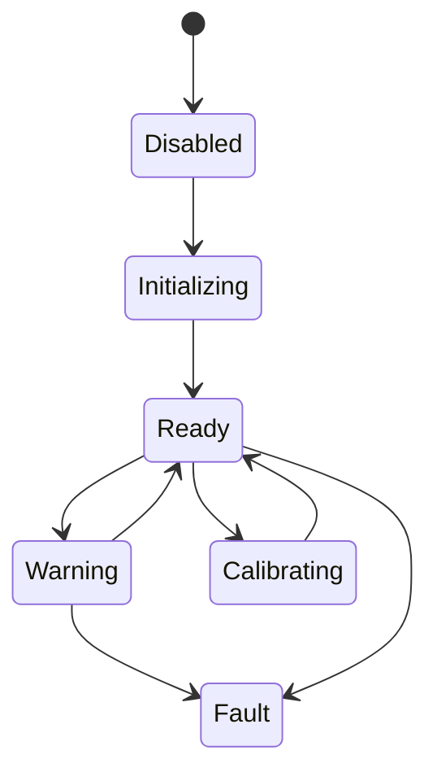

# Sensor System 設計仕様書

# 1. 目的

本書は、Sensor System 要求仕様書に基づき、人型ロボットの外界および内部状態を計測し、Brain、Control、Safety、Power Systemへ提供する Sensor System の構成、データ形式、時刻、異常処理および拡張方針を定義する。

# 2. 関連文書

| 文書名 | 内容 |
| :- | :- |
| Sensor System 要求仕様書 | Sensor要求 |
| Brain System 設計仕様書 | Perception入力 |
| Control System 設計仕様書 | Feedback入力 |
| Safety System 設計仕様書 | Safety監視入力 |
| Power System 設計仕様書 | Voltage / Current / Temperature |

# 3. 設計方針

Sensor固有Driverと上位利用形式を分離する。



# 4. モジュール構成

| ID | モジュール | 主な責務 |
| :- | :- | :- |
| SEN-MOD-001 | Sensor Driver | Sensor固有アクセス |
| SEN-MOD-002 | Sensor Manager | ID / State管理 |
| SEN-MOD-003 | Timestamp Manager | 時刻付与 |
| SEN-MOD-004 | Calibration Manager | 補正 |
| SEN-MOD-005 | Validation Manager | 範囲・異常確認 |
| SEN-MOD-006 | Data Distributor | 上位配布 |
| SEN-MOD-007 | Fault Monitor | Sensor Fault |
| SEN-MOD-008 | Log / Trace | Sensor記録 |

# 5. Sensor Descriptor

```text
SensorDescriptor
├── Sensor ID
├── Type
├── Interface
├── Unit
├── Range
├── Resolution
├── Sampling Rate
├── Calibration Version
└── Device Version
```

# 6. 共通Sensor Data

```text
SensorData
├── Sensor ID
├── Type
├── Timestamp
├── Value
├── Status
├── Error
└── Sequence
```

# 7. Sensor State

| State | 内容 |
| :- | :- |
| Disabled | 無効 |
| Initializing | 初期化 |
| Ready | 正常 |
| Warning | 警告 |
| Fault | 異常 |
| Calibrating | 校正 |



# 8. Camera

Camera Driverは以下を提供する。

- Image Frame
- Timestamp
- Resolution
- Frame ID
- Device Status

Brain Systemへ画像を提供する。

# 9. IMU

IMUは以下を提供する。

- Angular Velocity
- Acceleration
- 必要に応じてMagnetic Field
- Timestamp
- Status

Control / Safetyへ高優先で配布可能とする。

# 10. Distance Sensor

以下を提供する。

- Distance
- Direction
- Confidence / Validity
- Timestamp

障害物および空間認識へ利用する。

# 11. Force / Torque / Touch

以下を扱う。

- Force
- Torque
- Touch State
- Contact Position
- Timestamp

Manipulation、Posture、Safetyへ提供する。

# 12. Joint Sensor

Joint Sensorは以下を提供する。

- Position
- 必要に応じてVelocity
- Index / Status
- Timestamp

# 13. Electrical / Temperature Sensor

以下を提供する。

- Voltage
- Current
- Temperature
- Status
- Timestamp

Power / Safetyへ提供する。

# 14. Calibration

Sensorごとに以下を管理可能とする。

- Offset
- Scale
- Alignment
- Bias
- Calibration Date
- Calibration Version

Calibration情報はログおよびVersion管理対象とする。

# 15. Validation

以下を検証する。

- Range
- NaN / Invalid
- Sudden Jump
- Timeout
- Stale Data
- Sensor Status

異常Dataは正常値として無条件に上位へ渡さない。

# 16. Timestamp

Timestampは可能な限り計測時刻に近い時点で付与する。

複数Sensor間の時間関係を識別可能とする。

# 17. Stale Data

一定時間更新されないデータは Stale として扱う。

```text
DataAge = CurrentTime - Timestamp
```

規定時間を超えた場合、上位へFault / Warningを通知する。

# 18. Data Distribution

Sensor Typeごとに必要Subsystemへ配布する。

| Sensor | Brain | Control | Safety | Power |
| :- | :-: | :-: | :-: | :-: |
| Camera | ○ | △ | △ | - |
| IMU | ○ | ○ | ○ | - |
| Distance | ○ | △ | ○ | - |
| Force/Torque | ○ | ○ | ○ | - |
| Joint | ○ | ○ | ○ | - |
| Temperature | △ | △ | ○ | ○ |
| Voltage/Current | △ | △ | ○ | ○ |

# 19. Fault Detection

検出対象：

- No Response
- Out of Range
- Invalid Data
- Stale Data
- Communication Error
- Calibration Error
- Self Test Error

# 20. Sensor Fault時設計

Fault SensorのデータはValidityを明示する。

代替Sensorがある場合は上位で代替利用可能とする。

Safetyに必要なSensorが失われた場合はSafety Systemへ即時通知する。

# 21. Log / Trace

以下を記録可能とする。

- Sensor Data
- Sensor State
- Fault
- Calibration
- Device Version
- Sampling Rate
- Timestamp Error

# 22. 拡張性設計

共通Sensor Interfaceを定義する。

```text
Sensor Interface
├── initialize()
├── start()
├── stop()
├── read()
├── getState()
├── calibrate()
├── reset()
└── getDescriptor()
```

# 23. 試験性設計

- Sensor Driver Mock
- Range Error
- Timeout
- Stale Data
- Calibration
- Communication Error
- Multiple Sensor Timestamp
- Sensor Replacement

# 24. 要求トレーサビリティ

| 要求ID | 設計項目 |
| :- | :- |
| REQ-SEN-SYS-001 ～ 006 | Sensor System全体構成 |
| REQ-SEN-DATA-001 ～ 005 | 共通Sensor Data |
| REQ-SEN-CAM-001 ～ 004 | Camera |
| REQ-SEN-IMU-001 ～ 004 | IMU |
| REQ-SEN-DST-001 ～ 003 | Distance Sensor |
| REQ-SEN-FRC-001 ～ 004 | Force / Torque / Touch |
| REQ-SEN-JNT-001 ～ 004 | Joint Sensor |
| REQ-SEN-PWR-001 ～ 004 | Electrical / Temperature |
| REQ-SEN-ERR-001 ～ 004 | Fault Detection |
| REQ-SEN-TIME-001 ～ 003 | Timestamp / Stale Data |
| REQ-SEN-QUAL-001 ～ 004 | Test / Log / Version / Interface |

# 25. 詳細設計対象

- Sensor Device
- Driver
- Sampling Rate
- Filter
- Calibration
- Timestamp Source
- Synchronization
- Communication Protocol
- Sensor Fusion

# 26. 未確定事項

- Sensor型式
- 配置
- Sampling Rate
- Range
- Resolution
- Precision
- Filter
- Calibration方式
