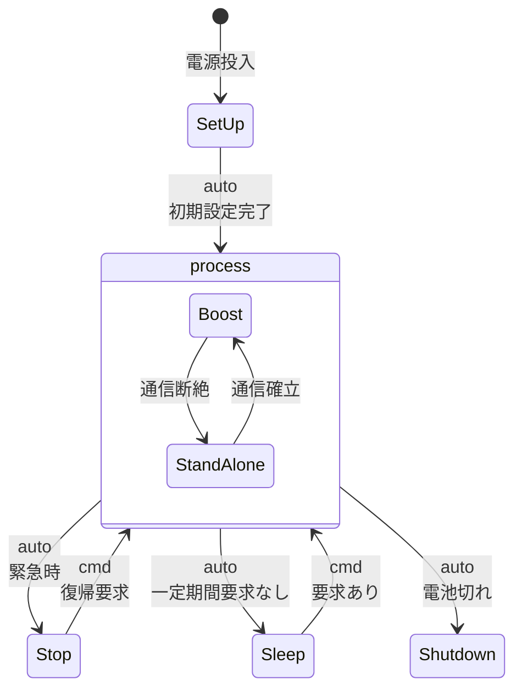
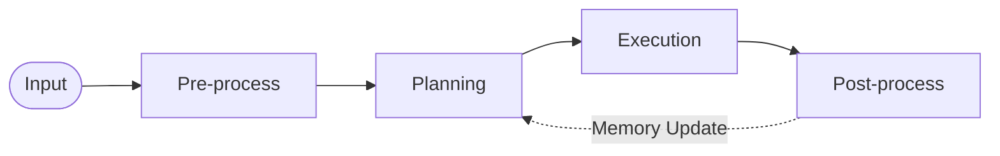

# 1. 概要
## 1.1 目標
本ロボットは、人間が行う肉体労働の一部または全部を代替・支援を可能にすることを目的としたものである。
本ロボットは、汎用的な行動を学習済みで、後に専門的な行動を学習できるものとする。

## 1.2 目的
本書は、人間が行う肉体労働の一部または全部を代替・支援可能な人型ロボットシステムについて、要求仕様書に基づきシステム構成、機能分割、インタフェース、データフロー、安全設計および各サブシステムの責務を定義する。
本書ではシステム全体の基本設計を対象とし、具体的なアルゴリズム、クラス構造、通信フレーム、ニューラルネットワーク構成、制御則等については各詳細設計書にて定義する。

# 2. 関連文書
| 文書名     | 内容                      |
| :------ | :---------------------- |
| [要求仕様書](../requirement/README.md)   | システムが満たすべき要求事項          |
| 頭脳設計仕様書 | 認識、会話、計画、記憶、学習に関する設計    |
| 制御設計仕様書 | 姿勢制御、関節制御、移動制御に関する設計    |
| 電気設計仕様書 | 電源、センサ、アクチュエータ、配線に関する設計 |
| 通信仕様書   | サブシステム間通信および外部通信に関する設計  |
| 安全設計仕様書 | 非常停止、制限、異常検出等に関する設計     |
| 試験仕様書   | 各要求および設計項目の試験方法         |

# 3. システム概要

## 3.1 システム構成
システム構成を以下に示す
| システム | 内容 |
| :- | :- |

本システムの外観および主要機構の概念イメージを以下に示す。
[ロボット全体イメージ](./Image_body_ChatGPT.png)

### 3.1.1 頭脳
動作モード一覧

| モード |  |
| :- | :- |
| standby | -- |
| set up | 各コンポーネントを起動させ、初期設定を完了する |
| boost | 外部のAIサーバーと通信可能な状態で、メイン処理を行うモード |
| stand alone | 外部のAIサーバーと通信負荷の状態で、メイン処理を行うモード |
| stop | 低層の基本的なリアルタイム処理にだけが走るモード |
| sleep | 行動を伴わない処理を一定期間続けた際に入るモード。運動に伴う電力を使わない。|
| shutdown | 電源を切った状態 |

処理モード

| モード |  |
| :- | :- |
| pre-process |
| plannning |
| exection |
| post-process |

### 3.1.2 骨格
骨格は人骨を採用し、主な採用個所は以下
| 骨格 |  |
| :- | :- |
| 頭蓋骨 | カメラ、スピーカ、マイク、計算処理装置 |
| 脊柱 | |
| 肋骨 | 電力供給 |
| 鎖骨 | |
| 肩甲骨 | |
| 上腕骨 | |
| 橈骨 | |
| 骨盤 | |
| 大腿骨 | |
| 膝蓋骨 | |
| 脛骨 | |

### 3.1.3 人工筋肉
アクチュエータの構成は、伸縮力のみを有する機構とし、以下で構成される
| 部品 | 主な動作 |
| :- | :- |
| 小型モータ | スライド機構に動力を提供する |
| スライド機構 | 小型モータの回転力をワイヤーの伸縮力に変換する |
| ワイヤー |  |

人工筋肉の部位として以下を採用する。
| アクチュエータ | 主な動作 |
| :- | :- |
| 教唆乳頭筋 | ①両側：頭部を上に向ける、頸部を前屈させる。②片側：頸部を側屈させる。反対方向に回旋させる |
| 頭板状筋 | ①両側：頭頚部の後屈。②片側：頭頚部の側屈、回旋 |
| 大胸筋 | 肩関節の内転、内旋 |
| 前鋸筋 | 肩甲骨を全外方に引く。①上部：上げた腕を引き下げる。②下部：肩甲骨の上方回旋 |
| 僧帽筋 | 肩甲骨の上方回旋。①下行部：肩甲骨を上げる。②横行部：肩甲骨を内側に引き寄せる。③上行部：肩甲骨を下げる |
| 広背筋 | 肩関節の内転、伸展、内旋 |
| 腹直筋 | 腰椎の前屈と側屈。|
| 腰方形筋 | 腰椎の側屈、骨盤の挙上 |
| 三角筋 | 上腕の外転(90度まで)。①前部：上腕の屈曲。②後部：上腕の伸展。 |
| 上腕二頭筋 | 肘関節の屈曲 |
| 上腕三頭筋 | 肘関節の伸展、上腕の伸展補助 |
| 大腰筋 | 大腿の屈曲と外旋、股関節の安定、腰椎の側屈 |
| 大殿筋 | 大腿の伸展、外旋、上部は外転、下部は内転 |
| 大内転筋 | 大腿の内転、外旋、伸展 |
| 大腿直筋 | 膝の伸展、股関節の屈曲 |
| 大腿二頭筋 | 膝関節の屈曲、大腿の伸展 |

### 3.1.4 スプリングダンパ機構
足首の機構として、地面からの反力を緩和させる機構として、
スプリングダンパ機構を有する。

### 3.1.5 ハンド
5本指のハンドを基本とし、肘先から別のハンドに交換可能とする

### 3.1.6 外皮
各骨格部位ごとに外皮を持ち、外皮は接触検知が可能である。
接触検知機構は、スイッチのような機構を有し、ピンの沈んだ深さにより電流抵抗が変化する機構を持つ。外皮は大雑把に区分けし、細かくは区分けしない。

例）上腕
前・後・左・右に外皮が分割される

