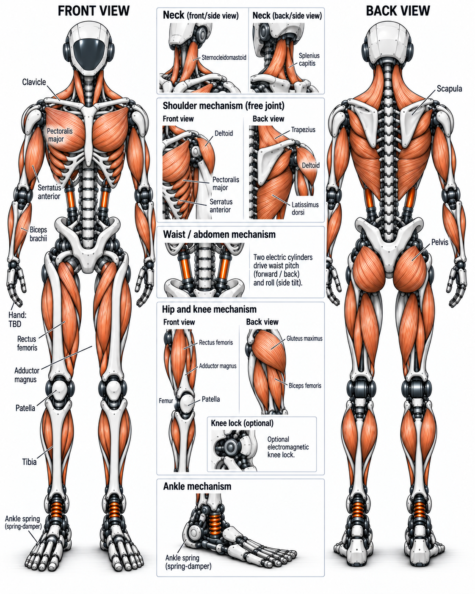
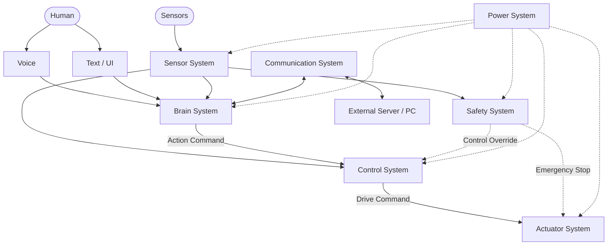
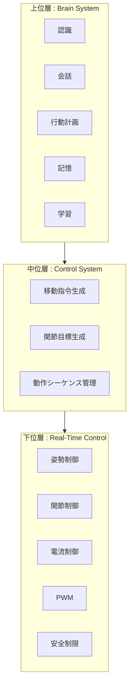
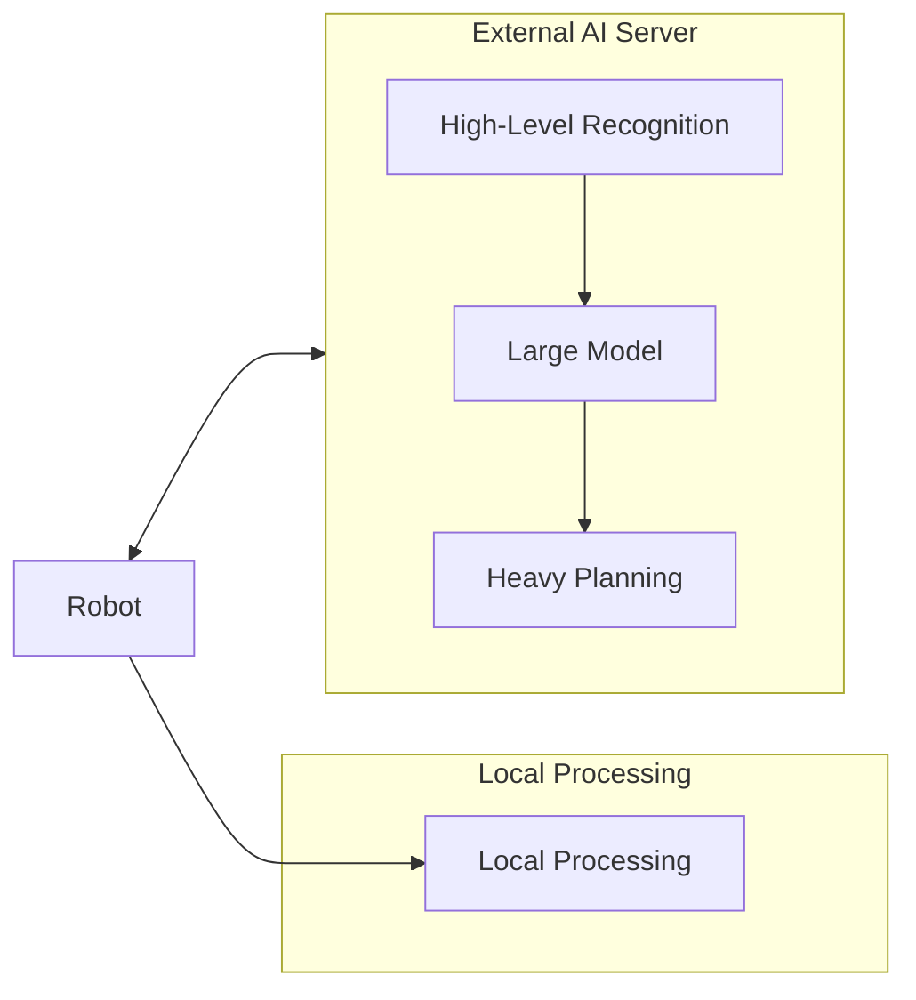
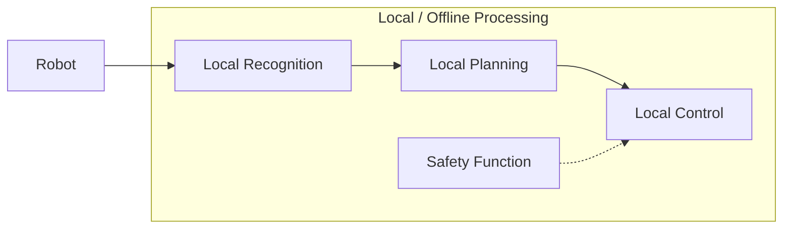
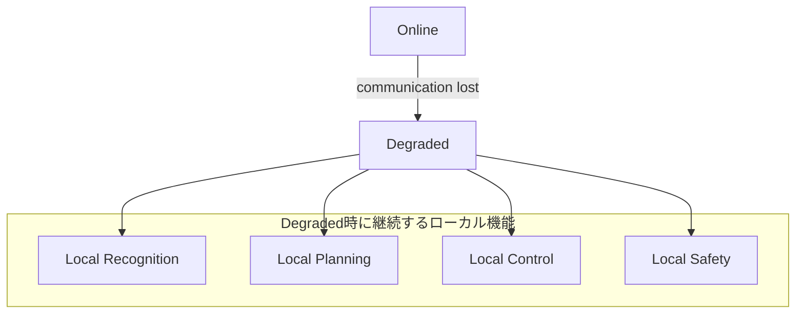
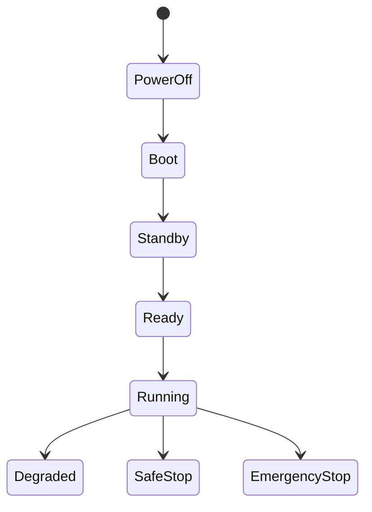

# 1. 目的
本書は、人間が行う肉体労働の一部または全部を代替・支援可能な人型ロボットシステムについて、要求仕様書に基づきシステム構成、機能分割、インタフェース、データフロー、安全設計および各サブシステムの責務を定義する。
本書ではシステム全体の基本設計を対象とし、具体的なアルゴリズム、クラス構造、通信フレーム、ニューラルネットワーク構成、制御則等については各詳細設計書にて定義する。

# 2. 関連文書
| 文書名     | 内容                      |
| :------ | :---------------------- |
| [要求仕様書](../requirement/README.md)   | システムが満たすべき要求事項          |
| 頭脳設計仕様書 | 認識、会話、計画、記憶、学習に関する設計    |
| 制御設計仕様書 | 姿勢制御、関節制御、移動制御に関する設計    |
| 電気設計仕様書 | 電源、センサ、アクチュエータ、配線に関する設計 |
| 通信仕様書   | サブシステム間通信および外部通信に関する設計  |
| 安全設計仕様書 | 非常停止、制限、異常検出等に関する設計     |
| 試験仕様書   | 各要求および設計項目の試験方法         |

# 3. システム概要
本システムは以下の機能を備える人型ロボットとする。
* 周囲環境を認識する
* 人間の音声およびテキストを理解する
* 日常会話および特定分野の専門的会話を行う
* 目的に応じて行動を計画する
* 計画した行動を実行する
* 実行結果を認識し、必要に応じて再計画する
* 過去の経験および知識を記憶する
* 外部通信が切断された場合でも最低限の自律動作を行う
* 人間および周囲環境に対して安全な動作を維持する
システムは、認識、判断、制御、安全機能を分離し、単一機能の異常がシステム全体の危険動作へ直結しない構成とする。
## 3.1 ロボット全体イメージ

本システムの外観および主要機構の概念イメージを以下に示す。

本図は、Actuator System で採用を検討している以下の構成を含むロボット全体の概念イメージである。
- 胸部・背部配置モータと Tendon / Cable を用いた肩・肩甲骨駆動
- 肘部の局所モータ駆動
- 骨盤から左右肋骨側へ接続する Dual Linear Actuator による腰部 Pitch / Roll 駆動
- 中央 Spine Lock による腰部姿勢保持
- 股関節の Active Joint
- 膝関節の Brake-Controlled Joint
- 足首の Passive Spring-Damper 機構
本図はシステム全体の構成および設計思想を共有するための参考図であり、最終的な寸法、外装形状、リンク長、Actuator配置、Cable Routing、関節可動域および部品構成を拘束するものではない。
詳細な機械構成、Actuator仕様、Safety機構および各関節の駆動方式については、Actuator System 設計仕様書および各詳細設計書で定義する。

# 4. システム構成
システムは以下の主要サブシステムから構成する。

| ID           | サブシステム                 | 主な責務                 |
| :----------- | :--------------------- | :------------------- |
| SYS-BRAIN    | Brain System           | 認識、会話、行動計画、記憶、学習     |
| SYS-CONTROL  | Control System         | 姿勢、関節、移動およびアクチュエータ制御 |
| SYS-SENSOR   | Sensor System          | 外界および内部状態の計測         |
| SYS-ACTUATOR | Actuator System        | 関節、ハンド、移動機構等の駆動      |
| SYS-SAFETY   | Safety System          | 非常停止、制限監視、異常検出、安全停止  |
| SYS-COMM     | Communication System   | 内部通信および外部通信          |
| SYS-POWER    | Power System           | 電源供給、電圧・電流監視、電源保護    |
| SYS-HMI      | Human Interface System | 音声、テキスト、状態表示、警告通知    |
基本構成を以下に示す。

# 5. システム設計方針
## 5.1 階層分離
システムは以下の3階層に分離する。

上位層の処理遅延または停止によって、下位制御が即座に停止しない構成とする。
一方、安全上必要な場合はSafety Systemが上位層の指令を無効化できること。

## 5.2 分散処理
高負荷な認識、AI推論、学習等は外部計算機を利用可能とする。
ただし、安全上必要な機能および最低限の自律動作はロボット内部で実行可能とする。
通常時：

通信断時：

## 5.3 モジュール独立性
各サブシステムは交換・拡張可能な構成とする。
例えばカメラ、AIモデル、計算装置、モータ制御装置等を変更した場合でも、他サブシステムへの影響を最小限とする。

# 6. Brain System
Brain Systemはロボットの高レベル判断を担当する。
主な機能は以下とする。
* 外界認識
* 自己状態認識
* 音声認識
* 文脈認識
* 行動計画
* 計画実行管理
* 記憶
* 学習
* 外部AIとの連携

# 7. Control System
## 7.1 概要
Control SystemはBrain Systemから受け取ったActionを、物理ロボットが実行可能な制御指令へ変換する。
## 7.2 機能
| ID       | 機能                   | 内容            |
| :------- | :------------------- | :------------ |
| CTRL-001 | Motion Control       | 全身動作を管理する     |
| CTRL-002 | Locomotion Control   | 歩行・移動を管理する    |
| CTRL-003 | Manipulation Control | 腕・手・把持を管理する   |
| CTRL-004 | Posture Control      | 姿勢安定化を行う      |
| CTRL-005 | Joint Control        | 各関節の制御を行う     |
| CTRL-006 | Actuator Control     | モータ等の最下位制御を行う |

# 8. Sensor System
Sensor Systemは以下のセンサ情報を取得可能とする。
* Camera
* IMU
* Distance Sensor
* Force Sensor
* Torque Sensor
* Touch Sensor
* Joint Angle Sensor
* Temperature Sensor
* Voltage Sensor
* Current Sensor
各センサデータには可能な範囲で以下を付与する。
| Sensor Data Field |
| :- |
| Sensor ID |
| Timestamp |
| Value |
| Status |
| Error |

# 9. Actuator System
Actuator Systemは以下を制御対象とする。
* Joint Motor
* Hand
* Gripper
* Leg
* Head
* Neck
* Other Actuator
各アクチュエータは少なくとも以下の状態を保持可能とする。
| Actuator State |
| :- |
| Position |
| Velocity |
| Torque |
| Current |
| Temperature |
| Error |

# 10. Safety System
## 10.1 設計方針
Safety SystemはBrain Systemから独立して動作可能な構成とする。
AIが異常な指令を出した場合でも、Safety Systemが制限または停止できること。
## 10.2 監視対象
以下を監視する。
| Monitoring Target |
| :- |
| Joint Position |
| Joint Velocity |
| Torque |
| Current |
| Temperature |
| Voltage |
| Force |
| Robot Attitude |
| Communication |
| Controller Status |
| Sensor Status |

## 10.3 安全レベル
異常状態を以下に分類する。
### Level 0
正常状態。
### Level 1
警告。
動作を継続可能だが、状態を監視する。
### Level 2
制限動作。
速度、トルク等を制限する。
### Level 3
安全停止。
現在動作を停止し、安全姿勢へ移行する。
### Level 4
非常停止。
アクチュエータ出力を停止する。

# 11. Communication System
## 11.1 内部通信

内部通信では以下を送受信する。

| Internal Communication Data |
| :- |
| Sensor Data |
| Robot State |
| Action Command |
| Control Command |
| Action Result |
| Error |
| Safety State |

通信方式は対象機器ごとに適切な方式を選択する。
候補：

| Communication Interface Candidate |
| :- |
| Ethernet |
| UART |
| SPI |
| I2C |
| CAN |
| USB |

## 11.2 外部通信

外部計算機との間で以下を送受信可能とする。

* 高負荷AI処理要求
* 認識結果
* 行動計画
* モデルデータ
* ログ
* システム状態

通信断を検出可能とする。

# 12. 通信断時設計

外部通信断発生時は以下の状態遷移とする。

通信断時に外部AIへ依存する処理は停止する。
ただし以下は継続する。

* Safety System
* Sensor System
* Control System
* 基本認識
* 基本行動
* 非常停止
* 状態監視

# 13. Human Interface System
人間とのインタフェースは以下を提供する。
* 音声入力
* テキスト入力
* 音声応答
* 状態表示
* エラー表示
* 警告
* 非常停止

# 14. Power System
Power Systemは以下を管理する。

* 主電源
* 制御系電源
* アクチュエータ電源
* バッテリー
* 電圧監視
* 電流監視
* 過電流保護
* 低電圧保護
* 電源遮断

可能な範囲で制御系電源とアクチュエータ電源を分離する。

# 15. 状態管理

システム全体は以下の状態を持つ。

| System State |
| :- |
| PowerOff |
| Boot |
| Standby |
| Ready |
| Running |
| Degraded |
| SafeStop |
| EmergencyStop |
| Error |
| Shutdown |

代表的な状態遷移を以下に示す。

# 16. エラー処理
各サブシステムはエラー発生時に以下を通知する。

| Error Field |
| :- |
| Error ID |
| Error Level |
| Source |
| Timestamp |
| Description |
| Recovery |

Error Levelに応じて、

| Recovery Action |
| :- |
| Retry |
| Fallback |
| Re-planning |
| Degraded Operation |
| Safe Stop |
| Emergency Stop |

を実行する。

# 17. ログ設計
以下をログとして保存可能とする。
* センサ情報
* 認識結果
* Goal
* Action Plan
* Action Result
* Control State
* Safety State
* Error
* Warning
* Communication State
* Power State
* AI Model Version
* Software Version
ログにはTimestampを付与する。

# 18. 時刻同期
複数のセンサ、制御装置および計算装置を使用するため、システム内部で時刻基準を統一する。
各データにはTimestampを付与し、異なるセンサ情報間の時間関係を識別可能とする。

# 19. リソース管理
システムは以下のリソース状態を監視可能とする。
| Resource |
| :- |
| CPU Usage |
| GPU/NPU Usage |
| Memory Usage |
| Storage Usage |
| Temperature |
| Network Status |
リソース不足時には安全機能を優先し、非重要処理を制限可能とする。

# 20. 拡張性設計
以下を交換・追加可能な構成とする。
* センサ
* アクチュエータ
* AIモデル
* 計算装置
* 制御装置
* 通信方式
* 認識機能
* 行動
* 記憶方式
各機能は共通インタフェースを介して接続する。

# 21. 要求トレーサビリティ
主要な要求と設計項目の対応を以下に示す。
| 要求ID                   | 設計項目                                           |
| :--------------------- | :--------------------------------------------- |
| REQ-SYS-PER-001 ～ 008  | Pre-process / Sensor System                    |
| REQ-SYS-COM-001 ～ 006  | Speech Recognition / Context Recognition / HMI |
| REQ-SYS-ACT-001 ～ 006  | Planning / Execution / Control System          |
| REQ-SYS-MEM-001 ～ 005  | Memory System / Post-process                   |
| REQ-SYS-AUT-001 ～ 003  | Communication System / 通信断時設計                  |
| REQ-PER-PLN-001 ～ 004  | Planning                                       |
| REQ-PER-MOT-001 ～ 005  | Control System                                 |
| REQ-IF-SEN-001 ～ 010   | Sensor System                                  |
| REQ-IF-ACT-001 ～ 005   | Actuator System                                |
| REQ-IF-INT-001 ～ 004   | Communication System                           |
| REQ-IF-EXT-001 ～ 004   | Communication System                           |
| REQ-IF-HMI-001 ～ 005   | Human Interface System                         |
| REQ-SAFE-BAS-001 ～ 004 | Safety System                                  |
| REQ-SAFE-EST-001 ～ 003 | Safety System                                  |
| REQ-SAFE-LIM-001 ～ 008 | Safety System / Control System                 |
| REQ-SAFE-ERR-001 ～ 009 | Safety System                                  |
| REQ-SAFE-NET-001 ～ 003 | 通信断時設計                                         |
| REQ-QUAL-REL-001 ～ 003 | 状態管理 / Error Handling                          |
| REQ-QUAL-MNT-001 ～ 003 | モジュール独立性                                       |
| REQ-QUAL-EXT-001 ～ 005 | 拡張性設計                                          |
| REQ-QUAL-TST-001 ～ 004 | Test Interface                                 |
| REQ-QUAL-LOG-001 ～ 009 | ログ設計                                           |
| REQ-QUAL-REP-001 ～ 002 | ログ / Version管理                                 |
| REQ-QUAL-VER-001 ～ 008 | Version管理                                      |
